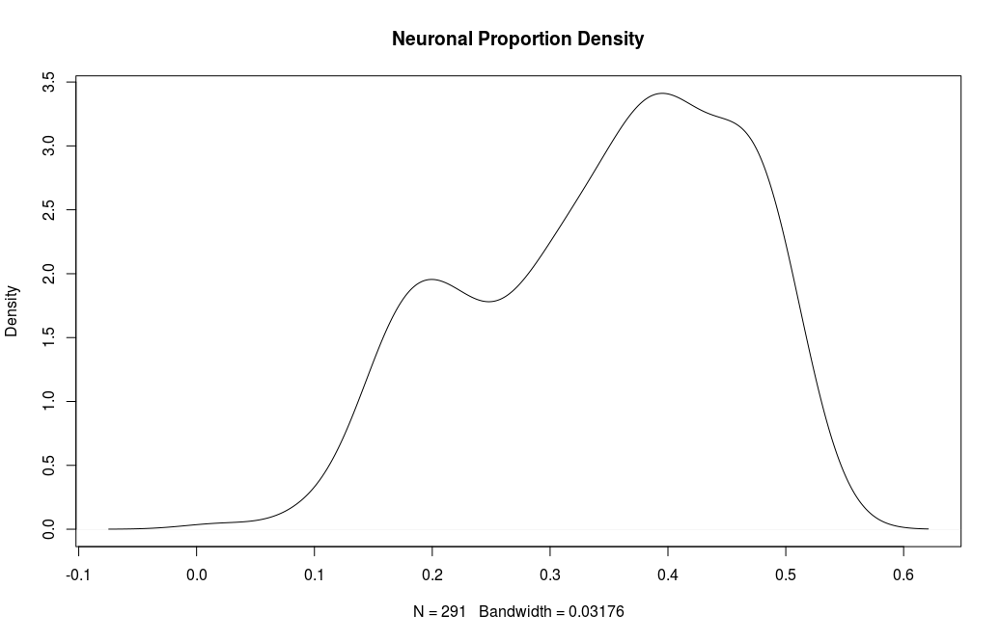

Progress Report
================

### What has changed based on the final proposal?

For our project we will be using the same dataset that we had detailed in our proposal (accession identifier [GSE59685](https://www.ncbi.nlm.nih.gov/geo/query/acc.cgi?acc=GSE59685)). However, since the writing of our proposal, we have discovered that the nature of the dataset is different from our initial understanding. We came across this dataset through a study by [Hannon et al (2015)](https://www.ncbi.nlm.nih.gov/pmc/articles/PMC4844197/), which examined methylation between whole blood, cortex, and cerebellum tissues. As this paper did not indicate otherwise, we believed that the dataset was comprised of primarily healthy individuals. Since acquiring and pre-processing the dataset, we have discovered that the majority of the samples (n= 235 from a total of n= 366) were obtained from individuals with Alzheimer's disease. The metadata indicates the disease status and braak stage (a measure that classifies the degree of pathology in Alzheimer’s disease) for each sample. 

Our initial main objective for this project was to establish a baseline of differentially methylated regions between brain regions of healthy individuals. Since the majority of our samples did not come from healthy individuals, we have decided to change our aims to the following: (1) Does cell type correction affect the results of studies examining differentially methylated regions (DMRs)? (2) Since methylation of CpG islands are usually not so variable, we decided to investigate genes that are differentially methylated between cortex and cerebellum. To this end, we wish to investigate whether we see differences in differentially methylated genes between cell-type corrected vs non cell-type corrected data. We will narrow down our analysis to the differentially methylated genes that were detected in cell-type corrected but not detected in non cell-type corrected to examine the biological function/impact of these of these genes.

Overall the general task assignments will remain the same for each group member. Hilary has preprocessed the data sets and Sam has performed initial PCA, removed batch effects, and corrected for cell type. Lisa and Cassia will examine the overall methylation levels between the cell-type corrected and non cell-type corrected data, while Randip will examine the DMRs between the brain regions. If different DMRs are discovered between the datasets, Sam will aid Randip in researching functional biological implications of the identified regions.      

### What is the progress of the analyses?

The dataset containing the methylation beta values for 122 individuals was retrieved and downloaded from the [GEO database](https://www.ncbi.nlm.nih.gov/geo/). The metadata associated with this dataset was acquired using the SQLite database. Both the beta values file and the metadata underwent some slight formatting and cleaning to create files that were easy to read and manipulate (details on these steps can be found [here](https://github.com/STAT540-UBC/team_Methylhomies/blob/master/data/processed_data/Acquiring%20GEO%20meta%20data.Rmd)). Initially we planned on normalizing the beta values using quantro and BMIQ, however when the downloaded dataset was examined it was found that it had already been normalized using the dasen method. Instead of “un-normalizing” the data and renormalizing it with our planned method, we decided to proceed with the dasen normalized data. Details on the dasen method can be found [here](https://github.com/STAT540-UBC/team_Methylhomies/blob/master/data/processed_data/Normalization%20of%20Beta%20Data.Rmd). We then moved onto filtering out probes. Two different probe annotation sets (lumi package) designed for the Illumina HumanMethylation450 BeadChip ([GPL13534](https://www.ncbi.nlm.nih.gov/geo/query/acc.cgi?acc=GPL13534) and [GPL16304](https://www.ncbi.nlm.nih.gov/geo/query/acc.cgi?acc=GPL16304)) were used to identify and filter out: probes targeting SNPs, probes containing SNPs, probes targeted to the X and Y chromosomes, and cross hybridized probes. Specifics on this process can be found [here](https://github.com/STAT540-UBC/team_Methylhomies/blob/master/data/processed_data/Probe%20Filtering.Rmd). At this point the dataset still contained samples of whole blood. As we are only interested in the brain tissue samples, all blood samples were removed (steps can be found [here](https://github.com/STAT540-UBC/team_Methylhomies/blob/master/data/processed_data/Create.brain.only.Rmd)).

A PCA (visualized using Lattice, RColourBrewer, and gplots) was done first to examine sources of variation in the data such as sex, disease status, age, row, and chip. The ComBat function in the SVA package ([Johnson et al, 2007](https://academic.oup.com/biostatistics/article/8/1/118/252073/Adjusting-batch-effects-in-microarray-expression)) was then used to remove batch effects from row and chip. A copy of this dataset was saved before proceeding, for comparison with cell type correction. Cell type correction was subsequently performed using the R package CETS ([Guintivano et al, 2013](https://www.ncbi.nlm.nih.gov/pubmed/23426267)). PCAs were also performed between each of these steps to evaluate their effect on the data; the corresponding scripts can be found [here](https://github.com/STAT540-UBC/team_Methylhomies/blob/master/src/Cell%20Type%20Prediction.Rmd) and [here](https://github.com/STAT540-UBC/team_Methylhomies/blob/master/src/PCA%20%26%20ComBat.Rmd). 

These two finalized datasets are now ready for further analysis. We will primarily focus on three main objectives. First, we wish to investigate whether methylation levels (and their distributions) differ between cell-type corrected and non cell-type corrected data. Specifically, we plan to use heatmaps to visualize the overall methylation levels of both datasets and see if there are any differences in patterns of methylation across brain regions. Second, we will look at the distributions of methylation levels for each brain region with boxplots, and compare our results with those from Hannon et al. The Wilcoxon test (p.adjusted for multiple testing with BH) will be used to test for statistical significance in the methylation level differences across different brain regions. Thirdly, we wish to see if methylation levels between brain regions are correlated with each other. For this, we plan to use data from multiple brain regions belonging to the same patient. Spearman correlation will be used to quantify the level of correlation.

We will then move onto examining DMRs using the R package DMRcate ([Peters et al, 2015](https://epigeneticsandchromatin.biomedcentral.com/articles/10.1186/1756-8935-8-6)). This package, along with limma, will allow us to identify and map differentially methylated regions onto specific genomic locations using probe information. During the limma-based linear regression, we will account for variation in the dataset caused by subject, sex, Alzheimer’s status and age by including these as covariates. Functional enrichment analysis of the methylated regions will be assessed using the [IlluminaHumanMethylation450k.db](https://bioconductor.org/packages/release/data/annotation/html/IlluminaHumanMethylation450k.db.html) package.

### Results

Pre-processing of our dataset has shown that out of the 122 individuals samples, 71 of them have samples for all 4 brain regions. There were also a total of 485 577 probes used to generate the beta values. During probe filtering 70 497 probes were removed, leaving a total of 415 080. 

**Cell type prediction (neuronal proportion) for normalized, uncorrected data:**

Four peaks appeared. These could correspond to different neuronal distributions in the four brain regions.

**PCA on normalized, uncorrected data:**

The largest contributors to variance are age, AD disease status, Braak Stage, and chip, with some row effects.

**Cell type prediction (neuronal proportion) for ComBat-corrected data:** 

The initial four peaks are smoothed into two main peaks; the second peak has a large spread. The difference in distributions may again be due to brain region differences or (more likely) to differences in neuronal ratios between control and AD subjects.

**PCA on ComBat-corrected data:**

Row and chip effects were removed. This slightly altered the PC distribution of the remaining variables.

**PCA on CETS-corrected data:** 

Correcting for cell type based on the estimation from ComBat-corrected neuronal proportions reduced the effect of age, increased the effect of sex, and altered the significance and PC distribution of AD status/Braak Stage.

### References

Guintivano, J., Aryee, M.J., & Kaminsky, Z.A. (2013). A cell epigenotype specific model for the correction of brain cellular heterogeneity bias and its application to age, brain region and major depression. *Epigenetics*. 8(3): 290-302.

Hannon, E., Lunnon, K., Schalkwyk, L., & Mill, J. (2015). Interindividual methylomic variation across blood, cortex, and cerebellum: implications for epigenetic studies of neurological and neuropsychiatric phenotypes. *Epigenetics*. 10(11): 1024-1032.

Johnson, W. E., Li, C., & Rabinovic, A. (2007). Adjusting batch effects in microarray expression data using empirical Bayes methods. *Biostatistics*. 8(1): 118-127.

Peters, T.J., Buckely, M. J., Statham, A.L, Pidsley, R., Samaras, K., Lord, R.V., Clark, S.J., & Molloy, P.L. (2015). De novo identification of differentially methylated regions in the human genome. *Epigenetics & Chromatin*. 8(6): 1-16 
