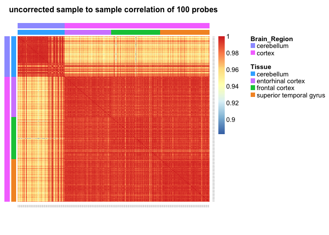

# correction Matters
Cassia Warren  
March 16, 2017  


**Load the data and check that the columns are in the same order**
This is the data that lisa has already rearranged 

```r
load("/Volumes/Lexar/Lisa_sorted_data/GSE59685_batch_cor_sorted_by_brain_regions.RData")

load("/Volumes/Lexar/Lisa_sorted_data/GSE59685_cell_cor_sorted_by_brain_regions.RData")

load("/Volumes/Lexar/Lisa_sorted_data/meta_order_by_brain_regions.RData")

identical(colnames(GSE59685_batch_cor_sorted_by_brain_regions),colnames(GSE59685_cell_cor_sorted_by_brain_regions)) # TRUE
```

```
## [1] TRUE
```

```r
identical(colnames(GSE59685_batch_cor_sorted_by_brain_regions),as.character(meta_order_by_brain_regions$gsm)) #TRUE
```

```
## [1] TRUE
```

**subset 100 Probes so my computer doesnt crash**

```r
brain_regions <- meta_order_by_brain_regions$broad_regions
tissue <- meta_order_by_brain_regions$Tissue
#sample of 100 probes
set.seed(1)
probes <- sample(rownames(GSE59685_cell_cor_sorted_by_brain_regions),100)
aheatmap(GSE59685_batch_cor_sorted_by_brain_regions[probes,], Colv = NA, annCol = list(Brain_Region = brain_regions, Tissue = tissue), main =  "Uncorrected heatmap of 100 probes")
```

<!-- -->

```r
aheatmap(GSE59685_cell_cor_sorted_by_brain_regions[probes,], Colv = NA, annCol = list(Brain_Region = brain_regions, Tissue = tissue, main = "Corrected heatmap of 100 probes"))
```

<!-- -->

**Want to see what thier expression is and if it changes between corrected and non corercted data sets. **

```r
#compare expression of those 100 probes between data sets
# create a combined data set
batch_sub <- GSE59685_batch_cor_sorted_by_brain_regions[probes,]
t.batch_sub <- t(batch_sub)
colnames(t.batch_sub) <- gsub("cg", "batch", colnames(t.batch_sub))

cell_sub <- GSE59685_cell_cor_sorted_by_brain_regions[probes,]
t.cell_sub <- t(cell_sub)
colnames(t.cell_sub) <- gsub("cg", "cell", colnames(t.cell_sub))

#identical(rownames(t.cell_sub),as.character(meta_order_by_brain_regions$gsm))

#identical(rownames(t.batch_sub),as.character(meta_order_by_brain_regions$gsm))

Meta_probes <- data.frame(meta_order_by_brain_regions, t.cell_sub, t.batch_sub)

cell_met <- data.frame(Meta_probes[,c(2,3,10,15)], t.cell_sub)
batch_met <- data.frame(Meta_probes[,c(2,3,10,15)], t.batch_sub)

cell_melt <- melt(cell_met, id.vars= c("gsm", "Tissue", "broad_regions", "Subject"))
cell_melt$Data.set <- "cell_corrected"

batch_melt <- melt(batch_met, id.vars= c("gsm", "Tissue", "broad_regions", "Subject"))
batch_melt$Data.set <- "not_corrected"

meta_probes_meled <- rbind(batch_melt,cell_melt)
meta_probes_meled$variable <- gsub("cell", "cg", meta_probes_meled$variable)
meta_probes_meled$variable <- gsub("batch", "cg", meta_probes_meled$variable)
```


```r
stripplot(meta_probes_meled$variable ~ meta_probes_meled$value | meta_probes_meled$Data.set, meta_probes_meled, groups = Tissue, layout = c(2, 1), auto.key = TRUE)
```

<!-- -->

```r
#facet wrap based on brain region
stripplot(meta_probes_meled$variable ~ meta_probes_meled$value | meta_probes_meled$Data.set*meta_probes_meled$Tissue , meta_probes_meled, groups = Tissue, auto.key = TRUE)
```

<!-- -->

```r
#facet wrap based on sample 
#subset patients
subset_patient_6 <- meta_probes_meled[meta_probes_meled$Subject==6,]

stripplot(subset_patient_6$variable ~ subset_patient_6$value | subset_patient_6$Data.set , subset_patient_6, groups = Tissue, auto.key = TRUE)
```

<!-- -->

```r
stripplot(subset_patient_6$variable ~ subset_patient_6$value | subset_patient_6$Data.set*subset_patient_6$Tissue , subset_patient_6, groups = Tissue, auto.key = TRUE)
```

<!-- -->

```r
#sample to sample correlations based on brain region


aheatmap(cor(batch_sub),Colv = NA, Rowv = NA,  annCol = list(Brain_Region = brain_regions, Tissue = tissue), annRow = list(Brain_Region = brain_regions, Tissue = tissue),main = "uncorrected sample to sample correlation of 100 probes")
```

<!-- -->

```r
aheatmap(cor(cell_sub),Colv = NA, Rowv = NA,  annCol = list(Brain_Region = brain_regions, Tissue = tissue), annRow = list(Brain_Region = brain_regions, Tissue = tissue), main = "corrected sample to sample correlation of 100 probes")
```

<!-- -->
**as expected there is less correlation between samples once you cell type correct**


```r
#boxplot - one probe

plotfunction <- function(n)
{
  ggplot(n, aes(factor(Tissue),value)) +
    geom_violin(aes(col = Tissue)) +
   facet_wrap(~Data.set) +
  theme(axis.text.x = element_text(angle = 90, hjust = 1)) +
  xlab("Tissue") +
  ylab("Methylation") +
  labs(title = paste0("Methylation values for probe ", n$variable))
  
}

plotfunction(meta_probes_meled[meta_probes_meled$variable== "cg06607866",] )
```

<!-- -->

```r
plotfunction(meta_probes_meled[meta_probes_meled$variable== "cg03435979",] )
```

<!-- -->

```r
plotfunction(meta_probes_meled[meta_probes_meled$variable== "cg20745248",] )
```

<!-- -->

DO we like violine or box?

```r
plotfunction2 <- function(n)
{
  ggplot(n, aes(factor(Tissue),value)) +
    geom_boxplot(aes(col = Tissue)) +
   facet_wrap(~Data.set) +
  theme(axis.text.x = element_text(angle = 90, hjust = 1)) +
  xlab("Tissue") +
  ylab("Methylation") +
  labs(title = paste0("Methylation values for probe ", n$variable))
  
}

plotfunction2(meta_probes_meled[meta_probes_meled$variable== "cg06607866",] )
```

<!-- -->

```r
plotfunction2(meta_probes_meled[meta_probes_meled$variable== "cg03435979",] )
```

<!-- -->

```r
plotfunction2(meta_probes_meled[meta_probes_meled$variable== "cg20745248",] )
```

<!-- -->

