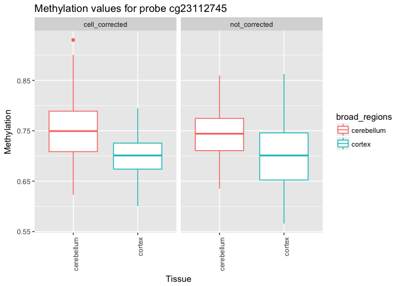
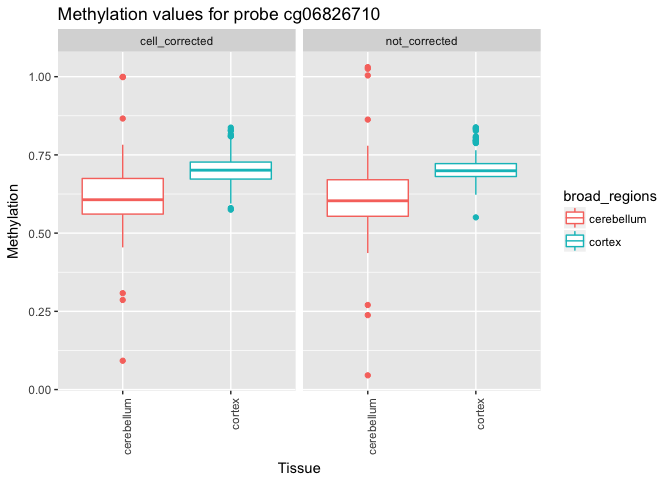
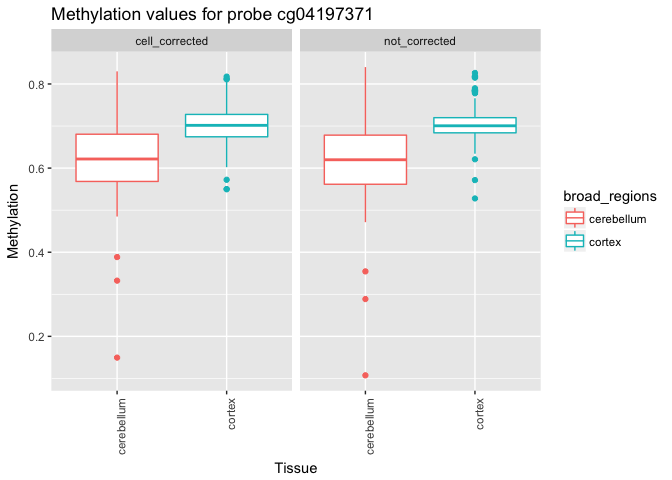

# Boxplots_probes
Cassia Warren  
April 3, 2017  


**Load the data and check that the columns are in the same order**


```r
load("/Volumes/Lexar/New corrected/GSE43414_batch_cor.RData")

load("/Volumes/Lexar/New corrected/GSE43414_cell_cor.RData")

load("/Volumes/Lexar/New corrected/Meta_batch_cor.RData")
```

Remove Braak stage exludes and NAs

```r
meta2 <- na.omit(meta) #remove NA
meta <- meta2[!c(meta2$braak.stage=="Exclude"),] #remove exlucdes
```


Lisas code to rearrange

```r
## add another broad region column
meta$broad_regions <- ifelse(meta$Tissue == "cerebellum", "cerebellum","cortex")
meta$tissue_color <- lapply(meta$Tissue,function(x){
  if (x == "cerebellum") {y <- "red"}
  if (x == "frontal cortex") {y <- "blue"}
  if (x == "superior temporal gyrus") {y <- "orange"}
  if (x == "entorhinal cortex") {y <- "yellow"}
  y
  })

meta$broad_colors <- lapply(meta$broad_regions,function(x){
  if (x == "cerebellum") {y <- "red"}
  if (x == "cortex") {y <- "blue"}
  y
})

## transpose data such that probe names are colnames, and rows are patient samples
transpose_GSE43414_cell_cor <- t(GSE43414_cell_cor)
## order metadata by brain region
#data has barcode NOT gsm as column names
meta_order_by_brain_regions <- meta %>% arrange(Tissue)
matches_GSE43414_cell_cor <- match(meta_order_by_brain_regions$barcode, rownames(transpose_GSE43414_cell_cor))

GSE43414_cell_cor_sorted_by_brain_regions <- t(transpose_GSE43414_cell_cor[matches_GSE43414_cell_cor,])
#repeat for batch

transpose_GSE43414_batch_cor <- t(GSE43414_batch_cor)
## order metadata by brain region
GSE43414_batch_cor_sorted_by_brain_regions <- t(transpose_GSE43414_batch_cor[matches_GSE43414_cell_cor,])

#Check for identical 
identical(colnames(GSE43414_batch_cor_sorted_by_brain_regions),colnames(GSE43414_cell_cor_sorted_by_brain_regions)) # TRUE
```

```
## [1] TRUE
```

```r
identical(colnames(GSE43414_cell_cor_sorted_by_brain_regions),as.character(meta_order_by_brain_regions$barcode)) #TRUE
```

```
## [1] TRUE
```


```r
cell.pr <- "cg23112745" 
batch.pr <- "cg06826710"
both.pr <- "cg04197371" 
probes.2 <- c(cell.pr,batch.pr,both.pr)

#compare expression of those 100 probes between data sets
# create a combined data set
batch_sub <- GSE43414_batch_cor_sorted_by_brain_regions[probes.2,]
t.batch_sub <- t(batch_sub)
colnames(t.batch_sub) <- gsub("cg", "batch", colnames(t.batch_sub))

cell_sub <- GSE43414_cell_cor_sorted_by_brain_regions[probes.2,]
t.cell_sub <- t(cell_sub)
colnames(t.cell_sub) <- gsub("cg", "cell", colnames(t.cell_sub))

identical(rownames(t.cell_sub),as.character(meta_order_by_brain_regions$barcode))
```

```
## [1] TRUE
```

```r
identical(rownames(t.batch_sub),as.character(meta_order_by_brain_regions$barcode))
```

```
## [1] TRUE
```

```r
Meta_probes <- data.frame(meta_order_by_brain_regions, t.cell_sub, t.batch_sub)

cell_met <- data.frame(Meta_probes[,c(2:4,12,17)], t.cell_sub)
# keeps "gms", "Subject", "barcode", "Tissue","broad_regions"
batch_met <- data.frame(Meta_probes[,c(2:4,12,17)], t.batch_sub)

cell_melt <- melt(cell_met, id.vars= c("gsm", "Tissue", "broad_regions", "Subject", "barcode"))
cell_melt$Data.set <- "cell_corrected"

batch_melt <- melt(batch_met, id.vars= c("gsm", "Tissue", "broad_regions", "Subject", "barcode"))
batch_melt$Data.set <- "not_corrected"

meta_probes_meled <- rbind(batch_melt,cell_melt)
meta_probes_meled$variable <- gsub("cell", "cg", meta_probes_meled$variable)
meta_probes_meled$variable <- gsub("batch", "cg", meta_probes_meled$variable)
 
 
identical(as.character(cell_met$gsm),as.character(batch_met$gsm))
```

```
## [1] TRUE
```

Top one only found in cell 

```r
plotfunction4<- function(n)
{
  ggplot(n, aes(factor(broad_regions),value)) +
    geom_boxplot(aes(col =broad_regions)) +
   facet_wrap(~Data.set) +
  theme(axis.text.x = element_text(angle = 90, hjust = 1)) +
  xlab("Tissue") +
  ylab("Methylation") +
  labs(title = paste0("Methylation values for probe ", n$variable))
  
}

plotfunction4(meta_probes_meled[meta_probes_meled$variable== cell.pr,] )
```

<!-- -->

Top one only in batch

```r
plotfunction4(meta_probes_meled[meta_probes_meled$variable== batch.pr,] )
```

<!-- -->

Top found in both

```r
plotfunction4(meta_probes_meled[meta_probes_meled$variable== both.pr,] )
```

<!-- -->


