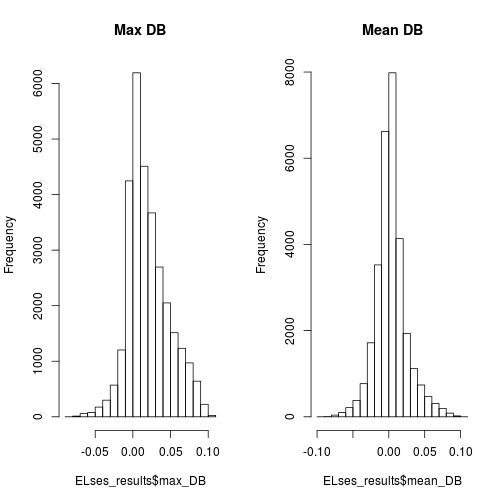

```r
setwd("/home/sschaffner/team_Methylhomies")
#Loading necessary packages: Functions of packages are noted here also for HW Assignment Q1-5
#Supressing warnings that were appearing to make my markdown less cluttered
options(warn=-1) 
suppressWarnings(suppressMessages(library(ggfortify)))
suppressWarnings(suppressMessages(library(gridExtra)))
suppressWarnings(suppressMessages(library(plotly)))
suppressWarnings(suppressMessages(library(GEOquery)))
suppressWarnings(suppressMessages(library(wateRmelon)))
suppressWarnings(suppressMessages(library(minfi)))
suppressWarnings(suppressMessages(library(limma)))
suppressWarnings(suppressMessages(library(IlluminaHumanMethylation450kanno.ilmn12.hg19)))
suppressWarnings(suppressMessages(library(IlluminaHumanMethylation450kmanifest)))
suppressWarnings(suppressMessages(library(RColorBrewer)))
suppressWarnings(suppressMessages(library(missMethyl)))
suppressWarnings(suppressMessages(library(matrixStats)))
suppressWarnings(suppressMessages(library(minfiData)))
suppressWarnings(suppressMessages(library(Gviz)))
suppressWarnings(suppressMessages(library(DMRcate)))
suppressWarnings(suppressMessages(library(gplots)))
suppressWarnings(suppressMessages(library(ggplot2)))
suppressWarnings(suppressMessages(library(stringr)))
suppressWarnings(suppressMessages(library(tidyverse)))
suppressWarnings(suppressMessages(library(data.table)))
suppressWarnings(suppressMessages(library(colorspace)))
suppressWarnings(suppressMessages(library(VennDiagram)))
suppressWarnings(suppressMessages(library(qpcR)))
```

```
## Error: package 'rgl' could not be loaded
```

```r
library(wateRmelon)
library(Sushi)
```

```
## Loading required package: zoo
```

```
## 
## Attaching package: 'zoo'
```

```
## The following objects are masked from 'package:base':
## 
##     as.Date, as.Date.numeric
```

```
## Loading required package: biomaRt
```

```r
library(IlluminaHumanMethylation450k.db)
library(lumi)
library(ggfortify) #For plotting
library(gridExtra) #For plotting
library(plotly) #For plotting
library(GEOquery) #For downloading genetic data
library(wateRmelon) #For model/analyses
library(limma) #For model/analyses
library(minfi) #For model/analyses
library(IlluminaHumanMethylation450kanno.ilmn12.hg19) #Gene annotation for analyses
library(IlluminaHumanMethylation450kmanifest) #Gene annotation for analyses
library(RColorBrewer) #Colors for plotting
library(missMethyl)  #For model/analyses
library(matrixStats) #For data manipulation
library(minfiData) #For model/analyses
library(Gviz) #For DMR plotting
library(DMRcate) #For DMR model/analyses
library(gplots) #For plotting
library(ggplot2) #For plotting
library(stringr) #For data manipulation
library(tidyverse) #For data manipulation
library(data.table) #For data manipulation
library(colorspace) #Colors for plotting
library(VennDiagram) #Necessary for the overlap counts/venn diagram
library(qpcR) #Necessary for the overlap counts/venn diagram
```

```
## Loading required package: rgl
```

```
## Error: package 'rgl' could not be loaded
```

```r
library(methylumi)
library(parallel)
library(dplyr)
```


```r
#Assigning annotation information for CpG probes on the 450k array
ann450k = getAnnotation(IlluminaHumanMethylation450kanno.ilmn12.hg19)
head(ann450k)
```

```
## DataFrame with 6 rows and 33 columns
##                    chr       pos      strand        Name    AddressA
##            <character> <integer> <character> <character> <character>
## cg00050873        chrY   9363356           -  cg00050873    32735311
## cg00212031        chrY  21239348           -  cg00212031    29674443
## cg00213748        chrY   8148233           -  cg00213748    30703409
## cg00214611        chrY  15815688           -  cg00214611    69792329
## cg00455876        chrY   9385539           -  cg00455876    27653438
## cg01707559        chrY   6778695           +  cg01707559    45652402
##               AddressB                                          ProbeSeqA
##            <character>                                        <character>
## cg00050873    31717405 ACAAAAAAACAACACACAACTATAATAATTTTTAAAATAAATAAACCCCA
## cg00212031    38703326 CCCAATTAACCACAAAAACTAAACAAATTATACAATCAAAAAAACATACA
## cg00213748    36767301 TTTTAACACCTAACACCATTTTAACAATAAAAATTCTACAAAAAAAAACA
## cg00214611    46723459 CTAACTTCCAAACCACACTTTATATACTAAACTACAATATAACACAAACA
## cg00455876    69732350 AACTCTAAACTACCCAACACAAACTCCAAAAACTTCTCAAAAAAAACTCA
## cg01707559    64689504 ACAAATTAAAAACACTAAAACAAACACAACAACTACAACAACAAAAAACA
##                                                     ProbeSeqB        Type
##                                                   <character> <character>
## cg00050873 ACGAAAAAACAACGCACAACTATAATAATTTTTAAAATAAATAAACCCCG           I
## cg00212031 CCCAATTAACCGCAAAAACTAAACAAATTATACGATCGAAAAAACGTACG           I
## cg00213748 TTTTAACGCCTAACACCGTTTTAACGATAAAAATTCTACAAAAAAAAACG           I
## cg00214611 CTAACTTCCGAACCGCGCTTTATATACTAAACTACAATATAACGCGAACG           I
## cg00455876 AACTCTAAACTACCCGACACAAACTCCAAAAACTTCTCGAAAAAAACTCG           I
## cg01707559 GCGAATTAAAAACACTAAAACGAACGCGACGACTACAACGACAAAAAACG           I
##               NextBase       Color    Probe_rs Probe_maf      CpG_rs
##            <character> <character> <character> <numeric> <character>
## cg00050873           A         Red          NA        NA          NA
## cg00212031           T         Red          NA        NA          NA
## cg00213748           A         Red          NA        NA          NA
## cg00214611           A         Red          NA        NA          NA
## cg00455876           A         Red          NA        NA          NA
## cg01707559           A         Red          NA        NA          NA
##              CpG_maf      SBE_rs   SBE_maf           Islands_Name
##            <numeric> <character> <numeric>            <character>
## cg00050873        NA          NA        NA   chrY:9363680-9363943
## cg00212031        NA          NA        NA chrY:21238448-21240005
## cg00213748        NA          NA        NA   chrY:8147877-8148210
## cg00214611        NA          NA        NA chrY:15815488-15815779
## cg00455876        NA          NA        NA   chrY:9385471-9385777
## cg01707559        NA          NA        NA   chrY:6778574-6780028
##            Relation_to_Island
##                   <character>
## cg00050873            N_Shore
## cg00212031             Island
## cg00213748            S_Shore
## cg00214611             Island
## cg00455876             Island
## cg01707559             Island
##                                                                                                                        Forward_Sequence
##                                                                                                                             <character>
## cg00050873 TATCTCTGTCTGGCGAGGAGGCAACGCACAACTGTGGTGGTTTTTGGAGTGGGTGGACCC[CG]GCCAAGACGGCCTGGGCTGACCAGAGACGGGAGGCAGAAAAAGTGGGCAGGTGGTTGCAG
## cg00212031 CCATTGGCCCGCCCCAGTTGGCCGCAGGGACTGAGCAAGTTATGCGGTCGGGAAGACGTG[CG]TTAAAGGGCTGAAGGGGAGGGACGGAACTGACAGTCTCTGTGACAGCTCTGAGGTGGGAG
## cg00213748 TCTGTGGGACCATTTTAACGCCTGGCACCGTTTTAACGATGGAGGTTCTGCAGGAGGGGG[CG]ACCTGGGGTAGGAGGCGTGCTAGTGGTGGATGACATTGTGGCAGAGATGGAGGTGGTGGC
## cg00214611 GCGCCGGCAGGACTAGCTTCCGGGCCGCGCTTTGTGTGCTGGGCTGCAGTGTGGCGCGGG[CG]AGGAAGCTGGTAGGGCGGTTGTCGCAAGCTCCAGCTGCAGCCTCCGCCTACGTGAGAAGA
## cg00455876 CGCGTGTGCCTGGACTCTGAGCTACCCGGCACAAGCTCCAAGGGCTTCTCGGAGGAGGCT[CG]GGGACGGAAGGCGTGGGGTGAGTGGGCTGGAGATGCAGGCGCGCCCGTGGCTGTGCAGCC
## cg01707559 AGCGGCCGCTCCCAGTGGTGGTCACCGCCAGTGCCAATCCCTTGCGCCGCCGTGCAGTCC[CG]CCCTCTGTCGCTGCAGCCGCCGCGCCCGCTCCAGTGCCCCCAATTCGCGCTCGGGAGTGA
##                                                     SourceSeq Random_Loci
##                                                   <character> <character>
## cg00050873 CGGGGTCCACCCACTCCAAAAACCACCACAGTTGTGCGTTGCCTCCTCGC            
## cg00212031 CGCACGTCTTCCCGACCGCATAACTTGCTCAGTCCCTGCGGCCAACTGGG            
## cg00213748 CGCCCCCTCCTGCAGAACCTCCATCGTTAAAACGGTGCCAGGCGTTAAAA            
## cg00214611 CGCCCGCGCCACACTGCAGCCCAGCACACAAAGCGCGGCCCGGAAGCTAG            
## cg00455876 GACTCTGAGCTACCCGGCACAAGCTCCAAGGGCTTCTCGGAGGAGGCTCG            
## cg01707559 CGCCCTCTGTCGCTGCAGCCGCCGCGCCCGCTCCAGTGCCCCCAATTCGC            
##            Methyl27_Loci UCSC_RefGene_Name        UCSC_RefGene_Accession
##              <character>       <character>                   <character>
## cg00050873                  TSPY4;FAM197Y2        NM_001164471;NR_001553
## cg00212031                          TTTY14                     NR_001543
## cg00213748                                                              
## cg00214611                   TMSB4Y;TMSB4Y           NM_004202;NM_004202
## cg00455876                                                              
## cg01707559               TBL1Y;TBL1Y;TBL1Y NM_134259;NM_033284;NM_134258
##              UCSC_RefGene_Group     Phantom         DMR    Enhancer
##                     <character> <character> <character> <character>
## cg00050873         Body;TSS1500                                    
## cg00212031               TSS200                                    
## cg00213748                                                         
## cg00214611        1stExon;5'UTR                                    
## cg00455876                                                         
## cg01707559 TSS200;TSS200;TSS200                                    
##                     HMM_Island Regulatory_Feature_Name
##                    <character>             <character>
## cg00050873   Y:9973136-9976273                        
## cg00212031 Y:19697854-19699393                        
## cg00213748   Y:8207555-8208234                        
## cg00214611 Y:14324883-14325218     Y:15815422-15815706
## cg00455876   Y:9993394-9995882                        
## cg01707559   Y:6838022-6839951                        
##                          Regulatory_Feature_Group         DHS
##                                       <character> <character>
## cg00050873                                                   
## cg00212031                                                   
## cg00213748                                                   
## cg00214611 Promoter_Associated_Cell_type_specific            
## cg00455876                                                   
## cg01707559
```

```r
#Load data and meta files
load("GSE43414_cell_cor.RData", verbose=TRUE) 
```

```
## Loading objects:
##   GSE43414_cell_cor
```

```r
load("Meta_batch_cor.RData", verbose=TRUE)
```

```
## Loading objects:
##   meta
```

```r
## transpose data such that probe names are colnames, and rows are patient samples
transpose_GSE43414_cell_cor <- t(GSE43414_cell_cor)
## order metadata by brain region to remove lunnon NA cases
meta_order_by_braak <- meta %>% arrange(braak.stage)
meta_order_by_braakdf <- as.data.frame(meta_order_by_braak)

#Remordering samples in beta data based on lunnon et al.
matches_GSE43414_cell_cor <- match(meta_order_by_braakdf$barcode, rownames(transpose_GSE43414_cell_cor))
GSE43414_cell_cor_sorted_by_braak <- t(transpose_GSE43414_cell_cor[matches_GSE43414_cell_cor,])
GSE43414_cell_cor_sorted_by_braakdf <- as.data.frame(GSE43414_cell_cor_sorted_by_braak)

#Removing NA and braak exclude samples in meta 
meta_order_by_braakdf <- meta_order_by_braakdf[-c(280:432), ]

#Removing the NA and braak exclude samples in data
GSE43414_cell_cor_sorted_by_braakdf <- subset(GSE43414_cell_cor_sorted_by_braakdf, select = -c(280:432))
GSE43414_cell_cor_sorted_by_braakmat <- as.matrix(GSE43414_cell_cor_sorted_by_braakdf)

#Create broad regions column
meta_order_by_braakdf$broad_regions <- ifelse(meta_order_by_braakdf$Tissue == "cerebellum", "cerebellum","cortex")

#Making tissue names and braak stage syntactically valid for analysis later (removes space, adds ".", numeric stage)
meta_order_by_braakdf$braak.stage <- as.numeric(meta_order_by_braakdf$braak.stage)

str(meta_order_by_braakdf)
```

```
## 'data.frame':	279 obs. of  17 variables:
##  $ series_id        : chr  "GSE43414" "GSE43414" "GSE43414" "GSE43414" ...
##  $ gsm              : chr  "GSM1068965" "GSM1069176" "GSM1069080" "GSM1069136" ...
##  $ Subject          : chr  "1" "1" "1" "6" ...
##  $ barcode          : chr  "6042316048_R05C01" "6042316103_R06C02" "6969568118_R03C02" "6042316054_R04C01" ...
##  $ lunnon.et.al     : chr  "TRUE" "TRUE" "TRUE" "TRUE" ...
##  $ tissue.code      : chr  "A" "F" "E" "F" ...
##  $ braak.stage      : num  0 0 0 1 1 1 1 1 1 1 ...
##  $ Sex              : chr  "FEMALE" "FEMALE" "FEMALE" "MALE" ...
##  $ ad.disease.status: chr  "C" "C" "C" "C" ...
##  $ age.brain        : num  82 82 82 78 85 85 92 78 78 85 ...
##  $ age.blood        : chr  "79" "79" "79" "78" ...
##  $ Tissue           : chr  "frontal cortex" "superior temporal gyrus" "entorhinal cortex" "superior temporal gyrus" ...
##  $ Neuron           : num  0.442 0.486 0.332 0.408 0.306 ...
##  $ Glia             : num  0.558 0.514 0.668 0.592 0.694 ...
##  $ chip             : chr  "6042316048" "6042316103" "6969568118" "6042316054" ...
##  $ row              : chr  "05" "06" "03" "04" ...
##  $ broad_regions    : chr  "cortex" "cortex" "cortex" "cortex" ...
```

```r
str(GSE43414_cell_cor_sorted_by_braakdf)
```

```
## 'data.frame':	338359 obs. of  279 variables:
##  $ 6042316048_R05C01: num  0.578 0.764 0.351 0.803 0.512 ...
##  $ 6042316103_R06C02: num  0.596 0.841 0.165 0.779 0.491 ...
##  $ 6969568118_R03C02: num  0.629 0.81 0.261 0.821 0.511 ...
##  $ 6042316054_R04C01: num  0.607 0.81 0.228 0.802 0.433 ...
##  $ 6042316063_R05C01: num  0.533 0.752 0.347 0.776 0.392 ...
##  $ 6042316069_R03C01: num  0.618 0.797 0.263 0.824 0.454 ...
##  $ 6042316094_R05C01: num  0.562 0.837 0.331 0.83 0.536 ...
##  $ 6042316099_R01C01: num  0.587 0.804 0.296 0.815 0.413 ...
##  $ 6042316127_R03C01: num  0.685 0.766 0.355 0.832 0.491 ...
##  $ 6057825014_R02C02: num  0.606 0.938 0.382 0.81 0.492 ...
##  $ 6057825017_R06C01: num  0.684 0.935 0.306 0.829 0.5 ...
##  $ 6969568084_R02C01: num  0.585 0.839 0.236 0.828 0.462 ...
##  $ 6969568118_R01C02: num  0.556 0.766 0.463 0.753 0.569 ...
##  $ 7786923046_R03C02: num  0.541 0.874 0.187 0.871 0.495 ...
##  $ 7786923107_R04C01: num  0.585 0.851 0.253 0.858 0.502 ...
##  $ 6042316066_R05C01: num  0.663 0.767 0.279 0.83 0.445 ...
##  $ 6042316103_R02C01: num  0.585 0.779 0.209 0.802 0.471 ...
##  $ 6042316103_R03C01: num  0.528 0.821 0.197 0.805 0.443 ...
##  $ 6042316121_R04C02: num  0.569 0.828 0.268 0.846 0.443 ...
##  $ 6929718123_R02C02: num  0.696 0.574 0.509 0.756 0.453 ...
##  $ 6969568084_R03C02: num  0.617 0.819 0.307 0.831 0.456 ...
##  $ 6969568087_R03C01: num  0.53 0.785 0.239 0.798 0.407 ...
##  $ 6969568087_R03C02: num  0.67 0.79 0.251 0.834 0.568 ...
##  $ 7796806002_R04C02: num  0.537 0.761 0.217 0.855 0.505 ...
##  $ 7796806022_R04C02: num  0.678 0.685 0.404 0.793 0.551 ...
##  $ 7796806038_R03C02: num  0.541 0.863 0.195 0.856 0.457 ...
##  $ 6042316035_R01C01: num  0.552 0.875 0.276 0.854 0.465 ...
##  $ 6042316035_R05C02: num  0.594 0.784 0.185 0.779 0.559 ...
##  $ 6042316036_R04C02: num  0.567 0.79 0.266 0.856 0.457 ...
##  $ 6042316036_R05C02: num  0.611 0.75 0.24 0.755 0.493 ...
##  $ 6042316048_R03C01: num  0.658 0.768 0.2 0.875 0.454 ...
##  $ 6042316050_R01C02: num  0.637 0.814 0.203 0.839 0.449 ...
##  $ 6042316050_R04C02: num  0.548 0.799 0.273 0.821 0.567 ...
##  $ 6042316050_R05C02: num  0.551 0.85 0.307 0.758 0.427 ...
##  $ 6042316050_R06C01: num  0.626 0.782 0.413 0.786 0.461 ...
##  $ 6042316053_R01C01: num  0.556 0.794 0.249 0.823 0.494 ...
##  $ 6042316054_R03C01: num  0.535 0.844 0.241 0.83 0.423 ...
##  $ 6042316061_R03C02: num  0.631 0.793 0.206 0.829 0.527 ...
##  $ 6042316066_R01C01: num  0.536 0.804 0.216 0.827 0.461 ...
##  $ 6042316066_R06C02: num  0.564 0.8 0.381 0.821 0.573 ...
##  $ 6042316085_R01C01: num  0.504 0.567 0.491 0.878 0.539 ...
##  $ 6042316110_R06C01: num  0.68 0.779 0.219 0.841 0.523 ...
##  $ 6042316121_R03C01: num  0.586 0.766 0.275 0.871 0.497 ...
##  $ 6042316121_R05C01: num  0.6 0.835 0.248 0.798 0.468 ...
##  $ 6042316127_R01C02: num  0.644 0.671 0.466 0.808 0.578 ...
##  $ 6042316127_R04C01: num  0.647 0.808 0.254 0.783 0.467 ...
##  $ 6057825008_R02C02: num  0.61 0.67 0.311 0.865 0.538 ...
##  $ 6057825008_R04C01: num  0.586 0.811 0.26 0.859 0.48 ...
##  $ 6057825017_R04C02: num  0.593 0.929 0.112 0.865 0.473 ...
##  $ 6057825017_R05C02: num  0.674 0.771 0.18 0.811 0.558 ...
##  $ 6057825018_R03C02: num  0.526 0.779 0.411 0.822 0.486 ...
##  $ 6057825018_R04C02: num  0.556 0.68 0.252 0.858 0.543 ...
##  $ 6929718123_R03C02: num  0.604 0.801 0.217 0.837 0.49 ...
##  $ 6929718136_R02C02: num  0.602 0.824 0.247 0.816 0.448 ...
##  $ 6929718136_R03C01: num  0.604 0.81 0.299 0.847 0.511 ...
##  $ 6929718138_R04C01: num  0.581 0.81 0.284 0.859 0.518 ...
##  $ 6929718138_R06C02: num  0.572 0.772 0.31 0.853 0.502 ...
##  $ 6969568082_R06C01: num  0.547 0.811 0.29 0.828 0.398 ...
##  $ 6969568084_R04C01: num  0.582 0.774 0.247 0.823 0.539 ...
##  $ 6969568087_R06C02: num  0.588 0.808 0.286 0.811 0.462 ...
##  $ 6969568118_R02C01: num  0.579 0.83 0.192 0.842 0.574 ...
##  $ 6969568118_R03C01: num  0.563 0.765 0.224 0.813 0.473 ...
##  $ 7786923063_R03C01: num  0.708 0.715 0.221 0.785 0.496 ...
##  $ 7786923107_R05C01: num  0.525 0.786 0.169 0.824 0.486 ...
##  $ 7786923107_R06C01: num  0.624 0.783 0.261 0.788 0.536 ...
##  $ 7796806022_R05C02: num  0.504 0.875 0.217 0.854 0.484 ...
##  $ 6042316035_R03C02: num  0.543 0.894 0.293 0.846 0.547 ...
##  $ 6042316035_R04C01: num  0.621 0.802 0.23 0.826 0.505 ...
##  $ 6042316050_R02C02: num  0.767 0.752 0.287 0.862 0.522 ...
##  $ 6042316053_R02C02: num  0.623 0.862 0.25 0.86 0.537 ...
##  $ 6042316053_R03C02: num  0.585 0.83 0.277 0.847 0.417 ...
##  $ 6042316063_R03C01: num  0.588 0.794 0.268 0.861 0.524 ...
##  $ 6042316063_R03C02: num  0.681 0.792 0.199 0.84 0.537 ...
##  $ 6042316069_R02C01: num  0.62 0.776 0.257 0.797 0.421 ...
##  $ 6042316085_R05C01: num  0.552 0.764 0.274 0.774 0.482 ...
##  $ 6042316094_R06C01: num  0.632 0.735 0.228 0.813 0.533 ...
##  $ 6042316099_R02C01: num  0.551 0.825 0.255 0.856 0.5 ...
##  $ 6042316107_R03C01: num  0.622 0.792 0.404 0.806 0.54 ...
##  $ 6042316113_R06C01: num  0.622 0.749 0.256 0.792 0.528 ...
##  $ 6057825014_R03C01: num  0.607 0.738 0.374 0.86 0.469 ...
##  $ 6057825018_R05C02: num  0.645 0.754 0.185 0.831 0.55 ...
##  $ 6929718136_R05C01: num  0.611 0.868 0.18 0.838 0.534 ...
##  $ 6929718138_R01C01: num  0.484 0.82 0.262 0.829 0.458 ...
##  $ 6969568084_R05C02: num  0.587 0.796 0.218 0.798 0.488 ...
##  $ 6969568087_R02C01: num  0.699 0.781 0.227 0.816 0.492 ...
##  $ 6969568118_R06C02: num  0.652 0.775 0.243 0.832 0.507 ...
##  $ 6042316035_R02C02: num  0.564 0.853 0.275 0.828 0.48 ...
##  $ 6042316048_R02C01: num  0.572 0.826 0.229 0.796 0.557 ...
##  $ 6042316050_R06C02: num  0.605 0.805 0.214 0.818 0.504 ...
##  $ 6042316053_R06C02: num  0.598 0.761 0.224 0.8 0.471 ...
##  $ 6042316054_R02C02: num  0.601 0.807 0.396 0.826 0.486 ...
##  $ 6042316054_R04C02: num  0.509 0.853 0.202 0.869 0.446 ...
##  $ 6042316061_R03C01: num  0.509 0.841 0.224 0.83 0.512 ...
##  $ 6042316061_R04C01: num  0.579 0.784 0.235 0.827 0.546 ...
##  $ 6042316061_R05C01: num  0.657 0.798 0.261 0.818 0.508 ...
##  $ 6042316063_R02C01: num  0.572 0.793 0.306 0.803 0.447 ...
##  $ 6042316063_R04C02: num  0.608 0.82 0.228 0.851 0.506 ...
##  $ 6042316065_R06C02: num  0.63 0.701 0.297 0.838 0.424 ...
##  $ 6042316066_R02C02: num  0.66 0.825 0.207 0.833 0.528 ...
##   [list output truncated]
```

```r
#Creating beta and M value dataframes
B.norm <- GSE43414_cell_cor_sorted_by_braakmat
B.normdf <- as.data.frame(B.norm)

M.norm <- logit2(GSE43414_cell_cor_sorted_by_braakmat)
M.normdf <- as.data.frame(M.norm)

#Memory Cleaning - Necessary when data is large
rm(GSE43414_cell_cor)
rm(transpose_GSE43414_cell_cor)
rm(GSE43414_cell_cor_sorted_by_braak)
rm(GSE43414_cell_cor_sorted_by_braakmat)
rm(matches_GSE43414_cell_cor)
gc()
```

```
##             used   (Mb) gc trigger   (Mb)   max used   (Mb)
## Ncells   9175204  490.1   14442815  771.4    9570697  511.2
## Vcells 525803300 4011.6 1103837585 8421.7 1103733341 8420.9
```


```r
# Pre-DMRcate Setup
# create the design for the model
design <- model.matrix(~meta_order_by_braakdf$broad_regions+meta_order_by_braakdf$braak.stage+meta_order_by_braakdf$Sex+meta_order_by_braakdf$age.brain, row.names=T)
View(design)

# fit the linear model
fit <- lmFit(M.norm, design)

# fit the contrasts
fit2 <- eBayes(fit)

# look at the numbers of DM CpGs at FDR < 0.05
summary(decideTests(fit2))
```

```
##    (Intercept) meta_order_by_braakdf$broad_regionscortex
## -1      151926                                     53378
## 0        25540                                    224761
## 1       160893                                     60220
##    meta_order_by_braakdf$braak.stage meta_order_by_braakdf$SexMALE
## -1                               825                          5160
## 0                             336778                        286917
## 1                                756                         46282
##    meta_order_by_braakdf$age.brain
## -1                            1365
## 0                           333314
## 1                             3680
```

```r
# get the table of results for the first contrast
ann450ksub <- ann450k[match(rownames(M.norm),ann450k$Name),
c(1:4,12:19,24:ncol(ann450k))]
DMPs <- topTable(fit2, num=Inf, coef=2, genelist=ann450ksub)
str(DMPs)
```

```
## 'data.frame':	338359 obs. of  28 variables:
##  $ chr                     : chr  "chr5" "chr7" "chr3" "chr13" ...
##  $ pos                     : int  20108891 2069894 181441680 113396924 167104601 698162 58217357 61765468 11375385 91720578 ...
##  $ strand                  : chr  "-" "+" "-" "-" ...
##  $ Name                    : chr  "cg04197371" "cg18709737" "cg25960893" "cg19259125" ...
##  $ Probe_rs                : chr  NA NA NA NA ...
##  $ Probe_maf               : num  NA NA NA NA NA ...
##  $ CpG_rs                  : chr  NA NA NA NA ...
##  $ CpG_maf                 : num  NA NA NA NA NA NA NA NA NA NA ...
##  $ SBE_rs                  : chr  NA NA NA NA ...
##  $ SBE_maf                 : num  NA NA NA NA NA NA NA NA NA NA ...
##  $ Islands_Name            : chr  "" "" "chr3:181444409-181445000" "" ...
##  $ Relation_to_Island      : chr  "OpenSea" "OpenSea" "N_Shelf" "OpenSea" ...
##  $ UCSC_RefGene_Name       : chr  "" "MAD1L1;MAD1L1;MAD1L1" "SOX2OT" "ATP11A;ATP11A" ...
##  $ UCSC_RefGene_Accession  : chr  "" "NM_003550;NM_001013837;NM_001013836" "NR_004053" "NM_015205;NM_032189" ...
##  $ UCSC_RefGene_Group      : chr  "" "Body;Body;Body" "Body" "Body;Body" ...
##  $ Phantom                 : chr  "" "" "" "" ...
##  $ DMR                     : chr  "" "" "CDMR" "" ...
##  $ Enhancer                : chr  "TRUE" "" "" "" ...
##  $ HMM_Island              : chr  "" "7:2036316-2036425" "3:182924190-182924375" "13:112444916-112444958" ...
##  $ Regulatory_Feature_Name : chr  "" "" "" "" ...
##  $ Regulatory_Feature_Group: chr  "" "" "" "" ...
##  $ DHS                     : chr  "" "" "" "" ...
##  $ logFC                   : num  0.554 0.564 -0.511 0.579 0.555 ...
##  $ AveExpr                 : num  1.11 1.17 -1.06 1.03 1.16 ...
##  $ t                       : num  9.35 9.32 -9.3 9.23 9.22 ...
##  $ P.Value                 : num  2.82e-18 3.69e-18 4.28e-18 6.90e-18 7.50e-18 ...
##  $ adj.P.Val               : num  4.68e-13 4.68e-13 4.68e-13 4.68e-13 4.68e-13 ...
##  $ B                       : num  30.8 30.5 30.4 29.9 29.8 ...
```

```r
# Saving the data.frame file as an Excel
write.table(DMPs, file="Cell-type-DMPs.csv", sep=",", row.names=FALSE)

# As a quick check, plot the top 4 most significantly differentially methylated CpGs, Tissue
png("DMP-quickcheck-Tissue.png")
par(mfrow=c(2,2))
sapply(rownames(DMPs)[1:4], function(cpg){
plotCpg(B.norm, cpg=cpg, pheno=meta_order_by_braakdf$broad_regions, type = "categorical", measure = "beta")
})
```

```
## $cg04197371
## NULL
## 
## $cg18709737
## NULL
## 
## $cg25960893
## NULL
## 
## $cg19259125
## NULL
```

```r
dev.off()
```

```
## png 
##   2
```

```r
# As a quick check, plot the top 4 most significantly differentially methylated CpGs, Braak
png("DMP-quickcheck-Braak.png")
par(mfrow=c(2,2))
sapply(rownames(DMPs)[1:4], function(cpg){
plotCpg(B.norm, cpg=cpg, pheno=meta_order_by_braakdf$braak.stage, type = "continuous", measure = "beta")
})
```

```
## $cg04197371
## NULL
## 
## $cg18709737
## NULL
## 
## $cg25960893
## NULL
## 
## $cg19259125
## NULL
```

```r
dev.off()
```

```
## png 
##   2
```

Differential methylation analysis of regions

Use dmrcate function to combine individual CpG statistics to identify differentially methylated regions. DMRs$results contains all of the regions found, with genomic annotations and p-values


```r
#DMRcate Contrast Copy
myannotation <- cpg.annotate(object = M.norm, datatype = "array", what = "M", arraytype = "450K", analysis.type="differential", design=design, coef=2)
```

```
## Your contrast returned 113598 individually significant probes. We recommend the default setting of pcutoff in dmrcate().
```

```r
#113508 individually significant probes
str(myannotation)
```

```
## List of 6
##  $ ID    : Factor w/ 338359 levels "cg00000029","cg00000108",..: 180947 301360 201815 15178 158126 291516 2684 82058 283599 230470 ...
##  $ stat  : num [1:338359] 0.43042 3.08891 -4.42333 -0.23467 0.00363 ...
##  $ CHR   : Factor w/ 22 levels "chr1","chr10",..: 1 1 1 1 1 1 1 1 1 1 ...
##  $ pos   : int [1:338359] 15865 534242 710097 714177 758829 763119 790667 805102 805554 812539 ...
##  $ betafc: num [1:338359] 1.87e-03 1.45e-02 -2.04e-02 -2.12e-05 -5.84e-04 ...
##  $ indfdr: num [1:338359] 0.79857 0.00861 0.0001 0.89474 0.99851 ...
##  - attr(*, "row.names")= int [1:338359] 282704 86866 47099 308067 337881 200612 108950 54794 144406 51080 ...
##  - attr(*, "class")= chr "annot"
```

```r
dmrcoutput <- dmrcate(myannotation, lambda=1000, C=2, pcutoff = 0.05)
```

```
## Fitting chr1...
```

```
## Fitting chr10...
```

```
## Fitting chr11...
```

```
## Fitting chr12...
```

```
## Fitting chr13...
```

```
## Fitting chr14...
```

```
## Fitting chr15...
```

```
## Fitting chr16...
```

```
## Fitting chr17...
```

```
## Fitting chr18...
```

```
## Fitting chr19...
```

```
## Fitting chr2...
```

```
## Fitting chr20...
```

```
## Fitting chr21...
```

```
## Fitting chr22...
```

```
## Fitting chr3...
```

```
## Fitting chr4...
```

```
## Fitting chr5...
```

```
## Fitting chr6...
```

```
## Fitting chr7...
```

```
## Fitting chr8...
```

```
## Fitting chr9...
```

```
## Demarcating regions...
```

```
## Done!
```

```r
#head(dmrcoutput$results)
#str(dmrcoutput$results)

# convert the regions to annotated genomic ranges
results.ranges <- extractRanges(dmrcoutput, genome = "hg19")
```

### Individual CpG Table Underlying DMRs


```r
load("Priest.RData")
### Individual CpG Table Underlying DMRs
fdat <- fData(Priest)
fdat$CHR <- as.character(fdat$CHR)

# Pulling out CpGs based on positions from ranges object.
sig.cpgs <- lapply(1:length(results.ranges), function(x){
  print(x)
  coords <- names(ranges(results.ranges))[x]
  chr <- sub(":.*", "", coords) 
  chr <- sub("chr", "", chr)
  bookends <- sub(".*:", "", coords)
  startcpg <- as.integer(sub("-.*", "", bookends))
  stopcpg <- as.integer(sub(".*-", "", bookends))
  cpgs <- rownames(fdat)[fdat$CHR %in% chr & fdat$MAPINFO >= 
                             startcpg & fdat$MAPINFO <= stopcpg]
})
sig.cpgs.list <- unlist(sig.cpgs)
```


```r
#Create a continuous variable from the categorical variable "brain region" using the "Cortex" value from the design matrix of 1 for cortex, 0 for cerebellum
colnames(design) <- c("Intercept", "Cortex", "Braak.stage", "Male", "Age")
design <- as.data.frame(design)

#Calculate delta betas using a linear model for brain region
delbeta<-sapply(1:nrow(B.norm), function(x) {
  z<-lm(unlist(B.norm[x,]) ~meta_order_by_braakdf$broad_regions+meta_order_by_braakdf$braak.stage+meta_order_by_braakdf$Sex+meta_order_by_braakdf$age.brain)
  intercept=z$coefficients[1]
  slope=z$coefficients[2]
  as.numeric((slope*max(design$Cortex, na.rm=T)+intercept)-intercept)
})
save(delbeta, file="GSE43414_cell_cor_delbeta.RData")
#load("GSE43414_cell_cor_delbeta.RData")
```


```r
#Making a dataframe based on CpGs from ranges object and attaching map info and DMRcate statistics. 
delbeta.ann <- cbind(rownames(B.norm),delbeta)
colnames(delbeta.ann) <- c("probe", "DB")
delbeta.ann <- as.data.frame(delbeta.ann)
delbeta.ann$DB <- as.numeric(as.character(delbeta.ann$DB))
delbeta.ann <- delbeta.ann[delbeta.ann$probe %in% sig.cpgs.list,]

dmrinput <- dmrcoutput$input
sub_dmrinput <- dmrinput[dmrinput$ID %in% sig.cpgs.list,]
sub_fdat <- fdat[fdat$ILMNID %in% sig.cpgs.list,]
head(sub_fdat)
```

```
##            MAPINF0-1 MAPINFO+1 Probe_start
## cg00000029  53468111  53468113    53468112
## cg00000108  37459205  37459207    37459206
## cg00000165  91194673  91194675    91194624
## cg00000292  28890099  28890101    28890100
## cg00000321  41167801  41167803    41167752
## cg00000807  23913413  23913415    23913414
##            Probe_end SNPCpG n_SNPCpG
## cg00000029  53468162              NA
## cg00000108  37459256              NA
## cg00000165  91194674              NA
## cg00000292  28890150              NA
## cg00000321  41167802              NA
## cg00000807  23913464              NA
##              SNPprobe n_SNPprobe
## cg00000029                    NA
## cg00000108  rs9857774          1
## cg00000165 rs76771611          1
## cg00000292 rs62037371          1
## cg00000321                    NA
## cg00000807                    NA
##            HIL_CpG_class
## cg00000029            HC
## cg00000108            LC
## cg00000165       ICshore
## cg00000292            IC
## cg00000321       ICshore
## cg00000807            IC
##                          HIL_CpG_Island_Name
## cg00000029 chr16_HCshore:53467967-53469412;.
## cg00000108                               .;.
## cg00000165  .;chr1_ICshore:91194238-91195462
## cg00000292      .;chr16_IC:28889913-28890373
## cg00000321  .;chr8_ICshore:41165660-41169277
## cg00000807       .;chr2_IC:23913292-23914845
##            n_bp_repetitive AlleleA_Hits
## cg00000029               0            1
## cg00000108              48            1
## cg00000165               0            1
## cg00000292               0            1
## cg00000321               0            1
## cg00000807               0            1
##            AlleleB_Hits XY_Hits
## cg00000029            0   XY_NO
## cg00000108            0   XY_NO
## cg00000165            0   XY_NO
## cg00000292            0   XY_NO
## cg00000321            0   XY_NO
## cg00000807            0   XY_NO
##            Autosomal_Hits Closest_TSS
## cg00000029           A_NO    53468350
## cg00000108           A_NO    37458757
## cg00000165           A_NO    91182793
## cg00000292           A_NO    28889808
## cg00000321           A_NO    41166989
## cg00000807           A_NO    23911654
##            Closest_TSS_1
## cg00000029      53468351
## cg00000108      37458758
## cg00000165      91182794
## cg00000292      28889809
## cg00000321      41166990
## cg00000807      23911655
##            Distance_closest_TSS
## cg00000029                 -238
## cg00000108                  449
## cg00000165               -11880
## cg00000292                  292
## cg00000321                 -812
## cg00000807                 1760
##            Closest_TSS_gene_name
## cg00000029                  RBL2
## cg00000108               C3orf35
## cg00000165                BARHL2
## cg00000292                ATP2A1
## cg00000321                 SFRP1
## cg00000807                KLHL29
##            Closest_TSS_Transcript     ILMNID
## cg00000029              NM_005611 cg00000029
## cg00000108              CCDS46792 cg00000108
## cg00000165              NM_020063 cg00000165
## cg00000292              NM_004320 cg00000292
## cg00000321              NM_003012 cg00000321
## cg00000807               AB067508 cg00000807
##                  NAME ADDRESSA_ID
## cg00000029 cg00000029    14782418
## cg00000108 cg00000108    12709357
## cg00000165 cg00000165    12637463
## cg00000292 cg00000292    43764508
## cg00000321 cg00000321    62789509
## cg00000807 cg00000807    61697410
##                                              ALLELEA_PROBESEQ
## cg00000029 AACTATACTAACRAAAAAATATCCAAAAAACACTAACRTATAAAAATTTC
## cg00000108 ATACAATAAAACAAACCTAAAATAATCCTAACTCCRCTATCATCCTAACC
## cg00000165 CAAAATCTATTAATACAATAACTTTTAATAAAACAACTAAAACACACATC
## cg00000292 AAAACATTAATTACCAACCRCTCTTCCAAAAAACACTTACCATTAAAACC
## cg00000321 ATAAATACCCAATAAACCTAACTAAACTCCCTAAAAAACRAAACRAAAAC
## cg00000807 ACTAAACCTAACCACRTAACTAAAAAATAACCTCTATAATCCACTCACTC
##            ADDRESSB_ID ALLELEB_PROBESEQ
## cg00000029          NA                 
## cg00000108          NA                 
## cg00000165          NA                 
## cg00000292          NA                 
## cg00000321          NA                 
## cg00000807          NA                 
##            INFINIUM_DESIGN_TYPE NEXT_BASE
## cg00000029                   II          
## cg00000108                   II          
## cg00000165                   II          
## cg00000292                   II          
## cg00000321                   II          
## cg00000807                   II          
##            COLOR_CHANNEL
## cg00000029              
## cg00000108              
## cg00000165              
## cg00000292              
## cg00000321              
## cg00000807              
##                                                                                                                        FORWARD_SEQUENCE
## cg00000029 TTTTTTAGATAAGGATATCCAGGCGATGAGGAAGTTTTACTTCTGGGAACAGCCTGGATA[CG]AAACCTTCACACGTCAGTGTCTTTTGGACATTTTCTCGTCAGTACAGCCCTGTTGAATGT
## cg00000108 TCCATTTTGAAGGAAAAAAATGAAGGCTCTGAAAGTGTAAATCGCTTACTGAAGGGCACA[CG]GCCAGGATGACAGCGGAGCCAGGATCACCCCAGGTCTGTCTCATTGCATATGTCATGGCT
## cg00000165 CTAAGTGCAGTCAGGATCTGTTAGTACAGTGGCTTTTGATGGAACAGCTGAGGCACACAT[CG]CCCGTGGCATGGACTCCGGGGCCGAACGCTCACGACCAAGACTTTTGCCCTTTTGAAATG
## cg00000292 TGGGGTGAGTGAGACCACGGGCCTCACCCCGGACCAAGTTAAGCGGAATCTGGAGAAATA[CG]GCCTCAATGGTAAGTGTCCCTTGGAAGAGCGGCTGGTAATTAATGCCCTCCTGCACCCCC
## cg00000321 GAGGTCTGCTTGTAAATACCCAGTGGGCCTGGCTGGGCTCCCTGGAAGGCGAGGCGAAGG[CG]CAGTTGGAGCTGTTTGCTGTGAGCAGCACCTCTCCAGGTGGGGCCGCCCATGGTGGCCCT
## cg00000807 AGCCGCAGGTGCGCGCAAGGGACCCGTCACAAGCATCTTGCCCTGTGGCCTCCTGAGAAG[CG]AGTGAGTGGACCACAGAGGTCATTTCCCAGCCACGTGGCCAGGCCCAGCCCGAGGCAGGA
##            GENOME_BUILD CHR  MAPINFO
## cg00000029           37  16 53468112
## cg00000108           37   3 37459206
## cg00000165           37   1 91194674
## cg00000292           37  16 28890100
## cg00000321           37   8 41167802
## cg00000807           37   2 23913414
##                                                     SOURCESEQ
## cg00000029 GCTGTACTGACGAGAAAATGTCCAAAAGACACTGACGTGTGAAGGTTTCG
## cg00000108 CGGCCAGGATGACAGCGGAGCCAGGATCACCCCAGGTCTGTCTCATTGCA
## cg00000165 AGGATCTGTTAGTACAGTGGCTTTTGATGGAACAGCTGAGGCACACATCG
## cg00000292 CGGCCTCAATGGTAAGTGTCCCTTGGAAGAGCGGCTGGTAATTAATGCCC
## cg00000321 CGCCTTCGCCTCGCCTTCCAGGGAGCCCAGCCAGGCCCACTGGGTATTTA
## cg00000807 CTGGGCCTGGCCACGTGGCTGGGAAATGACCTCTGTGGTCCACTCACTCG
##            CHROMOSOME_36 COORDINATE_36
## cg00000029            16      52025613
## cg00000108             3      37434210
## cg00000165             1      90967262
## cg00000292            16      28797601
## cg00000321             8      41286959
## cg00000807             2      23766919
##            STRAND PROBE_SNPS PROBE_SNPS_10
## cg00000029      F                         
## cg00000108      F  rs9857774              
## cg00000165      R                         
## cg00000292      F rs62037371              
## cg00000321      R                         
## cg00000807      F                         
##            RANDOM_LOCI METHYL27_LOCI
## cg00000029          NA            NA
## cg00000108          NA            NA
## cg00000165          NA            NA
## cg00000292          NA          TRUE
## cg00000321          NA            NA
## cg00000807          NA            NA
##            UCSC_REFGENE_NAME
## cg00000029              RBL2
## cg00000108   C3orf35;C3orf35
## cg00000165                  
## cg00000292     ATP2A1;ATP2A1
## cg00000321             SFRP1
## cg00000807            KLHL29
##            UCSC_REFGENE_ACCESSION
## cg00000029              NM_005611
## cg00000108    NM_178339;NM_178342
## cg00000165                       
## cg00000292    NM_004320;NM_173201
## cg00000321              NM_003012
## cg00000807              NM_052920
##            UCSC_REFGENE_GROUP
## cg00000029            TSS1500
## cg00000108         Body;3'UTR
## cg00000165                   
## cg00000292    1stExon;1stExon
## cg00000321            TSS1500
## cg00000807               Body
##              UCSC_CPG_ISLANDS_NAME
## cg00000029 chr16:53468284-53469209
## cg00000108                        
## cg00000165  chr1:91190489-91192804
## cg00000292 chr16:28890954-28891868
## cg00000321  chr8:41165852-41167140
## cg00000807  chr2:23913308-23913569
##            RELATION_TO_UCSC_CPG_ISLAND
## cg00000029                     N_Shore
## cg00000108                            
## cg00000165                     S_Shore
## cg00000292                     N_Shore
## cg00000321                     S_Shore
## cg00000807                      Island
##            PHANTOM  DMR ENHANCER
## cg00000029                    NA
## cg00000108                    NA
## cg00000165         CDMR     TRUE
## cg00000292                    NA
## cg00000321                    NA
## cg00000807                    NA
##                     HMM_ISLAND
## cg00000029                    
## cg00000108                    
## cg00000165 1:90967262-90967361
## cg00000292                    
## cg00000321                    
## cg00000807 2:23766919-23767074
##            REGULATORY_FEATURE_NAME
## cg00000029    16:53467838-53469685
## cg00000108                        
## cg00000165                        
## cg00000292                        
## cg00000321                        
## cg00000807                        
##            REGULATORY_FEATURE_GROUP  DHS
## cg00000029      Promoter_Associated TRUE
## cg00000108                            NA
## cg00000165                            NA
## cg00000292                            NA
## cg00000321                            NA
## cg00000807                            NA
##            Index   TargetID ProbeID_A
## cg00000029     1 cg00000029  14782418
## cg00000108     2 cg00000108  12709357
## cg00000165     4 cg00000165  12637463
## cg00000292     7 cg00000292  43764508
## cg00000321     8 cg00000321  62789509
## cg00000807    16 cg00000807  61697410
##            ProbeID_B
## cg00000029  14782418
## cg00000108  12709357
## cg00000165  12637463
## cg00000292  43764508
## cg00000321  62789509
## cg00000807  61697410
```

```r
# Sanity check.
sub_fdat <- sub_fdat[order(sub_fdat$ILMNID),]
dim(sub_fdat) 
```

```
## [1] 185651     57
```

```r
sub_dmrinput <- sub_dmrinput[order(sub_dmrinput$ID),]
dim(sub_dmrinput) 
```

```
## [1] 158450     10
```

```r
#The dmr input list has fewer rows than sub_fdat, likely due to the probes containing NAs that were removed during filtering.

#Subset fdat probe list
sub_fdat <- sub_fdat[sub_fdat$ILMNID %in% sub_dmrinput$ID,]
identical(nrow(sub_fdat), nrow(sub_dmrinput)) #TRUE
```

```
## [1] TRUE
```

```r
dmrcate.in <- as.vector(sub_dmrinput[["ID"]])
fdat.in <- as.vector(sub_fdat[["ILMNID"]])
fdat.in <- fdat.in[fdat.in %in% dmrcate.in]
identical(dmrcate.in, fdat.in) 
```

```
## [1] FALSE
```

```r
sig.cpgs.fc <- data.frame(cpg=sub_dmrinput$ID, 
                          FC = sub_dmrinput$betafc,
                          FDR = sub_dmrinput$fdr,
                          Gene = sub_fdat$UCSC_REFGENE_NAME,
                          pvalue = sub_dmrinput$raw,
                          chr = sub_fdat$CHR,
                          pos = sub_fdat$MAPINFO,
                          DB = delbeta.ann$DB)
sig.cpgs.fc$chr <- gsub("^", "chr", sig.cpgs.fc$chr)
```


```r
# Assigning the correct DMR to each CpG (long running code)
sig.cpg.dmr <- lapply(1:nrow(sig.cpgs.fc), function(x){
  print(x)
  a<- which(sub(":.*", "", names(ranges(results.ranges))) == sig.cpgs.fc$chr[x] & 
              start(ranges(results.ranges)) <= sig.cpgs.fc$pos[x] & 
              end(ranges(results.ranges)) >= sig.cpgs.fc$pos[x])
  names(ranges(results.ranges))[a]
})
#Takes the list of probes and annotates them with the fold change across brain regions, FDR, p value, chromosome, position, gene, and DMR.
sig.cpgs.fc$dmr <- unlist(sig.cpg.dmr)
ELses.sig.cpgs.fc <- sig.cpgs.fc
write.table(ELses.sig.cpgs.fc, "significant.DMPs_cell.txt",sep="\t")
```

### Table Containing Annotation for DMRs
We will now produce a table containing information for the DMRs.

```r
# This code adds the mean, max and min delta beta values for each DMR.
head(ELses.sig.cpgs.fc)
```

```
##          cpg           FC          FDR                 Gene
## 1 cg00000029 -0.033741800 1.985300e-13                 RBL2
## 2 cg00000108  0.055690861 6.351817e-10      C3orf35;C3orf35
## 3 cg00000165 -0.039621048 2.378053e-10                     
## 4 cg00000292  0.013732029 2.652008e-04        ATP2A1;ATP2A1
## 5 cg00000807 -0.002434596 4.673618e-02               KLHL29
## 6 cg00000924 -0.006849062 2.980157e-05 KCNQ1;KCNQ1OT1;KCNQ1
##         pvalue   chr      pos           DB                     dmr
## 1 1.867605e-14 chr16 53468112 -0.033741800 chr16:53467612-53469344
## 2 9.194731e-11  chr3 37459206  0.055690861  chr3:37458845-37459206
## 3 3.249767e-11  chr1 91194674 -0.039621048  chr1:91194674-91196488
## 4 9.196230e-05 chr16 28890100  0.013732029 chr16:28887830-28890100
## 5 2.628883e-02  chr2 23913414 -0.002434596  chr2:23913414-23914503
## 6 8.779669e-06 chr11  2720463 -0.006849062   chr11:2720229-2722713
```

```r
mean_max_DB <- data.frame(DB=ELses.sig.cpgs.fc$DB, 
                          dmr = ELses.sig.cpgs.fc$dmr)
test <- aggregate(.~dmr, data=mean_max_DB, mean)
colnames(test) <- c("dmr", "mean_DB")
test.max <- aggregate(.~dmr, data=mean_max_DB, max)
colnames(test.max) <- c("dmr", "max_DB")
test.min <- aggregate(.~dmr, data=mean_max_DB, min)
colnames(test.min) <- c("dmr", "min_DB")
DB_info <- merge(test, test.max, by = "dmr")
DB_info <- merge(DB_info, test.min, by = "dmr")
# Making a second table with DMR info.
results <- dmrcoutput$results
#getting the mean for the DMR - you could do other manipulations here as well 
dmr.mean.fc <- lapply(1:length(unique(sig.cpgs.fc$dmr)), function(x) {
  mean(sig.cpgs.fc$FC[which(sig.cpgs.fc$dmr == unique(sig.cpgs.fc$dmr)[x])])
})
dmr.fc <- data.frame(dmr = unique(sig.cpgs.fc$dmr),
                     meanbetafc = unlist(dmr.mean.fc))
dmr.fc <- dmr.fc[order(match(dmr.fc$dmr, results$coord)),]
identical(as.character(dmr.fc$dmr), results$coord)
```

```
## [1] TRUE
```

```r
dmr.fc$dmr <- as.character(dmr.fc$dmr)
results <- merge(results, dmr.fc, by.x = "coord", by.y = "dmr") 
results$chr <- sub(":.*", "", results$coord)
bookends <- sub(".*:", "", results$coord)
results$start <- as.integer(sub("-.*", "", bookends))
results$end <- as.integer(sub(".*-", "", bookends))
results$width <- (results$end - results$start) + 1
results <- merge(results, DB_info, by.x = "coord",by.y = "dmr")
ELses_results <- results  
write.table(ELses_results, "significant.DMRs_cell.txt",sep="\t")

par(mfrow=c(1,2))
hist(ELses_results$max_DB, main="Max DB")
hist(ELses_results$mean_DB, main="Mean DB")
```


We can see that the distribution of delta betas is centered around 0; this is more prominent for the mean DB score than the max DB score. Setting a DB cutoff of 0.05 will capture those that appear to have a real change between cortex and cerebellum.

# Look at top hits

```r
#Filter by mean DB >= 0.05
hits <- ELses_results %>% filter(mean_DB >= 0.05)
nrow(hits)
```

```
## [1] 734
```

```r
#Arrange by mean DB
hits <- hits %>% arrange(desc(mean_DB))
write.table(hits, "significant.DMRs.txt",sep="\t")
hits$coord[1:2]
```

```
## [1] "chr11:674623-674687"       "chr10:131209478-131209623"
```

# Volcano plot

```r
##Construct the volcano plot
ann450k = getAnnotation(IlluminaHumanMethylation450kanno.ilmn12.hg19)
# create the design for the model
design <- model.matrix(~meta_order_by_braakdf$broad_regions+meta_order_by_braakdf$braak.stage+meta_order_by_braakdf$Sex+meta_order_by_braakdf$age.brain, row.names=T)
fit <- lmFit(M.norm, design)
fit2 <- eBayes(fit)
summary(decideTests(fit2))
```

```
##    (Intercept) meta_order_by_braakdf$broad_regionscortex
## -1      151926                                     53378
## 0        25540                                    224761
## 1       160893                                     60220
##    meta_order_by_braakdf$braak.stage meta_order_by_braakdf$SexMALE
## -1                               825                          5160
## 0                             336778                        286917
## 1                                756                         46282
##    meta_order_by_braakdf$age.brain
## -1                            1365
## 0                           333314
## 1                             3680
```

```r
ann450ksub <- ann450k[match(rownames(M.norm),ann450k$Name),
c(1:4,12:19,24:ncol(ann450k))]
DMPs <- topTable(fit2, num=Inf, coef=2, genelist=ann450ksub)
str(DMPs)
```

```
## 'data.frame':	338359 obs. of  28 variables:
##  $ chr                     : chr  "chr5" "chr7" "chr3" "chr13" ...
##  $ pos                     : int  20108891 2069894 181441680 113396924 167104601 698162 58217357 61765468 11375385 91720578 ...
##  $ strand                  : chr  "-" "+" "-" "-" ...
##  $ Name                    : chr  "cg04197371" "cg18709737" "cg25960893" "cg19259125" ...
##  $ Probe_rs                : chr  NA NA NA NA ...
##  $ Probe_maf               : num  NA NA NA NA NA ...
##  $ CpG_rs                  : chr  NA NA NA NA ...
##  $ CpG_maf                 : num  NA NA NA NA NA NA NA NA NA NA ...
##  $ SBE_rs                  : chr  NA NA NA NA ...
##  $ SBE_maf                 : num  NA NA NA NA NA NA NA NA NA NA ...
##  $ Islands_Name            : chr  "" "" "chr3:181444409-181445000" "" ...
##  $ Relation_to_Island      : chr  "OpenSea" "OpenSea" "N_Shelf" "OpenSea" ...
##  $ UCSC_RefGene_Name       : chr  "" "MAD1L1;MAD1L1;MAD1L1" "SOX2OT" "ATP11A;ATP11A" ...
##  $ UCSC_RefGene_Accession  : chr  "" "NM_003550;NM_001013837;NM_001013836" "NR_004053" "NM_015205;NM_032189" ...
##  $ UCSC_RefGene_Group      : chr  "" "Body;Body;Body" "Body" "Body;Body" ...
##  $ Phantom                 : chr  "" "" "" "" ...
##  $ DMR                     : chr  "" "" "CDMR" "" ...
##  $ Enhancer                : chr  "TRUE" "" "" "" ...
##  $ HMM_Island              : chr  "" "7:2036316-2036425" "3:182924190-182924375" "13:112444916-112444958" ...
##  $ Regulatory_Feature_Name : chr  "" "" "" "" ...
##  $ Regulatory_Feature_Group: chr  "" "" "" "" ...
##  $ DHS                     : chr  "" "" "" "" ...
##  $ logFC                   : num  0.554 0.564 -0.511 0.579 0.555 ...
##  $ AveExpr                 : num  1.11 1.17 -1.06 1.03 1.16 ...
##  $ t                       : num  9.35 9.32 -9.3 9.23 9.22 ...
##  $ P.Value                 : num  2.82e-18 3.69e-18 4.28e-18 6.90e-18 7.50e-18 ...
##  $ adj.P.Val               : num  4.68e-13 4.68e-13 4.68e-13 4.68e-13 4.68e-13 ...
##  $ B                       : num  30.8 30.5 30.4 29.9 29.8 ...
```

```r
#Add DBs to topTable result
gene_list <- DMPs

ggplot(data=gene_list, aes(x=logFC, y=-log10(P.Value), colour=threshold)) +
  geom_point(alpha=0.4, size=1.75) +
  labs(legend.position = "none") +
  xlab("log2 fold change") + ylab("-log10 p-value")
```

```
## Error in eval(expr, envir, enclos): object 'threshold' not found
```


