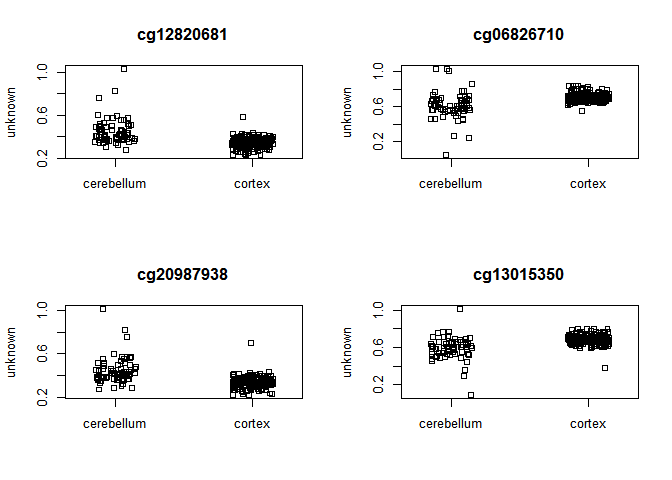
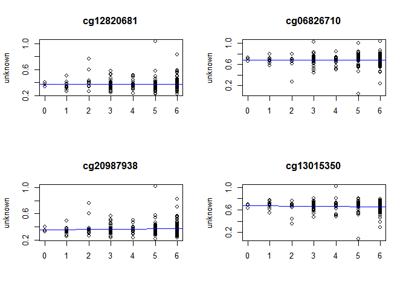

BATCH CORRECTED ONLY DMP,DMR
================

``` r
#Loading necessary packages: Functions of packages are noted here also for HW Assignment Q1-5
#Supressing warnings that were appearing to make my markdown less cluttered
options(warn=-1) 
suppressWarnings(suppressMessages(library(ggfortify)))
suppressWarnings(suppressMessages(library(gridExtra)))
suppressWarnings(suppressMessages(library(plotly)))
suppressWarnings(suppressMessages(library(GEOquery)))
suppressWarnings(suppressMessages(library(wateRmelon)))
suppressWarnings(suppressMessages(library(minfi)))
suppressWarnings(suppressMessages(library(limma)))
suppressWarnings(suppressMessages(library(IlluminaHumanMethylation450kanno.ilmn12.hg19)))
suppressWarnings(suppressMessages(library(IlluminaHumanMethylation450kmanifest)))
suppressWarnings(suppressMessages(library(RColorBrewer)))
suppressWarnings(suppressMessages(library(missMethyl)))
suppressWarnings(suppressMessages(library(matrixStats)))
suppressWarnings(suppressMessages(library(minfiData)))
suppressWarnings(suppressMessages(library(Gviz)))
suppressWarnings(suppressMessages(library(DMRcate)))
suppressWarnings(suppressMessages(library(gplots)))
suppressWarnings(suppressMessages(library(ggplot2)))
suppressWarnings(suppressMessages(library(stringr)))
suppressWarnings(suppressMessages(library(tidyverse)))
suppressWarnings(suppressMessages(library(data.table)))
suppressWarnings(suppressMessages(library(colorspace)))
suppressWarnings(suppressMessages(library(VennDiagram)))
suppressWarnings(suppressMessages(library(qpcR)))

library(ggfortify) #For plotting
library(gridExtra) #For plotting
library(plotly) #For plotting
library(GEOquery) #For downloading genetic data
library(wateRmelon) #For model/analyses
library(limma) #For model/analyses
library(minfi) #For model/analyses
library(IlluminaHumanMethylation450kanno.ilmn12.hg19) #Gene annotation for analyses
library(IlluminaHumanMethylation450kmanifest) #Gene annotation for analyses
library(RColorBrewer) #Colors for plotting
library(missMethyl)  #For model/analyses
library(matrixStats) #For data manipulation
library(minfiData) #For model/analyses
library(Gviz) #For DMR plotting
library(DMRcate) #For DMR model/analyses
library(gplots) #For plotting
library(ggplot2) #For plotting
library(stringr) #For data manipulation
library(tidyverse) #For data manipulation
library(data.table) #For data manipulation
library(colorspace) #Colors for plotting
library(VennDiagram) #Necessary for the overlap counts/venn diagram
library(qpcR) #Necessary for the overlap counts/venn diagram

#Assigning annotation information for CpG probes on the 450k array
ann450k = getAnnotation(IlluminaHumanMethylation450kanno.ilmn12.hg19)
head(ann450k)
```

    ## DataFrame with 6 rows and 33 columns
    ##                    chr       pos      strand        Name    AddressA
    ##            <character> <integer> <character> <character> <character>
    ## cg00050873        chrY   9363356           -  cg00050873    32735311
    ## cg00212031        chrY  21239348           -  cg00212031    29674443
    ## cg00213748        chrY   8148233           -  cg00213748    30703409
    ## cg00214611        chrY  15815688           -  cg00214611    69792329
    ## cg00455876        chrY   9385539           -  cg00455876    27653438
    ## cg01707559        chrY   6778695           +  cg01707559    45652402
    ##               AddressB                                          ProbeSeqA
    ##            <character>                                        <character>
    ## cg00050873    31717405 ACAAAAAAACAACACACAACTATAATAATTTTTAAAATAAATAAACCCCA
    ## cg00212031    38703326 CCCAATTAACCACAAAAACTAAACAAATTATACAATCAAAAAAACATACA
    ## cg00213748    36767301 TTTTAACACCTAACACCATTTTAACAATAAAAATTCTACAAAAAAAAACA
    ## cg00214611    46723459 CTAACTTCCAAACCACACTTTATATACTAAACTACAATATAACACAAACA
    ## cg00455876    69732350 AACTCTAAACTACCCAACACAAACTCCAAAAACTTCTCAAAAAAAACTCA
    ## cg01707559    64689504 ACAAATTAAAAACACTAAAACAAACACAACAACTACAACAACAAAAAACA
    ##                                                     ProbeSeqB        Type
    ##                                                   <character> <character>
    ## cg00050873 ACGAAAAAACAACGCACAACTATAATAATTTTTAAAATAAATAAACCCCG           I
    ## cg00212031 CCCAATTAACCGCAAAAACTAAACAAATTATACGATCGAAAAAACGTACG           I
    ## cg00213748 TTTTAACGCCTAACACCGTTTTAACGATAAAAATTCTACAAAAAAAAACG           I
    ## cg00214611 CTAACTTCCGAACCGCGCTTTATATACTAAACTACAATATAACGCGAACG           I
    ## cg00455876 AACTCTAAACTACCCGACACAAACTCCAAAAACTTCTCGAAAAAAACTCG           I
    ## cg01707559 GCGAATTAAAAACACTAAAACGAACGCGACGACTACAACGACAAAAAACG           I
    ##               NextBase       Color    Probe_rs Probe_maf      CpG_rs
    ##            <character> <character> <character> <numeric> <character>
    ## cg00050873           A         Red          NA        NA          NA
    ## cg00212031           T         Red          NA        NA          NA
    ## cg00213748           A         Red          NA        NA          NA
    ## cg00214611           A         Red          NA        NA          NA
    ## cg00455876           A         Red          NA        NA          NA
    ## cg01707559           A         Red          NA        NA          NA
    ##              CpG_maf      SBE_rs   SBE_maf           Islands_Name
    ##            <numeric> <character> <numeric>            <character>
    ## cg00050873        NA          NA        NA   chrY:9363680-9363943
    ## cg00212031        NA          NA        NA chrY:21238448-21240005
    ## cg00213748        NA          NA        NA   chrY:8147877-8148210
    ## cg00214611        NA          NA        NA chrY:15815488-15815779
    ## cg00455876        NA          NA        NA   chrY:9385471-9385777
    ## cg01707559        NA          NA        NA   chrY:6778574-6780028
    ##            Relation_to_Island
    ##                   <character>
    ## cg00050873            N_Shore
    ## cg00212031             Island
    ## cg00213748            S_Shore
    ## cg00214611             Island
    ## cg00455876             Island
    ## cg01707559             Island
    ##                                                                                                                        Forward_Sequence
    ##                                                                                                                             <character>
    ## cg00050873 TATCTCTGTCTGGCGAGGAGGCAACGCACAACTGTGGTGGTTTTTGGAGTGGGTGGACCC[CG]GCCAAGACGGCCTGGGCTGACCAGAGACGGGAGGCAGAAAAAGTGGGCAGGTGGTTGCAG
    ## cg00212031 CCATTGGCCCGCCCCAGTTGGCCGCAGGGACTGAGCAAGTTATGCGGTCGGGAAGACGTG[CG]TTAAAGGGCTGAAGGGGAGGGACGGAACTGACAGTCTCTGTGACAGCTCTGAGGTGGGAG
    ## cg00213748 TCTGTGGGACCATTTTAACGCCTGGCACCGTTTTAACGATGGAGGTTCTGCAGGAGGGGG[CG]ACCTGGGGTAGGAGGCGTGCTAGTGGTGGATGACATTGTGGCAGAGATGGAGGTGGTGGC
    ## cg00214611 GCGCCGGCAGGACTAGCTTCCGGGCCGCGCTTTGTGTGCTGGGCTGCAGTGTGGCGCGGG[CG]AGGAAGCTGGTAGGGCGGTTGTCGCAAGCTCCAGCTGCAGCCTCCGCCTACGTGAGAAGA
    ## cg00455876 CGCGTGTGCCTGGACTCTGAGCTACCCGGCACAAGCTCCAAGGGCTTCTCGGAGGAGGCT[CG]GGGACGGAAGGCGTGGGGTGAGTGGGCTGGAGATGCAGGCGCGCCCGTGGCTGTGCAGCC
    ## cg01707559 AGCGGCCGCTCCCAGTGGTGGTCACCGCCAGTGCCAATCCCTTGCGCCGCCGTGCAGTCC[CG]CCCTCTGTCGCTGCAGCCGCCGCGCCCGCTCCAGTGCCCCCAATTCGCGCTCGGGAGTGA
    ##                                                     SourceSeq Random_Loci
    ##                                                   <character> <character>
    ## cg00050873 CGGGGTCCACCCACTCCAAAAACCACCACAGTTGTGCGTTGCCTCCTCGC            
    ## cg00212031 CGCACGTCTTCCCGACCGCATAACTTGCTCAGTCCCTGCGGCCAACTGGG            
    ## cg00213748 CGCCCCCTCCTGCAGAACCTCCATCGTTAAAACGGTGCCAGGCGTTAAAA            
    ## cg00214611 CGCCCGCGCCACACTGCAGCCCAGCACACAAAGCGCGGCCCGGAAGCTAG            
    ## cg00455876 GACTCTGAGCTACCCGGCACAAGCTCCAAGGGCTTCTCGGAGGAGGCTCG            
    ## cg01707559 CGCCCTCTGTCGCTGCAGCCGCCGCGCCCGCTCCAGTGCCCCCAATTCGC            
    ##            Methyl27_Loci UCSC_RefGene_Name        UCSC_RefGene_Accession
    ##              <character>       <character>                   <character>
    ## cg00050873                  TSPY4;FAM197Y2        NM_001164471;NR_001553
    ## cg00212031                          TTTY14                     NR_001543
    ## cg00213748                                                              
    ## cg00214611                   TMSB4Y;TMSB4Y           NM_004202;NM_004202
    ## cg00455876                                                              
    ## cg01707559               TBL1Y;TBL1Y;TBL1Y NM_134259;NM_033284;NM_134258
    ##              UCSC_RefGene_Group     Phantom         DMR    Enhancer
    ##                     <character> <character> <character> <character>
    ## cg00050873         Body;TSS1500                                    
    ## cg00212031               TSS200                                    
    ## cg00213748                                                         
    ## cg00214611        1stExon;5'UTR                                    
    ## cg00455876                                                         
    ## cg01707559 TSS200;TSS200;TSS200                                    
    ##                     HMM_Island Regulatory_Feature_Name
    ##                    <character>             <character>
    ## cg00050873   Y:9973136-9976273                        
    ## cg00212031 Y:19697854-19699393                        
    ## cg00213748   Y:8207555-8208234                        
    ## cg00214611 Y:14324883-14325218     Y:15815422-15815706
    ## cg00455876   Y:9993394-9995882                        
    ## cg01707559   Y:6838022-6839951                        
    ##                          Regulatory_Feature_Group         DHS
    ##                                       <character> <character>
    ## cg00050873                                                   
    ## cg00212031                                                   
    ## cg00213748                                                   
    ## cg00214611 Promoter_Associated_Cell_type_specific            
    ## cg00455876                                                   
    ## cg01707559

``` r
#Load data and meta files
load("C:/Users/GiLL/Desktop/Mar 22 Methyl/GSE43414_batch_cor.RData", verbose=TRUE) 
```

    ## Loading objects:
    ##   GSE43414_batch_cor

``` r
load("C:/Users/GiLL/Desktop/Mar 22 Methyl/Meta_batch_cor.RData", verbose=TRUE)
```

    ## Loading objects:
    ##   meta

``` r
## transpose data such that probe names are colnames, and rows are patient samples
transpose_GSE43414_batch_cor <- t(GSE43414_batch_cor)
## order metadata by brain region to remove lunnon NA cases
meta_order_by_braak <- meta %>% arrange(braak.stage)
meta_order_by_braakdf <- as.data.frame(meta_order_by_braak)

#Remordering samples in beta data based on lunnon et al.
matches_GSE43414_batch_cor <- match(meta_order_by_braakdf$barcode, rownames(transpose_GSE43414_batch_cor))
GSE43414_batch_cor_sorted_by_braak <- t(transpose_GSE43414_batch_cor[matches_GSE43414_batch_cor,])
GSE43414_batch_cor_sorted_by_braakdf <- as.data.frame(GSE43414_batch_cor_sorted_by_braak)

#Removing NA and braak exclude samples in meta 
meta_order_by_braakdf <- meta_order_by_braakdf[-c(280:432), ]

#Removing the NA and braak exclude samples in data
GSE43414_batch_cor_sorted_by_braakdf <- subset(GSE43414_batch_cor_sorted_by_braakdf, select = -c(280:432))
GSE43414_batch_cor_sorted_by_braakmat <- as.matrix(GSE43414_batch_cor_sorted_by_braakdf)

#Create broad regions column
meta_order_by_braakdf$broad_regions <- ifelse(meta_order_by_braakdf$Tissue == "cerebellum", "cerebellum","cortex")

#Making tissue names and braak stage syntactically valid for analysis later (removes space, adds ".", numeric stage)
meta_order_by_braakdf$braak.stage <- as.numeric(meta_order_by_braakdf$braak.stage)

str(meta_order_by_braakdf)
```

    ## 'data.frame':    279 obs. of  17 variables:
    ##  $ series_id        : chr  "GSE43414" "GSE43414" "GSE43414" "GSE43414" ...
    ##  $ gsm              : chr  "GSM1068965" "GSM1069176" "GSM1069080" "GSM1069136" ...
    ##  $ Subject          : chr  "1" "1" "1" "6" ...
    ##  $ barcode          : chr  "6042316048_R05C01" "6042316103_R06C02" "6969568118_R03C02" "6042316054_R04C01" ...
    ##  $ lunnon.et.al     : chr  "TRUE" "TRUE" "TRUE" "TRUE" ...
    ##  $ tissue.code      : chr  "A" "F" "E" "F" ...
    ##  $ braak.stage      : num  0 0 0 1 1 1 1 1 1 1 ...
    ##  $ Sex              : chr  "FEMALE" "FEMALE" "FEMALE" "MALE" ...
    ##  $ ad.disease.status: chr  "C" "C" "C" "C" ...
    ##  $ age.brain        : num  82 82 82 78 85 85 92 78 78 85 ...
    ##  $ age.blood        : chr  "79" "79" "79" "78" ...
    ##  $ Tissue           : chr  "frontal cortex" "superior temporal gyrus" "entorhinal cortex" "superior temporal gyrus" ...
    ##  $ Neuron           : num  0.442 0.487 0.33 0.408 0.307 ...
    ##  $ Glia             : num  0.558 0.513 0.67 0.592 0.693 ...
    ##  $ chip             : chr  "6042316048" "6042316103" "6969568118" "6042316054" ...
    ##  $ row              : chr  "05" "06" "03" "04" ...
    ##  $ broad_regions    : chr  "cortex" "cortex" "cortex" "cortex" ...

``` r
str(GSE43414_batch_cor_sorted_by_braakdf)
```

    ## 'data.frame':    338359 obs. of  279 variables:
    ##  $ 6042316048_R05C01: num  0.564 0.75 0.345 0.798 0.5 ...
    ##  $ 6042316103_R06C02: num  0.571 0.813 0.158 0.769 0.469 ...
    ##  $ 6969568118_R03C02: num  0.646 0.828 0.263 0.83 0.525 ...
    ##  $ 6042316054_R04C01: num  0.602 0.805 0.225 0.799 0.428 ...
    ##  $ 6042316063_R05C01: num  0.558 0.776 0.362 0.78 0.413 ...
    ##  $ 6042316069_R03C01: num  0.625 0.808 0.262 0.828 0.46 ...
    ##  $ 6042316094_R05C01: num  0.583 0.859 0.337 0.837 0.554 ...
    ##  $ 6042316099_R01C01: num  0.569 0.783 0.296 0.809 0.398 ...
    ##  $ 6042316127_R03C01: num  0.68 0.762 0.354 0.831 0.488 ...
    ##  $ 6057825014_R02C02: num  0.623 0.955 0.387 0.817 0.505 ...
    ##  $ 6057825017_R06C01: num  0.696 0.946 0.308 0.834 0.508 ...
    ##  $ 6969568084_R02C01: num  0.543 0.795 0.218 0.815 0.425 ...
    ##  $ 6969568118_R01C02: num  0.582 0.794 0.472 0.761 0.592 ...
    ##  $ 7786923046_R03C02: num  0.531 0.864 0.183 0.868 0.486 ...
    ##  $ 7786923107_R04C01: num  0.598 0.865 0.259 0.862 0.514 ...
    ##  $ 6042316066_R05C01: num  0.695 0.801 0.297 0.841 0.475 ...
    ##  $ 6042316103_R02C01: num  0.616 0.81 0.224 0.813 0.497 ...
    ##  $ 6042316103_R03C01: num  0.492 0.782 0.184 0.794 0.411 ...
    ##  $ 6042316121_R04C02: num  0.544 0.799 0.262 0.837 0.422 ...
    ##  $ 6929718123_R02C02: num  0.665 0.54 0.497 0.745 0.426 ...
    ##  $ 6969568084_R03C02: num  0.581 0.779 0.295 0.818 0.425 ...
    ##  $ 6969568087_R03C01: num  0.541 0.797 0.243 0.801 0.416 ...
    ##  $ 6969568087_R03C02: num  0.693 0.815 0.258 0.842 0.588 ...
    ##  $ 7796806002_R04C02: num  0.558 0.783 0.228 0.86 0.523 ...
    ##  $ 7796806022_R04C02: num  0.665 0.671 0.398 0.789 0.54 ...
    ##  $ 7796806038_R03C02: num  0.547 0.869 0.198 0.858 0.464 ...
    ##  $ 6042316035_R01C01: num  0.555 0.879 0.276 0.855 0.468 ...
    ##  $ 6042316035_R05C02: num  0.618 0.809 0.194 0.787 0.58 ...
    ##  $ 6042316036_R04C02: num  0.591 0.815 0.273 0.865 0.478 ...
    ##  $ 6042316036_R05C02: num  0.634 0.775 0.25 0.763 0.512 ...
    ##  $ 6042316048_R03C01: num  0.675 0.788 0.202 0.882 0.467 ...
    ##  $ 6042316050_R01C02: num  0.628 0.804 0.202 0.837 0.44 ...
    ##  $ 6042316050_R04C02: num  0.518 0.767 0.259 0.812 0.542 ...
    ##  $ 6042316050_R05C02: num  0.534 0.83 0.301 0.752 0.411 ...
    ##  $ 6042316050_R06C01: num  0.658 0.816 0.424 0.797 0.488 ...
    ##  $ 6042316053_R01C01: num  0.561 0.799 0.251 0.826 0.499 ...
    ##  $ 6042316054_R03C01: num  0.519 0.827 0.237 0.825 0.41 ...
    ##  $ 6042316061_R03C02: num  0.636 0.797 0.208 0.83 0.531 ...
    ##  $ 6042316066_R01C01: num  0.511 0.78 0.201 0.817 0.44 ...
    ##  $ 6042316066_R06C02: num  0.575 0.811 0.385 0.823 0.582 ...
    ##  $ 6042316085_R01C01: num  0.502 0.564 0.489 0.878 0.537 ...
    ##  $ 6042316110_R06C01: num  0.69 0.791 0.22 0.847 0.532 ...
    ##  $ 6042316121_R03C01: num  0.605 0.788 0.281 0.878 0.513 ...
    ##  $ 6042316121_R05C01: num  0.584 0.818 0.243 0.794 0.455 ...
    ##  $ 6042316127_R01C02: num  0.636 0.663 0.462 0.806 0.571 ...
    ##  $ 6042316127_R04C01: num  0.639 0.799 0.249 0.779 0.459 ...
    ##  $ 6057825008_R02C02: num  0.604 0.665 0.309 0.863 0.533 ...
    ##  $ 6057825008_R04C01: num  0.581 0.807 0.258 0.856 0.477 ...
    ##  $ 6057825017_R04C02: num  0.601 0.937 0.115 0.868 0.48 ...
    ##  $ 6057825017_R05C02: num  0.66 0.757 0.176 0.804 0.545 ...
    ##  $ 6057825018_R03C02: num  0.517 0.77 0.409 0.816 0.48 ...
    ##  $ 6057825018_R04C02: num  0.56 0.682 0.253 0.863 0.547 ...
    ##  $ 6929718123_R03C02: num  0.63 0.83 0.228 0.845 0.513 ...
    ##  $ 6929718136_R02C02: num  0.61 0.832 0.249 0.819 0.455 ...
    ##  $ 6929718136_R03C01: num  0.622 0.828 0.307 0.854 0.527 ...
    ##  $ 6929718138_R04C01: num  0.595 0.826 0.287 0.863 0.529 ...
    ##  $ 6929718138_R06C02: num  0.601 0.804 0.321 0.861 0.528 ...
    ##  $ 6969568082_R06C01: num  0.543 0.806 0.29 0.828 0.394 ...
    ##  $ 6969568084_R04C01: num  0.587 0.779 0.25 0.824 0.544 ...
    ##  $ 6969568087_R06C02: num  0.552 0.771 0.268 0.801 0.431 ...
    ##  $ 6969568118_R02C01: num  0.558 0.806 0.187 0.835 0.555 ...
    ##  $ 6969568118_R03C01: num  0.556 0.759 0.222 0.811 0.467 ...
    ##  $ 7786923063_R03C01: num  0.693 0.699 0.214 0.78 0.482 ...
    ##  $ 7786923107_R05C01: num  0.506 0.765 0.164 0.818 0.471 ...
    ##  $ 7786923107_R06C01: num  0.628 0.786 0.263 0.788 0.539 ...
    ##  $ 7796806022_R05C02: num  0.5 0.871 0.215 0.853 0.481 ...
    ##  $ 6042316035_R03C02: num  0.543 0.894 0.293 0.847 0.548 ...
    ##  $ 6042316035_R04C01: num  0.603 0.781 0.228 0.82 0.49 ...
    ##  $ 6042316050_R02C02: num  0.769 0.757 0.278 0.862 0.522 ...
    ##  $ 6042316053_R02C02: num  0.61 0.846 0.25 0.856 0.526 ...
    ##  $ 6042316053_R03C02: num  0.579 0.823 0.277 0.844 0.413 ...
    ##  $ 6042316063_R03C01: num  0.592 0.795 0.273 0.86 0.527 ...
    ##  $ 6042316063_R03C02: num  0.689 0.796 0.208 0.842 0.544 ...
    ##  $ 6042316069_R02C01: num  0.615 0.772 0.256 0.795 0.417 ...
    ##  $ 6042316085_R05C01: num  0.544 0.755 0.271 0.772 0.474 ...
    ##  $ 6042316094_R06C01: num  0.643 0.748 0.23 0.815 0.542 ...
    ##  $ 6042316099_R02C01: num  0.537 0.812 0.247 0.853 0.487 ...
    ##  $ 6042316107_R03C01: num  0.622 0.791 0.404 0.807 0.538 ...
    ##  $ 6042316113_R06C01: num  0.613 0.739 0.252 0.789 0.52 ...
    ##  $ 6057825014_R03C01: num  0.609 0.74 0.374 0.86 0.471 ...
    ##  $ 6057825018_R05C02: num  0.639 0.747 0.181 0.829 0.544 ...
    ##  $ 6929718136_R05C01: num  0.587 0.842 0.169 0.831 0.513 ...
    ##  $ 6929718138_R01C01: num  0.496 0.832 0.267 0.833 0.468 ...
    ##  $ 6969568084_R05C02: num  0.611 0.821 0.224 0.808 0.508 ...
    ##  $ 6969568087_R02C01: num  0.73 0.815 0.236 0.825 0.518 ...
    ##  $ 6969568118_R06C02: num  0.681 0.804 0.253 0.842 0.531 ...
    ##  $ 6042316035_R02C02: num  0.603 0.894 0.289 0.84 0.513 ...
    ##  $ 6042316048_R02C01: num  0.576 0.831 0.231 0.797 0.561 ...
    ##  $ 6042316050_R06C02: num  0.605 0.805 0.215 0.817 0.503 ...
    ##  $ 6042316053_R06C02: num  0.629 0.793 0.242 0.809 0.498 ...
    ##  $ 6042316054_R02C02: num  0.619 0.826 0.402 0.833 0.501 ...
    ##  $ 6042316054_R04C02: num  0.478 0.819 0.19 0.86 0.419 ...
    ##  $ 6042316061_R03C01: num  0.481 0.811 0.213 0.82 0.487 ...
    ##  $ 6042316061_R04C01: num  0.608 0.817 0.244 0.837 0.571 ...
    ##  $ 6042316061_R05C01: num  0.678 0.821 0.266 0.826 0.526 ...
    ##  $ 6042316063_R02C01: num  0.578 0.799 0.308 0.807 0.451 ...
    ##  $ 6042316063_R04C02: num  0.598 0.808 0.226 0.848 0.497 ...
    ##  $ 6042316065_R06C02: num  0.668 0.739 0.316 0.847 0.457 ...
    ##  $ 6042316066_R02C02: num  0.647 0.812 0.204 0.829 0.517 ...
    ##   [list output truncated]

``` r
#Creating beta and M value dataframes
B.norm <- GSE43414_batch_cor_sorted_by_braakmat
B.normdf <- as.data.frame(B.norm)

M.norm <- beta2m(GSE43414_batch_cor_sorted_by_braakmat)
M.normdf <- as.data.frame(M.norm)

#Memory Cleaning - Necessary when data is large
rm(GSE43414_batch_cor)
rm(transpose_GSE43414_batch_cor)
rm(GSE43414_batch_cor_sorted_by_braak)
```

``` r
# Pre-DMRcate Setup

# create the design for the model
design <- model.matrix(~meta_order_by_braakdf$broad_regions+meta_order_by_braakdf$braak.stage+meta_order_by_braakdf$Sex+meta_order_by_braakdf$age.brain, row.names=T)
View(design)

# fit the linear model
fit <- lmFit(M.norm, design)

# fit the contrasts
fit2 <- eBayes(fit)

# look at the numbers of DM CpGs at FDR < 0.05
summary(decideTests(fit2))
```

    ##    (Intercept) meta_order_by_braakdf$broad_regionscortex
    ## -1      150572                                     52992
    ## 0        27896                                    225325
    ## 1       159891                                     60042
    ##    meta_order_by_braakdf$braak.stage meta_order_by_braakdf$SexMALE
    ## -1                               484                          4501
    ## 0                             337367                        291450
    ## 1                                508                         42408
    ##    meta_order_by_braakdf$age.brain
    ## -1                             793
    ## 0                           335219
    ## 1                             2347

``` r
# get the table of results for the first contrast
ann450ksub <- ann450k[match(rownames(M.norm),ann450k$Name),
c(1:4,12:19,24:ncol(ann450k))]

DMPs <- topTable(fit2, num=Inf, coef=2, genelist=ann450ksub)
str(DMPs)
```

    ## 'data.frame':    338359 obs. of  28 variables:
    ##  $ chr                     : chr  "chr7" "chr1" "chr7" "chr11" ...
    ##  $ pos                     : int  155166290 246939249 155244149 493208 99736304 39666961 64711268 122535518 155264170 44199597 ...
    ##  $ strand                  : chr  "+" "-" "-" "+" ...
    ##  $ Name                    : chr  "cg12820681" "cg06826710" "cg20987938" "cg13015350" ...
    ##  $ Probe_rs                : chr  NA "rs6426334" NA NA ...
    ##  $ Probe_maf               : num  NA 0.468 NA NA NA ...
    ##  $ CpG_rs                  : chr  NA NA NA NA ...
    ##  $ CpG_maf                 : num  NA NA NA NA NA NA NA NA NA NA ...
    ##  $ SBE_rs                  : chr  NA NA NA NA ...
    ##  $ SBE_maf                 : num  NA NA NA NA NA NA NA NA NA NA ...
    ##  $ Islands_Name            : chr  "chr7:155164557-155167854" "" "chr7:155244046-155244357" "chr11:494853-495156" ...
    ##  $ Relation_to_Island      : chr  "Island" "OpenSea" "Island" "N_Shore" ...
    ##  $ UCSC_RefGene_Name       : chr  "" "" "" "" ...
    ##  $ UCSC_RefGene_Accession  : chr  "" "" "" "" ...
    ##  $ UCSC_RefGene_Group      : chr  "" "" "" "" ...
    ##  $ Phantom                 : chr  "" "" "" "" ...
    ##  $ DMR                     : chr  "DMR" "" "" "" ...
    ##  $ Enhancer                : chr  "TRUE" "" "" "" ...
    ##  $ HMM_Island              : chr  "" "1:245005810-245005900" "7:154934147-154937118" "11:482969-483211" ...
    ##  $ Regulatory_Feature_Name : chr  "" "" "" "11:493116-493264" ...
    ##  $ Regulatory_Feature_Group: chr  "" "" "" "Unclassified_Cell_type_specific" ...
    ##  $ DHS                     : chr  "" "" "" "" ...
    ##  $ logFC                   : num  -0.569 0.756 -0.583 0.622 0.565 ...
    ##  $ AveExpr                 : num  -0.768 1.093 -0.815 0.976 0.949 ...
    ##  $ t                       : num  -10.6 10.3 -10.3 10.1 10.1 ...
    ##  $ P.Value                 : num  2.82e-22 2.06e-21 2.31e-21 9.42e-21 1.41e-20 ...
    ##  $ adj.P.Val               : num  9.53e-17 2.61e-16 2.61e-16 7.97e-16 9.26e-16 ...
    ##  $ B                       : num  39.8 37.8 37.7 36.4 36 ...

``` r
DMPsbatch <- DMPs

# Saving the data.frame file as an Excel
write.table(DMPsbatch, file="Batch-DMPs.csv", sep=",", row.names=FALSE)

# As a quick check, plot the top 4 most significantly differentially methylated CpGs, Tissue
par(mfrow=c(2,2))
sapply(rownames(DMPs)[1:4], function(cpg){
plotCpg(B.norm, cpg=cpg, pheno=meta_order_by_braakdf$broad_regions, type = "categorical", measure = "beta")
})
```



    ## $cg12820681
    ## NULL
    ## 
    ## $cg06826710
    ## NULL
    ## 
    ## $cg20987938
    ## NULL
    ## 
    ## $cg13015350
    ## NULL

``` r
# As a quick check, plot the top 4 most significantly differentially methylated CpGs, Braak
par(mfrow=c(2,2))
sapply(rownames(DMPs)[1:4], function(cpg){
plotCpg(B.norm, cpg=cpg, pheno=meta_order_by_braakdf$braak.stage, type = "continuous", measure = "beta")
})
```



    ## $cg12820681
    ## NULL
    ## 
    ## $cg06826710
    ## NULL
    ## 
    ## $cg20987938
    ## NULL
    ## 
    ## $cg13015350
    ## NULL
