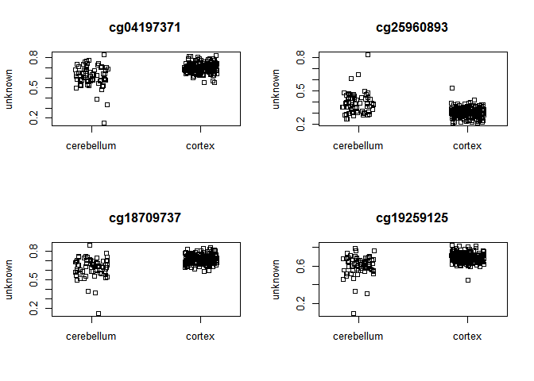
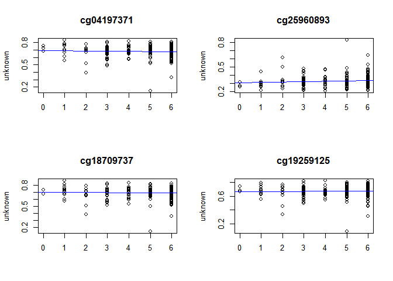
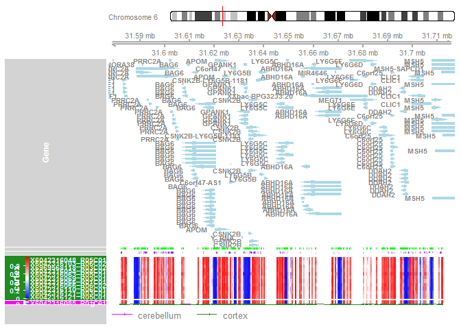
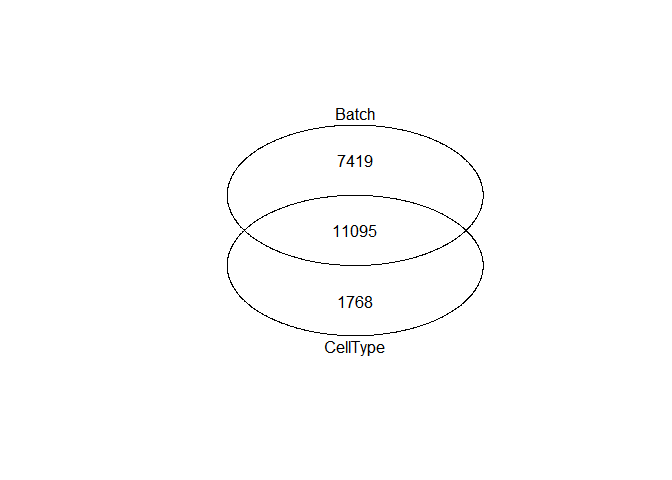

CELL-TYPE AND BATCH CORRECTED DMP,DMR
================

``` r
#Loading necessary packages: Functions of packages are noted here also for HW Assignment Q1-5
#Supressing warnings that were appearing to make my markdown less cluttered
options(warn=-1) 
suppressWarnings(suppressMessages(library(ggfortify)))
suppressWarnings(suppressMessages(library(gridExtra)))
suppressWarnings(suppressMessages(library(plotly)))
suppressWarnings(suppressMessages(library(GEOquery)))
suppressWarnings(suppressMessages(library(wateRmelon)))
suppressWarnings(suppressMessages(library(minfi)))
suppressWarnings(suppressMessages(library(limma)))
suppressWarnings(suppressMessages(library(IlluminaHumanMethylation450kanno.ilmn12.hg19)))
suppressWarnings(suppressMessages(library(IlluminaHumanMethylation450kmanifest)))
suppressWarnings(suppressMessages(library(RColorBrewer)))
suppressWarnings(suppressMessages(library(missMethyl)))
suppressWarnings(suppressMessages(library(matrixStats)))
suppressWarnings(suppressMessages(library(minfiData)))
suppressWarnings(suppressMessages(library(Gviz)))
suppressWarnings(suppressMessages(library(DMRcate)))
suppressWarnings(suppressMessages(library(gplots)))
suppressWarnings(suppressMessages(library(ggplot2)))
suppressWarnings(suppressMessages(library(stringr)))
suppressWarnings(suppressMessages(library(tidyverse)))
suppressWarnings(suppressMessages(library(data.table)))
suppressWarnings(suppressMessages(library(colorspace)))
suppressWarnings(suppressMessages(library(VennDiagram)))
suppressWarnings(suppressMessages(library(qpcR)))

library(readr) #reading csv file
library(lumi)
library(ggfortify) #For plotting
library(gridExtra) #For plotting
library(plotly) #For plotting
library(GEOquery) #For downloading genetic data
library(wateRmelon) #For model/analyses
library(limma) #For model/analyses
library(minfi) #For model/analyses
library(IlluminaHumanMethylation450kanno.ilmn12.hg19) #Gene annotation for analyses
library(IlluminaHumanMethylation450kmanifest) #Gene annotation for analyses
library(RColorBrewer) #Colors for plotting
library(missMethyl)  #For model/analyses
library(matrixStats) #For data manipulation
library(minfiData) #For model/analyses
library(Gviz) #For DMR plotting
library(DMRcate) #For DMR model/analyses
library(gplots) #For plotting
library(ggplot2) #For plotting
library(stringr) #For data manipulation
library(tidyverse) #For data manipulation
library(data.table) #For data manipulation
library(colorspace) #Colors for plotting
library(VennDiagram) #Necessary for the overlap counts/venn diagram
library(qpcR) #Necessary for the overlap counts/venn diagram
library(methylumi)
library(parallel)

#Assigning annotation information for CpG probes on the 450k array
ann450k = getAnnotation(IlluminaHumanMethylation450kanno.ilmn12.hg19)
head(ann450k)
```

    ## DataFrame with 6 rows and 33 columns
    ##                    chr       pos      strand        Name    AddressA
    ##            <character> <integer> <character> <character> <character>
    ## cg00050873        chrY   9363356           -  cg00050873    32735311
    ## cg00212031        chrY  21239348           -  cg00212031    29674443
    ## cg00213748        chrY   8148233           -  cg00213748    30703409
    ## cg00214611        chrY  15815688           -  cg00214611    69792329
    ## cg00455876        chrY   9385539           -  cg00455876    27653438
    ## cg01707559        chrY   6778695           +  cg01707559    45652402
    ##               AddressB                                          ProbeSeqA
    ##            <character>                                        <character>
    ## cg00050873    31717405 ACAAAAAAACAACACACAACTATAATAATTTTTAAAATAAATAAACCCCA
    ## cg00212031    38703326 CCCAATTAACCACAAAAACTAAACAAATTATACAATCAAAAAAACATACA
    ## cg00213748    36767301 TTTTAACACCTAACACCATTTTAACAATAAAAATTCTACAAAAAAAAACA
    ## cg00214611    46723459 CTAACTTCCAAACCACACTTTATATACTAAACTACAATATAACACAAACA
    ## cg00455876    69732350 AACTCTAAACTACCCAACACAAACTCCAAAAACTTCTCAAAAAAAACTCA
    ## cg01707559    64689504 ACAAATTAAAAACACTAAAACAAACACAACAACTACAACAACAAAAAACA
    ##                                                     ProbeSeqB        Type
    ##                                                   <character> <character>
    ## cg00050873 ACGAAAAAACAACGCACAACTATAATAATTTTTAAAATAAATAAACCCCG           I
    ## cg00212031 CCCAATTAACCGCAAAAACTAAACAAATTATACGATCGAAAAAACGTACG           I
    ## cg00213748 TTTTAACGCCTAACACCGTTTTAACGATAAAAATTCTACAAAAAAAAACG           I
    ## cg00214611 CTAACTTCCGAACCGCGCTTTATATACTAAACTACAATATAACGCGAACG           I
    ## cg00455876 AACTCTAAACTACCCGACACAAACTCCAAAAACTTCTCGAAAAAAACTCG           I
    ## cg01707559 GCGAATTAAAAACACTAAAACGAACGCGACGACTACAACGACAAAAAACG           I
    ##               NextBase       Color    Probe_rs Probe_maf      CpG_rs
    ##            <character> <character> <character> <numeric> <character>
    ## cg00050873           A         Red          NA        NA          NA
    ## cg00212031           T         Red          NA        NA          NA
    ## cg00213748           A         Red          NA        NA          NA
    ## cg00214611           A         Red          NA        NA          NA
    ## cg00455876           A         Red          NA        NA          NA
    ## cg01707559           A         Red          NA        NA          NA
    ##              CpG_maf      SBE_rs   SBE_maf           Islands_Name
    ##            <numeric> <character> <numeric>            <character>
    ## cg00050873        NA          NA        NA   chrY:9363680-9363943
    ## cg00212031        NA          NA        NA chrY:21238448-21240005
    ## cg00213748        NA          NA        NA   chrY:8147877-8148210
    ## cg00214611        NA          NA        NA chrY:15815488-15815779
    ## cg00455876        NA          NA        NA   chrY:9385471-9385777
    ## cg01707559        NA          NA        NA   chrY:6778574-6780028
    ##            Relation_to_Island
    ##                   <character>
    ## cg00050873            N_Shore
    ## cg00212031             Island
    ## cg00213748            S_Shore
    ## cg00214611             Island
    ## cg00455876             Island
    ## cg01707559             Island
    ##                                                                                                                        Forward_Sequence
    ##                                                                                                                             <character>
    ## cg00050873 TATCTCTGTCTGGCGAGGAGGCAACGCACAACTGTGGTGGTTTTTGGAGTGGGTGGACCC[CG]GCCAAGACGGCCTGGGCTGACCAGAGACGGGAGGCAGAAAAAGTGGGCAGGTGGTTGCAG
    ## cg00212031 CCATTGGCCCGCCCCAGTTGGCCGCAGGGACTGAGCAAGTTATGCGGTCGGGAAGACGTG[CG]TTAAAGGGCTGAAGGGGAGGGACGGAACTGACAGTCTCTGTGACAGCTCTGAGGTGGGAG
    ## cg00213748 TCTGTGGGACCATTTTAACGCCTGGCACCGTTTTAACGATGGAGGTTCTGCAGGAGGGGG[CG]ACCTGGGGTAGGAGGCGTGCTAGTGGTGGATGACATTGTGGCAGAGATGGAGGTGGTGGC
    ## cg00214611 GCGCCGGCAGGACTAGCTTCCGGGCCGCGCTTTGTGTGCTGGGCTGCAGTGTGGCGCGGG[CG]AGGAAGCTGGTAGGGCGGTTGTCGCAAGCTCCAGCTGCAGCCTCCGCCTACGTGAGAAGA
    ## cg00455876 CGCGTGTGCCTGGACTCTGAGCTACCCGGCACAAGCTCCAAGGGCTTCTCGGAGGAGGCT[CG]GGGACGGAAGGCGTGGGGTGAGTGGGCTGGAGATGCAGGCGCGCCCGTGGCTGTGCAGCC
    ## cg01707559 AGCGGCCGCTCCCAGTGGTGGTCACCGCCAGTGCCAATCCCTTGCGCCGCCGTGCAGTCC[CG]CCCTCTGTCGCTGCAGCCGCCGCGCCCGCTCCAGTGCCCCCAATTCGCGCTCGGGAGTGA
    ##                                                     SourceSeq Random_Loci
    ##                                                   <character> <character>
    ## cg00050873 CGGGGTCCACCCACTCCAAAAACCACCACAGTTGTGCGTTGCCTCCTCGC            
    ## cg00212031 CGCACGTCTTCCCGACCGCATAACTTGCTCAGTCCCTGCGGCCAACTGGG            
    ## cg00213748 CGCCCCCTCCTGCAGAACCTCCATCGTTAAAACGGTGCCAGGCGTTAAAA            
    ## cg00214611 CGCCCGCGCCACACTGCAGCCCAGCACACAAAGCGCGGCCCGGAAGCTAG            
    ## cg00455876 GACTCTGAGCTACCCGGCACAAGCTCCAAGGGCTTCTCGGAGGAGGCTCG            
    ## cg01707559 CGCCCTCTGTCGCTGCAGCCGCCGCGCCCGCTCCAGTGCCCCCAATTCGC            
    ##            Methyl27_Loci UCSC_RefGene_Name        UCSC_RefGene_Accession
    ##              <character>       <character>                   <character>
    ## cg00050873                  TSPY4;FAM197Y2        NM_001164471;NR_001553
    ## cg00212031                          TTTY14                     NR_001543
    ## cg00213748                                                              
    ## cg00214611                   TMSB4Y;TMSB4Y           NM_004202;NM_004202
    ## cg00455876                                                              
    ## cg01707559               TBL1Y;TBL1Y;TBL1Y NM_134259;NM_033284;NM_134258
    ##              UCSC_RefGene_Group     Phantom         DMR    Enhancer
    ##                     <character> <character> <character> <character>
    ## cg00050873         Body;TSS1500                                    
    ## cg00212031               TSS200                                    
    ## cg00213748                                                         
    ## cg00214611        1stExon;5'UTR                                    
    ## cg00455876                                                         
    ## cg01707559 TSS200;TSS200;TSS200                                    
    ##                     HMM_Island Regulatory_Feature_Name
    ##                    <character>             <character>
    ## cg00050873   Y:9973136-9976273                        
    ## cg00212031 Y:19697854-19699393                        
    ## cg00213748   Y:8207555-8208234                        
    ## cg00214611 Y:14324883-14325218     Y:15815422-15815706
    ## cg00455876   Y:9993394-9995882                        
    ## cg01707559   Y:6838022-6839951                        
    ##                          Regulatory_Feature_Group         DHS
    ##                                       <character> <character>
    ## cg00050873                                                   
    ## cg00212031                                                   
    ## cg00213748                                                   
    ## cg00214611 Promoter_Associated_Cell_type_specific            
    ## cg00455876                                                   
    ## cg01707559

``` r
#Load data and meta files
load("C:/Users/GiLL/Desktop/Mar 22 Methyl/GSE43414_cell_cor.RData", verbose=TRUE) 
```

    ## Loading objects:
    ##   GSE43414_cell_cor

``` r
load("C:/Users/GiLL/Desktop/Mar 22 Methyl/Meta_batch_cor.RData", verbose=TRUE)
```

    ## Loading objects:
    ##   meta

``` r
## transpose data such that probe names are colnames, and rows are patient samples
transpose_GSE43414_cell_cor <- t(GSE43414_cell_cor)
## order metadata by brain region to remove lunnon NA cases
meta_order_by_braak <- meta %>% arrange(braak.stage)
meta_order_by_braakdf <- as.data.frame(meta_order_by_braak)

#Remordering samples in beta data based on lunnon et al.
matches_GSE43414_cell_cor <- match(meta_order_by_braakdf$barcode, rownames(transpose_GSE43414_cell_cor))
GSE43414_cell_cor_sorted_by_braak <- t(transpose_GSE43414_cell_cor[matches_GSE43414_cell_cor,])
GSE43414_cell_cor_sorted_by_braakdf <- as.data.frame(GSE43414_cell_cor_sorted_by_braak)

#Removing NA and braak exclude samples in meta 
meta_order_by_braakdf <- meta_order_by_braakdf[-c(280:432), ]

#Removing the NA and braak exclude samples in data
GSE43414_cell_cor_sorted_by_braakdf <- subset(GSE43414_cell_cor_sorted_by_braakdf, select = -c(280:432))
GSE43414_cell_cor_sorted_by_braakmat <- as.matrix(GSE43414_cell_cor_sorted_by_braakdf)

#Create broad regions column
meta_order_by_braakdf$broad_regions <- ifelse(meta_order_by_braakdf$Tissue == "cerebellum", "cerebellum","cortex")

#Making tissue names and braak stage syntactically valid for analysis later (removes space, adds ".", numeric stage)
meta_order_by_braakdf$braak.stage <- as.numeric(meta_order_by_braakdf$braak.stage)

str(meta_order_by_braakdf)
```

    ## 'data.frame':    279 obs. of  17 variables:
    ##  $ series_id        : chr  "GSE43414" "GSE43414" "GSE43414" "GSE43414" ...
    ##  $ gsm              : chr  "GSM1068965" "GSM1069176" "GSM1069080" "GSM1069136" ...
    ##  $ Subject          : chr  "1" "1" "1" "6" ...
    ##  $ barcode          : chr  "6042316048_R05C01" "6042316103_R06C02" "6969568118_R03C02" "6042316054_R04C01" ...
    ##  $ lunnon.et.al     : chr  "TRUE" "TRUE" "TRUE" "TRUE" ...
    ##  $ tissue.code      : chr  "A" "F" "E" "F" ...
    ##  $ braak.stage      : num  0 0 0 1 1 1 1 1 1 1 ...
    ##  $ Sex              : chr  "FEMALE" "FEMALE" "FEMALE" "MALE" ...
    ##  $ ad.disease.status: chr  "C" "C" "C" "C" ...
    ##  $ age.brain        : num  82 82 82 78 85 85 92 78 78 85 ...
    ##  $ age.blood        : chr  "79" "79" "79" "78" ...
    ##  $ Tissue           : chr  "frontal cortex" "superior temporal gyrus" "entorhinal cortex" "superior temporal gyrus" ...
    ##  $ Neuron           : num  0.442 0.487 0.33 0.408 0.307 ...
    ##  $ Glia             : num  0.558 0.513 0.67 0.592 0.693 ...
    ##  $ chip             : chr  "6042316048" "6042316103" "6969568118" "6042316054" ...
    ##  $ row              : chr  "05" "06" "03" "04" ...
    ##  $ broad_regions    : chr  "cortex" "cortex" "cortex" "cortex" ...

``` r
str(GSE43414_cell_cor_sorted_by_braakdf)
```

    ## 'data.frame':    338359 obs. of  279 variables:
    ##  $ 6042316048_R05C01: num  0.578 0.764 0.35 0.802 0.512 ...
    ##  $ 6042316103_R06C02: num  0.597 0.841 0.168 0.778 0.491 ...
    ##  $ 6969568118_R03C02: num  0.629 0.81 0.257 0.825 0.51 ...
    ##  $ 6042316054_R04C01: num  0.606 0.809 0.227 0.8 0.432 ...
    ##  $ 6042316063_R05C01: num  0.535 0.752 0.353 0.772 0.393 ...
    ##  $ 6042316069_R03C01: num  0.616 0.799 0.258 0.825 0.452 ...
    ##  $ 6042316094_R05C01: num  0.562 0.837 0.329 0.83 0.536 ...
    ##  $ 6042316099_R01C01: num  0.59 0.805 0.304 0.816 0.416 ...
    ##  $ 6042316127_R03C01: num  0.684 0.766 0.355 0.832 0.491 ...
    ##  $ 6057825014_R02C02: num  0.609 0.94 0.382 0.812 0.493 ...
    ##  $ 6057825017_R06C01: num  0.686 0.936 0.305 0.831 0.5 ...
    ##  $ 6969568084_R02C01: num  0.585 0.841 0.235 0.829 0.462 ...
    ##  $ 6969568118_R01C02: num  0.555 0.765 0.461 0.752 0.568 ...
    ##  $ 7786923046_R03C02: num  0.541 0.874 0.186 0.871 0.494 ...
    ##  $ 7786923107_R04C01: num  0.585 0.851 0.254 0.858 0.503 ...
    ##  $ 6042316066_R05C01: num  0.664 0.768 0.285 0.831 0.448 ...
    ##  $ 6042316103_R02C01: num  0.587 0.779 0.213 0.803 0.472 ...
    ##  $ 6042316103_R03C01: num  0.53 0.822 0.199 0.806 0.444 ...
    ##  $ 6042316121_R04C02: num  0.57 0.827 0.272 0.846 0.445 ...
    ##  $ 6929718123_R02C02: num  0.696 0.573 0.509 0.755 0.453 ...
    ##  $ 6969568084_R03C02: num  0.618 0.818 0.309 0.83 0.457 ...
    ##  $ 6969568087_R03C01: num  0.529 0.785 0.238 0.797 0.406 ...
    ##  $ 6969568087_R03C02: num  0.67 0.791 0.249 0.835 0.568 ...
    ##  $ 7796806002_R04C02: num  0.538 0.761 0.22 0.853 0.505 ...
    ##  $ 7796806022_R04C02: num  0.678 0.685 0.403 0.793 0.551 ...
    ##  $ 7796806038_R03C02: num  0.541 0.863 0.196 0.856 0.459 ...
    ##  $ 6042316035_R01C01: num  0.552 0.875 0.275 0.854 0.465 ...
    ##  $ 6042316035_R05C02: num  0.595 0.784 0.185 0.779 0.559 ...
    ##  $ 6042316036_R04C02: num  0.566 0.788 0.263 0.857 0.456 ...
    ##  $ 6042316036_R05C02: num  0.612 0.751 0.241 0.756 0.493 ...
    ##  $ 6042316048_R03C01: num  0.656 0.769 0.195 0.876 0.451 ...
    ##  $ 6042316050_R01C02: num  0.638 0.816 0.206 0.84 0.449 ...
    ##  $ 6042316050_R04C02: num  0.547 0.799 0.27 0.822 0.567 ...
    ##  $ 6042316050_R05C02: num  0.551 0.849 0.308 0.757 0.427 ...
    ##  $ 6042316050_R06C01: num  0.626 0.782 0.412 0.786 0.46 ...
    ##  $ 6042316053_R01C01: num  0.556 0.794 0.249 0.824 0.495 ...
    ##  $ 6042316054_R03C01: num  0.535 0.844 0.243 0.831 0.424 ...
    ##  $ 6042316061_R03C02: num  0.632 0.793 0.207 0.829 0.528 ...
    ##  $ 6042316066_R01C01: num  0.532 0.803 0.21 0.824 0.458 ...
    ##  $ 6042316066_R06C02: num  0.563 0.799 0.38 0.819 0.572 ...
    ##  $ 6042316085_R01C01: num  0.503 0.566 0.49 0.879 0.538 ...
    ##  $ 6042316110_R06C01: num  0.68 0.779 0.216 0.843 0.522 ...
    ##  $ 6042316121_R03C01: num  0.585 0.767 0.273 0.871 0.496 ...
    ##  $ 6042316121_R05C01: num  0.601 0.835 0.249 0.799 0.469 ...
    ##  $ 6042316127_R01C02: num  0.643 0.671 0.465 0.808 0.577 ...
    ##  $ 6042316127_R04C01: num  0.645 0.806 0.252 0.782 0.464 ...
    ##  $ 6057825008_R02C02: num  0.61 0.671 0.312 0.865 0.538 ...
    ##  $ 6057825008_R04C01: num  0.58 0.807 0.258 0.856 0.477 ...
    ##  $ 6057825017_R04C02: num  0.594 0.929 0.112 0.866 0.474 ...
    ##  $ 6057825017_R05C02: num  0.672 0.77 0.18 0.808 0.556 ...
    ##  $ 6057825018_R03C02: num  0.524 0.778 0.412 0.819 0.486 ...
    ##  $ 6057825018_R04C02: num  0.559 0.681 0.253 0.862 0.546 ...
    ##  $ 6929718123_R03C02: num  0.603 0.801 0.217 0.836 0.49 ...
    ##  $ 6929718136_R02C02: num  0.602 0.824 0.246 0.816 0.448 ...
    ##  $ 6929718136_R03C01: num  0.606 0.81 0.301 0.848 0.513 ...
    ##  $ 6929718138_R04C01: num  0.579 0.809 0.281 0.858 0.515 ...
    ##  $ 6929718138_R06C02: num  0.571 0.772 0.309 0.851 0.501 ...
    ##  $ 6969568082_R06C01: num  0.548 0.812 0.292 0.829 0.398 ...
    ##  $ 6969568084_R04C01: num  0.582 0.774 0.249 0.823 0.539 ...
    ##  $ 6969568087_R06C02: num  0.587 0.808 0.281 0.812 0.461 ...
    ##  $ 6969568118_R02C01: num  0.581 0.83 0.196 0.842 0.575 ...
    ##  $ 6969568118_R03C01: num  0.564 0.767 0.225 0.813 0.474 ...
    ##  $ 7786923063_R03C01: num  0.708 0.715 0.22 0.785 0.495 ...
    ##  $ 7786923107_R05C01: num  0.526 0.786 0.172 0.824 0.488 ...
    ##  $ 7786923107_R06C01: num  0.624 0.781 0.261 0.787 0.535 ...
    ##  $ 7796806022_R05C02: num  0.504 0.875 0.217 0.854 0.484 ...
    ##  $ 6042316035_R03C02: num  0.543 0.894 0.293 0.847 0.547 ...
    ##  $ 6042316035_R04C01: num  0.624 0.802 0.236 0.827 0.508 ...
    ##  $ 6042316050_R02C02: num  0.764 0.751 0.276 0.861 0.518 ...
    ##  $ 6042316053_R02C02: num  0.625 0.862 0.256 0.861 0.54 ...
    ##  $ 6042316053_R03C02: num  0.586 0.83 0.28 0.846 0.418 ...
    ##  $ 6042316063_R03C01: num  0.589 0.792 0.272 0.859 0.525 ...
    ##  $ 6042316063_R03C02: num  0.684 0.791 0.206 0.84 0.54 ...
    ##  $ 6042316069_R02C01: num  0.619 0.776 0.257 0.796 0.42 ...
    ##  $ 6042316085_R05C01: num  0.553 0.765 0.275 0.775 0.483 ...
    ##  $ 6042316094_R06C01: num  0.631 0.735 0.226 0.811 0.532 ...
    ##  $ 6042316099_R02C01: num  0.55 0.826 0.252 0.857 0.498 ...
    ##  $ 6042316107_R03C01: num  0.623 0.793 0.405 0.807 0.539 ...
    ##  $ 6042316113_R06C01: num  0.622 0.749 0.255 0.792 0.528 ...
    ##  $ 6057825014_R03C01: num  0.605 0.736 0.372 0.859 0.468 ...
    ##  $ 6057825018_R05C02: num  0.644 0.752 0.183 0.83 0.548 ...
    ##  $ 6929718136_R05C01: num  0.612 0.868 0.179 0.839 0.534 ...
    ##  $ 6929718138_R01C01: num  0.485 0.82 0.263 0.83 0.459 ...
    ##  $ 6969568084_R05C02: num  0.588 0.797 0.216 0.8 0.488 ...
    ##  $ 6969568087_R02C01: num  0.698 0.781 0.224 0.815 0.491 ...
    ##  $ 6969568118_R06C02: num  0.653 0.775 0.243 0.833 0.507 ...
    ##  $ 6042316035_R02C02: num  0.564 0.854 0.275 0.828 0.48 ...
    ##  $ 6042316048_R02C01: num  0.572 0.827 0.23 0.796 0.557 ...
    ##  $ 6042316050_R06C02: num  0.605 0.805 0.215 0.817 0.503 ...
    ##  $ 6042316053_R06C02: num  0.598 0.761 0.23 0.799 0.472 ...
    ##  $ 6042316054_R02C02: num  0.6 0.807 0.395 0.827 0.485 ...
    ##  $ 6042316054_R04C02: num  0.509 0.852 0.202 0.87 0.446 ...
    ##  $ 6042316061_R03C01: num  0.509 0.841 0.223 0.829 0.511 ...
    ##  $ 6042316061_R04C01: num  0.577 0.784 0.232 0.827 0.544 ...
    ##  $ 6042316061_R05C01: num  0.657 0.799 0.258 0.82 0.508 ...
    ##  $ 6042316063_R02C01: num  0.574 0.794 0.306 0.806 0.447 ...
    ##  $ 6042316063_R04C02: num  0.61 0.821 0.231 0.852 0.507 ...
    ##  $ 6042316065_R06C02: num  0.631 0.7 0.302 0.835 0.424 ...
    ##  $ 6042316066_R02C02: num  0.66 0.826 0.209 0.833 0.528 ...
    ##   [list output truncated]

``` r
#Creating beta and M value dataframes
B.norm <- GSE43414_cell_cor_sorted_by_braakmat
B.normdf <- as.data.frame(B.norm)

M.norm <- logit2(GSE43414_cell_cor_sorted_by_braakmat)
M.normdf <- as.data.frame(M.norm)

#Memory Cleaning - Necessary when data is large
rm(GSE43414_cell_cor)
rm(transpose_GSE43414_cell_cor)
rm(GSE43414_cell_cor_sorted_by_braak)
rm(GSE43414_cell_cor_sorted_by_braakmat)
rm(matches_GSE43414_cell_cor)
gc()
```

    ##             used   (Mb) gc trigger   (Mb)   max used   (Mb)
    ## Ncells   9698882  518.0   14442815  771.4   10078858  538.3
    ## Vcells 517771841 3950.3 1090527732 8320.1 1090446723 8319.5

``` r
# Pre-DMRcate Setup
# create the design for the model
design <- model.matrix(~meta_order_by_braakdf$broad_regions+meta_order_by_braakdf$braak.stage+meta_order_by_braakdf$Sex+meta_order_by_braakdf$age.brain, row.names=T)
View(design)

# fit the linear model
fit <- lmFit(M.norm, design)

# fit the contrasts
fit2 <- eBayes(fit)

# look at the numbers of DM CpGs at FDR < 0.05
summary(decideTests(fit2))
```

    ##    (Intercept) meta_order_by_braakdf$broad_regionscortex
    ## -1      151642                                     53271
    ## 0        25626                                    224851
    ## 1       161091                                     60237
    ##    meta_order_by_braakdf$braak.stage meta_order_by_braakdf$SexMALE
    ## -1                               797                          5244
    ## 0                             336841                        287820
    ## 1                                721                         45295
    ##    meta_order_by_braakdf$age.brain
    ## -1                            1403
    ## 0                           333643
    ## 1                             3313

``` r
# get the table of results for the first contrast
ann450ksub <- ann450k[match(rownames(M.norm),ann450k$Name),
c(1:4,12:19,24:ncol(ann450k))]
DMPs <- topTable(fit2, num=Inf, coef=2, genelist=ann450ksub)
str(DMPs)
```

    ## 'data.frame':    338359 obs. of  28 variables:
    ##  $ chr                     : chr  "chr5" "chr3" "chr7" "chr13" ...
    ##  $ pos                     : int  20108891 181441680 2069894 113396924 167104601 698162 58217357 61765468 11375385 181441364 ...
    ##  $ strand                  : chr  "-" "-" "+" "-" ...
    ##  $ Name                    : chr  "cg04197371" "cg25960893" "cg18709737" "cg19259125" ...
    ##  $ Probe_rs                : chr  NA NA NA NA ...
    ##  $ Probe_maf               : num  NA NA NA NA NA ...
    ##  $ CpG_rs                  : chr  NA NA NA NA ...
    ##  $ CpG_maf                 : num  NA NA NA NA NA NA NA NA NA NA ...
    ##  $ SBE_rs                  : chr  NA NA NA NA ...
    ##  $ SBE_maf                 : num  NA NA NA NA NA NA NA NA NA NA ...
    ##  $ Islands_Name            : chr  "" "chr3:181444409-181445000" "" "" ...
    ##  $ Relation_to_Island      : chr  "OpenSea" "N_Shelf" "OpenSea" "OpenSea" ...
    ##  $ UCSC_RefGene_Name       : chr  "" "SOX2OT" "MAD1L1;MAD1L1;MAD1L1" "ATP11A;ATP11A" ...
    ##  $ UCSC_RefGene_Accession  : chr  "" "NR_004053" "NM_003550;NM_001013837;NM_001013836" "NM_015205;NM_032189" ...
    ##  $ UCSC_RefGene_Group      : chr  "" "Body" "Body;Body;Body" "Body;Body" ...
    ##  $ Phantom                 : chr  "" "" "" "" ...
    ##  $ DMR                     : chr  "" "CDMR" "" "" ...
    ##  $ Enhancer                : chr  "TRUE" "" "" "" ...
    ##  $ HMM_Island              : chr  "" "3:182924190-182924375" "7:2036316-2036425" "13:112444916-112444958" ...
    ##  $ Regulatory_Feature_Name : chr  "" "" "" "" ...
    ##  $ Regulatory_Feature_Group: chr  "" "" "" "" ...
    ##  $ DHS                     : chr  "" "" "" "" ...
    ##  $ logFC                   : num  0.554 -0.511 0.563 0.579 0.555 ...
    ##  $ AveExpr                 : num  1.11 -1.06 1.17 1.03 1.16 ...
    ##  $ t                       : num  9.33 -9.31 9.3 9.21 9.2 ...
    ##  $ P.Value                 : num  3.26e-18 3.82e-18 4.28e-18 7.88e-18 8.69e-18 ...
    ##  $ adj.P.Val               : num  4.82e-13 4.82e-13 4.82e-13 5.51e-13 5.51e-13 ...
    ##  $ B                       : num  30.7 30.5 30.4 29.8 29.7 ...

``` r
# Saving the data.frame file as an Excel
write.table(DMPs, file="Cell-type-DMPs.csv", sep=",", row.names=FALSE)

# As a quick check, plot the top 4 most significantly differentially methylated CpGs, Tissue
par(mfrow=c(2,2))
sapply(rownames(DMPs)[1:4], function(cpg){
plotCpg(B.norm, cpg=cpg, pheno=meta_order_by_braakdf$broad_regions, type = "categorical", measure = "beta")
})
```



    ## $cg04197371
    ## NULL
    ## 
    ## $cg25960893
    ## NULL
    ## 
    ## $cg18709737
    ## NULL
    ## 
    ## $cg19259125
    ## NULL

``` r
# As a quick check, plot the top 4 most significantly differentially methylated CpGs, Braak
par(mfrow=c(2,2))
sapply(rownames(DMPs)[1:4], function(cpg){
plotCpg(B.norm, cpg=cpg, pheno=meta_order_by_braakdf$braak.stage, type = "continuous", measure = "beta")
})
```



    ## $cg04197371
    ## NULL
    ## 
    ## $cg25960893
    ## NULL
    ## 
    ## $cg18709737
    ## NULL
    ## 
    ## $cg19259125
    ## NULL

Differential methylation analysis of regions

Use dmrcate function to combine individual CpG statistics to identify differentially methylated regions. DMRs$results contains all of the regions found, with genomic annotations and p-values

``` r
#DMRcate Contrast Copy
myannotation <- cpg.annotate(object = M.norm, datatype = "array", what = "M", arraytype = "450K", analysis.type="differential", design=design, coef=2)
```

    ## Your contrast returned 113508 individually significant probes. We recommend the default setting of pcutoff in dmrcate().

``` r
str(myannotation)
```

    ## List of 7
    ##  $ ID    : Factor w/ 338359 levels "cg00000029","cg00000108",..: 180947 301360 201815 15178 158126 291516 2684 82058 283599 230470 ...
    ##  $ stat  : num [1:338359] 0.43033 3.08806 -4.41174 -0.23481 0.00425 ...
    ##  $ CHR   : Factor w/ 22 levels "chr1","chr10",..: 1 1 1 1 1 1 1 1 1 1 ...
    ##  $ pos   : int [1:338359] 15865 534242 710097 714177 758829 763119 790667 805102 805554 812539 ...
    ##  $ betafc: num [1:338359] 1.87e-03 1.45e-02 -2.04e-02 -2.19e-05 -5.92e-04 ...
    ##  $ indfdr: num [1:338359] 0.798821 0.008642 0.000105 0.894843 0.998223 ...
    ##  $ is.sig: logi [1:338359] FALSE TRUE TRUE FALSE FALSE FALSE ...
    ##  - attr(*, "row.names")= int [1:338359] 1 2 3 4 5 6 7 8 9 10 ...
    ##  - attr(*, "class")= chr "annot"

``` r
dmrcoutput <- dmrcate(myannotation, lambda=1000, C=2, pcutoff = 0.05)
```

    ## Fitting chr1...

    ## Fitting chr10...

    ## Fitting chr11...

    ## Fitting chr12...

    ## Fitting chr13...

    ## Fitting chr14...

    ## Fitting chr15...

    ## Fitting chr16...

    ## Fitting chr17...

    ## Fitting chr18...

    ## Fitting chr19...

    ## Fitting chr2...

    ## Fitting chr20...

    ## Fitting chr21...

    ## Fitting chr22...

    ## Fitting chr3...

    ## Fitting chr4...

    ## Fitting chr5...

    ## Fitting chr6...

    ## Fitting chr7...

    ## Fitting chr8...

    ## Fitting chr9...

    ## Demarcating regions...

    ## Done!

``` r
head(dmrcoutput$results)
```

    ##                           coord no.cpgs        minfdr      Stouffer
    ## 24812   chr15:89948930-89953370      20  2.136409e-84 8.432627e-133
    ## 20435 chr13:113629249-113637903      28  2.221566e-38 7.719411e-122
    ## 57102    chr6:31589161-31593323      34 7.388344e-110 1.191527e-108
    ## 28402   chr16:88961842-88970820      25  8.483372e-87 2.550897e-108
    ## 49705      chr4:1201315-1206150      26  1.098164e-77 8.032329e-105
    ## 57178    chr6:32036532-32057761     131  2.135628e-66 1.955221e-104
    ##         maxbetafc   meanbetafc
    ## 24812 -0.07468794 -0.058202498
    ## 20435  0.07485875  0.046373883
    ## 57102  0.07594727  0.032851295
    ## 28402  0.08455203  0.045017055
    ## 49705  0.05899313  0.032754504
    ## 57178  0.08147605  0.008236508

``` r
str(dmrcoutput$results)
```

    ## 'data.frame':    29176 obs. of  6 variables:
    ##  $ coord     : chr  "chr15:89948930-89953370" "chr13:113629249-113637903" "chr6:31589161-31593323" "chr16:88961842-88970820" ...
    ##  $ no.cpgs   : int  20 28 34 25 26 131 42 47 29 25 ...
    ##  $ minfdr    : num  2.14e-84 2.22e-38 7.39e-110 8.48e-87 1.10e-77 ...
    ##  $ Stouffer  : num  8.43e-133 7.72e-122 1.19e-108 2.55e-108 8.03e-105 ...
    ##  $ maxbetafc : num  -0.0747 0.0749 0.0759 0.0846 0.059 ...
    ##  $ meanbetafc: num  -0.0582 0.0464 0.0329 0.045 0.0328 ...

``` r
# convert the regions to annotated genomic ranges
results.ranges <- extractRanges(dmrcoutput, genome = "hg19")

# Creating a DMR.plot for cerebellum vs. cortex
groups <- c(cerebellum="magenta", cortex="forestgreen")
cols <- groups[as.character(meta_order_by_braakdf$broad_regions)]
samps <- c(1:6, 38+(1:6))
DMR.plot(ranges=results.ranges, dmr=3, CpGs=B.norm, what="Beta", arraytype = "450K",
phen.col=cols, genome="hg19", samps=samps, toscale=TRUE, plotmedians = TRUE)
```



``` r
#Combining DMPscell with DB values
load("C:/Users/GiLL/Desktop/GSE43414_cell_cor_delbeta.RData")
DMPscell <- read_csv("C:/Users/GiLL/Desktop/Mar 25 Subset DMR/Cell-type-DMPs.csv")
```

    ## Parsed with column specification:
    ## cols(
    ##   .default = col_character(),
    ##   pos = col_integer(),
    ##   Probe_maf = col_double(),
    ##   CpG_maf = col_double(),
    ##   SBE_maf = col_double(),
    ##   Enhancer = col_logical(),
    ##   DHS = col_logical(),
    ##   logFC = col_double(),
    ##   AveExpr = col_double(),
    ##   t = col_double(),
    ##   P.Value = col_double(),
    ##   adj.P.Val = col_double(),
    ##   B = col_double()
    ## )

    ## See spec(...) for full column specifications.

``` r
DMPscell <- as.data.frame(DMPscell)
delbeta.ann <- cbind(rownames(B.norm),delbeta)
colnames(delbeta.ann) <- c("cpg", "DB")
DMPscell$cpg <- as.factor(DMPscell$Name)
delbeta.ann <- as.data.frame(delbeta.ann)
delbeta.ann$DB <- as.numeric(as.character(delbeta.ann$DB))
cpgsbindcell <- merge(DMPscell, delbeta.ann, by=c("cpg","cpg"))

View(delbeta.ann)
View(cpgsbindcell)

rm(delbeta)
rm(delbeta.ann)

#Combining DMPsbatch with DB values
load("C:/Users/GiLL/Desktop/GSE43414_batch_cor_delbeta.RData")
DMPsbatch <- read_csv("C:/Users/GiLL/Desktop/Mar 25 Subset DMR/Batch-DMPs.csv")
```

    ## Parsed with column specification:
    ## cols(
    ##   .default = col_character(),
    ##   pos = col_integer(),
    ##   Probe_maf = col_double(),
    ##   CpG_maf = col_double(),
    ##   SBE_maf = col_double(),
    ##   Enhancer = col_logical(),
    ##   DHS = col_logical(),
    ##   logFC = col_double(),
    ##   AveExpr = col_double(),
    ##   t = col_double(),
    ##   P.Value = col_double(),
    ##   adj.P.Val = col_double(),
    ##   B = col_double()
    ## )
    ## See spec(...) for full column specifications.

``` r
DMPsbatch <- as.data.frame(DMPsbatch)
delbeta.ann <- cbind(rownames(B.norm),delbeta)
colnames(delbeta.ann) <- c("cpg", "DB")
DMPsbatch$cpg <- as.factor(DMPsbatch$Name)
delbeta.ann <- as.data.frame(delbeta.ann)
delbeta.ann$DB <- as.numeric(as.character(delbeta.ann$DB))
cpgsbindbatch <- merge(DMPsbatch, delbeta.ann, by=c("cpg","cpg"))

View(delbeta.ann)
View(cpgsbindbatch)

#Venn of DM significant CpGs Cell-type vs. Batch and Both

#Subsetting the rownames of differentially methylated probes Cell-type
DiffMcell1 <- subset(cpgsbindcell, adj.P.Val <= 0.05)
DiffMcell <- subset(DiffMcell1, abs(DB) >= 0.05)
View(DiffMcell)
DiffMcell <- DiffMcell[order(DiffMcell$adj.P.Val),] 
DiffMcellprobes <- DiffMcell$Name
head(DiffMcellprobes)
```

    ## [1] "cg04197371" "cg18709737" "cg25960893" "cg00267142" "cg19259125"
    ## [6] "cg20436707"

``` r
#Subsetting the rownames of differentially methylated probes Batch
DiffMbatch1 <- subset(cpgsbindbatch, adj.P.Val <=0.05)
DiffMbatch <- subset(DiffMbatch1, abs(DB) >= 0.05)
View(DiffMbatch)
DiffMbatch <- DiffMbatch[order(DiffMbatch$adj.P.Val),] 
DiffMbatchprobes <- DiffMbatch$Name
head(DiffMbatchprobes)
```

    ## [1] "cg12820681" "cg06826710" "cg20987938" "cg13015350" "cg00952162"
    ## [6] "cg07429804"

``` r
#Calculating the number of overlapping and different probes that were identified as DM by Cell-type vs. Batch-corrected only

#Significant in both cell-type and batch
bothprobes <- list(intersect(DiffMcellprobes,DiffMbatchprobes))
write.table(bothprobes, file="bothprobes.csv", sep=",")
str(bothprobes)
```

    ## List of 1
    ##  $ : chr [1:11095] "cg04197371" "cg18709737" "cg25960893" "cg00267142" ...

``` r
#Significant only in cell-type
cellprobes <- list(setdiff(DiffMcellprobes,DiffMbatchprobes))
write.table(cellprobes, file="cellprobes.csv", sep=",")
str(cellprobes)
```

    ## List of 1
    ##  $ : chr [1:1768] "cg23112745" "cg12645236" "cg14165909" "cg07133729" ...

``` r
#Significant only in batch
batchprobes <- list(setdiff(DiffMbatchprobes,DiffMcellprobes))
write.table(batchprobes, file="batchprobes.csv", sep=",")
str(batchprobes)
```

    ## List of 1
    ##  $ : chr [1:7419] "cg06826710" "cg25057705" "cg01219907" "cg04462567" ...

``` r
#Calculating the number of overlapping and different probes that were identified in Batch vs. Cell-type corrected
venn(list(CellType = DiffMcellprobes, Batch = DiffMbatchprobes))
```


