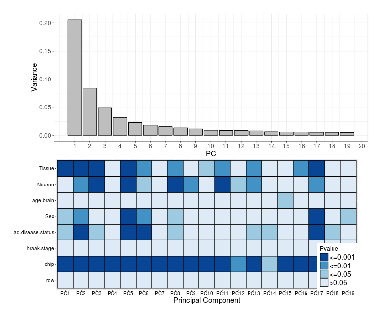

Hannon et al. (2017) 450K Data Principal Component Analysis
========================================================
## Original author: Sumaiya Islam
## Updated by: Samantha Schaffner
## Date updated: March 13, 2017
  
### Script contents:
  - detection and correction for technical batch variation using PCA and ComBat, respectively, of post-mortem human brain samples analyzed by Illumina HM450K platform from Jonathan Mill's research group (PMC4844197). 
   
### A. Set up working directory & packages

R version 3.2.3 (2015-12-10)

We will initially set our working directory and load our libraries.


## Heat scree plot Function

```r
### Function of association meta variable with PC (ANOVA)
heat_scree_plot<-function(Loadings, Importance, Num, Order){
  adjust<-1-Importance[1]
  pca_adjusted<-Importance[2:length(Importance)]/adjust
  pca_df<-data.frame(adjusted_variance=pca_adjusted, PC=seq(1:length(pca_adjusted)))
  
  scree<-ggplot(pca_df[which(pca_df$PC<Num),],aes(PC,adjusted_variance))+geom_bar(stat = "identity",color="black",fill="grey")+theme_bw()+
        theme(axis.text = element_text(size =12),
              axis.title = element_text(size =15),
              plot.margin=unit(c(1,1.5,0.2,2.25),"cm"))+ylab("Variance")+
    scale_x_continuous(breaks = seq(1,Num,1))
  
  #### Heat
  ## correlate meta with PCS
  ## Run anova of each PC on each meta data variable

  aov_PC_meta<-lapply(1:ncol(meta_categorical), function(covar) sapply(1:ncol(Loadings), function(PC) summary(aov(Loadings[,PC]~meta_categorical[,covar]))[[1]]$"Pr(>F)"[1]))
  cor_PC_meta<-lapply(1:ncol(meta_continuous), function(covar) sapply(1:ncol(Loadings), function(PC) (cor.test(Loadings[,PC],as.numeric(meta_continuous[,covar]),alternative = "two.sided", method="spearman", na.action=na.omit, exact=FALSE)$p.value)))
  names(aov_PC_meta)<-colnames(meta_categorical)
  names(cor_PC_meta)<-colnames(meta_continuous)
  aov_PC_meta<-do.call(rbind, aov_PC_meta)
  cor_PC_meta<-do.call(rbind, cor_PC_meta)
 aov_PC_meta<-rbind(aov_PC_meta, cor_PC_meta)
  aov_PC_meta<-as.data.frame(aov_PC_meta)
  #adjust
  aov_PC_meta_adjust<-aov_PC_meta[,2:ncol(aov_PC_meta)]
  
    
  #reshape
  avo<-aov_PC_meta_adjust[,1:(Num-1)]
  avo_heat_num<-apply(avo,2, as.numeric)
  avo_heat<-as.data.frame(avo_heat_num)
  colnames(avo_heat)<-sapply(1:(Num-1), function(x) paste("PC",x, sep=""))
  avo_heat$meta<-rownames(avo)
  avo_heat_melt<-melt(avo_heat, id=c("meta"))
  
  # cluster meta data
  ord <- Order
  meta_var_order<-unique(avo_heat_melt$meta)[rev(ord)]
  avo_heat_melt$meta <- factor(avo_heat_melt$meta, levels = meta_var_order)
  
  # color if sig
   avo_heat_melt$Pvalue<-sapply(1:nrow(avo_heat_melt), function(x) if(avo_heat_melt$value[x]>=0.9){">=0.9"}else{
    if(avo_heat_melt$value[x]>=0.5){">=0.5"}else{
      if(avo_heat_melt$value[x]>=0.1){">=0.1"}else{"<0.1"}}})
  avo_heat_melt$Pvalue<-sapply(1:nrow(avo_heat_melt), function(x) if(avo_heat_melt$value[x]<=0.001){"<=0.001"}else{
     if(avo_heat_melt$value[x]<=0.01){"<=0.01"}else{
       if(avo_heat_melt$value[x]<=0.05){"<=0.05"}else{">0.05"}}})
  
  heat<-ggplot(avo_heat_melt, aes(variable,meta, fill = Pvalue)) +
  geom_tile(color = "black",size=0.5) +
  theme_gray(8)+scale_fill_manual(values=c("#084594","#4292c6","#9ecae1","#deebf7"))+
      theme(axis.text = element_text(size =10, color="black"),
            axis.text.x = element_text(),
          axis.title = element_text(size =15),
          legend.text = element_text(size =14),
          legend.title = element_text(size =12),
          legend.position = c(1, 0), legend.justification = c(1,0),
          plot.margin=unit(c(0,2.25,1,1),"cm"))+
    xlab("Principal Component")+ylab(NULL)
  
  grid.arrange(scree, heat, ncol=1)
}
```


### B. Load files

#### We will be analyzing the normalized and filtered Hannon et al. dataset
First, load required files and reshape meta data:

```r
load("GSE43414_BMIQ.RData") # normalized beta values
ncol(GSE43414_BMIQ) #432
```

```
## [1] 432
```

```r
load("Brain_meta_matched_GSE43414.RData") # associated meta data
nrow(Brain_matched) #441
```

```
## [1] 441
```

```r
#There are some individuals in the meta data not included in the BMIQ data. We need to re-match the betas and meta data.
for (j in 1:nrow(Brain_matched)){
  if (!(Brain_matched$barcode[j] %in% colnames(GSE43414_BMIQ))){
  Brain_matched <- Brain_matched[-j,]  
 }}
nrow(Brain_matched) #434
```

```
## [1] 434
```

```r
length(unique(Brain_matched$barcode)) #434
```

```
## [1] 434
```

```r
length(unique(colnames(GSE43414_BMIQ))) #432
```

```
## [1] 432
```

```r
#Two individuals are still in the meta data, not present in BMIQ data.
#Rearrange to look at barcodes of both datasets
Brain_matched <- Brain_matched %>% arrange(barcode)
GSE.t <- as.data.frame(t(GSE43414_BMIQ))
GSE.t$barcode <- rownames(GSE.t)
GSE.t <- GSE.t %>% arrange(barcode)
for (j in 1:nrow(Brain_matched)){
  if (!(Brain_matched$barcode[j] %in% GSE.t$barcode)){
  Brain_matched <- Brain_matched[-j,]  
  }}
nrow(Brain_matched) #432 - all good!
```

```
## [1] 432
```

```r
save(Brain_matched, file="Brain_matched.RData")

cell.proportions<-read.csv("cellprop_uncor.csv", header=TRUE, row.names=1) # predicted neuron and glial cell proportions based on CETS
head(cell.proportions)
```

```
##                      neuron      glia
## 6057825008_R02C02 0.4978760 0.5021240
## 6057825008_R03C01 0.4990904 0.5009096
## 6057825008_R04C01 0.4928983 0.5071017
## 6057825008_R04C02 0.4976021 0.5023979
## 6057825008_R05C01 0.4832074 0.5167926
## 6057825008_R05C02 0.5175410 0.4824590
```

```r
# check for NAs in data
ind<-is.row.na(GSE43414_BMIQ) # The function returns a vector of logical variables, one for each row of the matrix. The variable is TRUE if the row does not contain any missing values and FAlSE otherwise.
length(na.count<-which(ind=="FALSE")) # 76545 rows contain NAs
```

```
## [1] 76545
```

```r
GSE43414_BMIQ <- na.omit(GSE43414_BMIQ) #Remove probes with NAs
dim(GSE43414_BMIQ) #[1] 338359    432
```

```
## [1] 338359    432
```

```r
#338359 probes left
save(GSE43414_BMIQ, file="GSE43414_BMIQ_na.RData")

uncor.dat<-GSE43414_BMIQ
meta<-Brain_matched

#Restructure meta data and cell proportion data so sample order matches
meta<- meta %>% arrange(barcode)
cell.proportions$barcode <- rownames(cell.proportions)
cell.proportions<- cell.proportions %>% arrange(barcode)

#Add cell proportion information to meta data
identical(cell.proportions$barcode, meta$barcode) # TRUE
```

```
## [1] TRUE
```

```r
meta$Neuron<-as.numeric(cell.proportions$neuron)
meta$Glia<-as.numeric(cell.proportions$glia)

#Add row and chip information to metadata; this can be found in the sample barcodes
for (i in 1:nrow(meta)){
  meta$chip[i]<-paste(substr(meta$barcode[i], start=1, stop=10))
  meta$row[i]<-paste(substr(meta$barcode[i], start=13, stop=14))
}

meta$age.brain <- as.numeric(meta$age.brain)
```

```
## Warning: NAs introduced by coercion
```

```r
meta$braak.stage <- as.numeric(meta$braak.stage)
```

```
## Warning: NAs introduced by coercion
```

```r
str(meta)
```

```
## 'data.frame':	432 obs. of  16 variables:
##  $ series_id        : chr  "GSE43414" "GSE43414" "GSE43414" "GSE43414" ...
##  $ gsm              : chr  "GSM1069412" "GSM1069413" "GSM1069414" "GSM1069415" ...
##  $ Subject          : chr  "NA" "NA" "NA" "NA" ...
##  $ barcode          : chr  "6042316024_R01C01" "6042316024_R01C02" "6042316024_R02C01" "6042316024_R02C02" ...
##  $ lunnon.et.al     : chr  "FALSE" "FALSE" "FALSE" "FALSE" ...
##  $ tissue.code      : chr  "NA" "NA" "NA" "NA" ...
##  $ braak.stage      : num  NA NA NA NA NA NA NA NA NA NA ...
##  $ Sex              : chr  "NA" "NA" "NA" "NA" ...
##  $ ad.disease.status: chr  "NA" "NA" "NA" "NA" ...
##  $ age.brain        : num  NA NA NA NA NA NA NA NA NA NA ...
##  $ age.blood        : chr  "NA" "NA" "NA" "NA" ...
##  $ Tissue           : chr  "cerebellum" "cerebellum" "cerebellum" "cerebellum" ...
##  $ Neuron           : num  0.493 0.515 0.503 0.48 0.513 ...
##  $ Glia             : num  0.507 0.485 0.497 0.52 0.487 ...
##  $ chip             : chr  "6042316024" "6042316024" "6042316024" "6042316024" ...
##  $ row              : chr  "01" "01" "02" "02" ...
```

```r
save(meta, file="Meta_uncor.RData")
```


## PCA Scree Heatmap for uncorrected data


```r
## PCA
uncor.dat <- t(scale(t(as.matrix(uncor.dat))))
PCA_full<-princomp(uncor.dat[complete.cases(uncor.dat),])
Loadings<-as.data.frame(unclass(PCA_full$loadings))
vars <- PCA_full$sdev^2
Importance<-vars/sum(vars)
adjust<-1-Importance[1]
pca_adjusted<-Importance[2:length(Importance)]/adjust
pca_df<-data.frame(adjusted_variance=pca_adjusted, PC=seq(1:length(pca_adjusted)))

#Specify which covariates are categorical and/or categorical
colnames(meta)
```

```
##  [1] "series_id"         "gsm"               "Subject"          
##  [4] "barcode"           "lunnon.et.al"      "tissue.code"      
##  [7] "braak.stage"       "Sex"               "ad.disease.status"
## [10] "age.brain"         "age.blood"         "Tissue"           
## [13] "Neuron"            "Glia"              "chip"             
## [16] "row"
```

```r
meta_categorical<-meta[,c("ad.disease.status", "braak.stage", "Sex", "Tissue", "chip", "row")]  # input column numbers in meta that contain categorical variables
meta_continuous<-meta[,c("age.brain", "Neuron")] # input column numbers in meta that contain continuous variables
#meta_continuous<-data.frame(meta_continuous)

# Specify the number of PCs you want shown (usually # of samples in the dataset)
Num<-20

# Designate what order you want the variables to appear (continuous variables rbinded to categorical variables in function)
Order<-c(4,8,7,3,1,2,5,6)

#Apply function on PCA results, pulls in the meta data and beta values from above
heat_scree_plot(Loadings, Importance, Num, Order)
```



The main contributors to variance in this data are chip, tissue, neuronal proportion, sex, and AD disease status. Brain region, AD status, and sex will be used as covariates in a linear regression model, while the large chip effect will be batch-corrected using ComBat.

## Batch correction using ComBat

ComBat is a function included in the SVA (surrogate variable analysis) package ((Johnson et al., 2007))[https://academic.oup.com/biostatistics/article-lookup/doi/10.1093/biostatistics/kxj037]. It uses empirical Bayesian adjustment to correct for known sources of batch variation. Correction is usually performed first on either the variable which contributes more to overall variance or the variable with fewer batches -- row satisfies both of these requirements, so we will correct for row, followed by chip.


```r
#The following packages must be unloaded in order to use sva:
detach("package:wateRmelon", unload=TRUE)
detach("package:IlluminaHumanMethylation450kanno.ilmn12.hg19", unload=TRUE)
detach("package:lumi", unload=TRUE)
unloadNamespace("methylumi")
unloadNamespace("minfi")
unloadNamespace("mgcv")
```

```
## Error: package 'mgcv' is required by 'sva' so will not be detached
```

```r
library(sva)

#Correction for row
#row <- meta$row
modcombat <- model.matrix(~1,data=meta)
combat_edata <- ComBat(dat=GSE43414_BMIQ, batch=row, mod=modcombat, par.prior=TRUE, prior.plots=FALSE)
```

```
## Error in unique.default(x, nmax = nmax): unique() applies only to vectors
```

```r
#Correction for chip
chip <- meta$chip
GSE43414_batch_cor <- ComBat(dat=combat_edata, batch=chip, mod=modcombat, par.prior=TRUE, prior.plots=FALSE)
```

```
## Found 50 batches
## Adjusting for 0 covariate(s) or covariate level(s)
```

```
## Error in ComBat(dat = combat_edata, batch = chip, mod = modcombat, par.prior = TRUE, : object 'combat_edata' not found
```

```r
save(GSE43414_batch_cor, file="GSE43414_batch_cor.RData")
```

```
## Error in save(GSE43414_batch_cor, file = "GSE43414_batch_cor.RData"): object 'GSE43414_batch_cor' not found
```

## Predict cell proportions for batch-corrected data


```r
library(cets)
# load "brain dataset" from data file in cetsBrain
load("~/team_Methylhomies/cetsBrain.rda") # click on cetsBrain.rda file to place in workspace
dim(brain)
```

```
## [1] 10000   146
```

```r
brain[1:3, 1:4]
```

```
##            X1_5175.G.P1A1._7766130090_R01C01
## cg02689072                         0.9271406
## cg12093060                         0.8889666
## cg05940691                         0.9427095
##            X7_5175.N.P1A7._7766130090_R01C02
## cg02689072                         0.1190979
## cg12093060                         0.1356233
## cg05940691                         0.1757897
##            X2_813.N.P1A2._7766130090_R02C01
## cg02689072                        0.1258751
## cg12093060                        0.1268435
## cg05940691                        0.1476256
##            X8_1740.N.P1A8._7766130090_R02C02
## cg02689072                         0.1372099
## cg12093060                         0.1110450
## cg05940691                         0.1692726
```

```r
head(pdBrain)
```

```
##   ID1 celltype       diag    sex ethnicity age batch row array PMI
## 1   1        G Depression   Male Caucasian  47     1   A     1  22
## 2   2        N Depression   Male Caucasian  47     1   A     1  22
## 3   3        N    Control Female Caucasian  30     1   A     1  14
## 4   4        N    Control Female   African  13     1   A     1  17
## 5   5        N Depression Female   African  14     1   A     1  15
## 6   6        G Depression Female   African  14     1   A     1  15
```

Create the neuron and glia reference profiles:


```r
modelIdx <- list(neuron = pdBrain$celltype == "N", glia = pdBrain$celltype ==  "G")
 # getReference returns a 2-column matrix, representing reference profiles for the two cell types.
refProfile <- getReference(brain, modelIdx)
head(refProfile)
```

```
##               neuron       glia
## cg02689072 0.1256035 0.93511026
## cg12093060 0.1425625 0.88545915
## cg05940691 0.1739833 0.92097174
## cg05403655 0.1380149 0.91071764
## cg05699921 0.7125904 0.08176213
## cg00968638 0.8164890 0.07838638
```

#### For the brain datasets

Estimate the neuronal proportion:

The estProportion function returns an estimate of the percentage of cell type in the first column of its profile argument (neurons in this case). 

```r
prop <- estProportion(GSE43414_batch_cor, profile = refProfile)
```

```
## Error in rownames(data): object 'GSE43414_batch_cor' not found
```

```r
prop<-as.data.frame(prop)
```

```
## Error in as.data.frame(prop): error in evaluating the argument 'x' in selecting a method for function 'as.data.frame': Error: object 'prop' not found
```

```r
prop$glia<-apply(prop,1,function(x) 1-x)
```

```
## Error in apply(prop, 1, function(x) 1 - x): object 'prop' not found
```

```r
colnames(prop)<- c("neuron", "glia")
```

```
## Error in colnames(prop) <- c("neuron", "glia"): object 'prop' not found
```

```r
head(prop)
```

```
## Error in head(prop): error in evaluating the argument 'x' in selecting a method for function 'head': Error: object 'prop' not found
```

```r
write.csv(prop, file = "cellprop_batch_cor.csv", row.names=T)
```

```
## Error in is.data.frame(x): object 'prop' not found
```

```r
summary(prop)
```

```
## Error in summary(prop): error in evaluating the argument 'object' in selecting a method for function 'summary': Error: object 'prop' not found
```

```r
plot(density(prop$neuron), main="Neuronal Proportion Density") 
```

```
## Error in plot(density(prop$neuron), main = "Neuronal Proportion Density"): error in evaluating the argument 'x' in selecting a method for function 'plot': Error in density(prop$neuron) : 
##   error in evaluating the argument 'x' in selecting a method for function 'density': Error: object 'prop' not found
```


```r
#Restructure meta data and cell proportion data so sample order matches
cell.proportions <- prop
```

```
## Error in eval(expr, envir, enclos): object 'prop' not found
```

```r
cell.proportions$barcode <- rownames(cell.proportions)
cell.proportions<- cell.proportions %>% arrange(barcode)

#Add cell proportion information to meta data
identical(cell.proportions$barcode, meta$barcode) # TRUE
```

```
## [1] FALSE
```

```r
meta$Neuron<-as.numeric(cell.proportions$neuron)
meta$Glia<-as.numeric(cell.proportions$glia)

#Save corrected meta data
save(meta, file="Meta_batch_cor.RData")
```

## PCA Scree Heatmap for batch-corrected data


```r
## PCA
load("Meta_batch_cor.RData")
load("GSE43414_batch_cor.RData")
batch.cor.dat <- t(scale(t(as.matrix(GSE43414_batch_cor))))
PCA_full<-princomp(batch.cor.dat[complete.cases(batch.cor.dat),])
Loadings<-as.data.frame(unclass(PCA_full$loadings))
vars <- PCA_full$sdev^2
Importance<-vars/sum(vars)
adjust<-1-Importance[1]
pca_adjusted<-Importance[2:length(Importance)]/adjust
pca_df<-data.frame(adjusted_variance=pca_adjusted, PC=seq(1:length(pca_adjusted)))

#Specify which covariates are categorical and/or categorical
colnames(meta)
```

```
##  [1] "series_id"         "gsm"               "Subject"          
##  [4] "barcode"           "lunnon.et.al"      "tissue.code"      
##  [7] "braak.stage"       "Sex"               "ad.disease.status"
## [10] "age.brain"         "age.blood"         "Tissue"           
## [13] "Neuron"            "Glia"              "chip"             
## [16] "row"
```

```r
meta_categorical<-meta[,c("ad.disease.status", "braak.stage", "Sex", "Tissue", "chip", "row")]  # input column numbers in meta that contain categorical variables
meta_continuous<-meta[,c("age.brain", "Neuron")] # input column numbers in meta that contain continuous variables
#meta_continuous<-data.frame(meta_continuous)

# Specify the number of PCs you want shown (usually # of samples in the dataset)
Num<-20

# Designate what order you want the variables to appear (continuous variables rbinded to categorical variables in function)
Order<-c(4,8,7,3,1,2,5,6)

#Apply function on PCA results, pulls in the meta data and beta values from above
heat_scree_plot(Loadings, Importance, Num, Order)
```


Batch correction removed much of the initial variation, leaving only Neuron significantly associated. 

We will now perform cell-type correction based on the neuronal/glial proportions.


```r
all(rownames(prop)%in%colnames(GSE43414_batch_cor))
```

```
## Error in rownames(prop) %in% colnames(GSE43414_batch_cor): error in evaluating the argument 'x' in selecting a method for function '%in%': Error in rownames(prop) : 
##   error in evaluating the argument 'x' in selecting a method for function 'rownames': Error: object 'prop' not found
```

```r
brain.cor.dat<- as.data.frame(GSE43414_batch_cor)

# fit methylation data for each probe in the dataset by the neuronal proportion
avebeta.lm<-apply(brain.cor.dat, 1, function(x){
  brain.sub<-prop[colnames(brain.cor.dat),]
  lm(x~neuron,data=brain.sub)
})
```

```
## Error in FUN(newX[, i], ...): object 'prop' not found
```

```r
# obtain residuals for each probe across all samples (as a matrix)
residuals<-t(sapply(avebeta.lm, function(x)residuals(summary(x))))
```

```
## Error in t(sapply(avebeta.lm, function(x) residuals(summary(x)))): error in evaluating the argument 'x' in selecting a method for function 't': Error in sapply(avebeta.lm, function(x) residuals(summary(x))) : 
##   error in evaluating the argument 'X' in selecting a method for function 'sapply': Error: object 'avebeta.lm' not found
```

```r
head(residuals)
```

```
##                                                                                                                                                                                                                                                                                                                                                                                                                                          
## 1 structure(function (object, ...)                                                                                                                                                                                                                                                                                                                                                                                                       
## 2 standardGeneric("residuals"), generic = structure("residuals", package = "stats"), package = "stats", group = list(), valueClass = character(0), signature = "object", default = structure(function (object,                                                                                                                                                                                                                           
## 3     ...)                                                                                                                                                                                                                                                                                                                                                                                                                               
## 4 UseMethod("residuals"), target = structure("ANY", class = structure("signature", package = "methods"), .Names = "object", package = "methods"), defined = structure("ANY", class = structure("signature", package = "methods"), .Names = "object", package = "methods"), generic = structure("residuals", package = "stats"), class = structure("derivedDefaultMethod", package = "methods")), skeleton = (structure(function (object, 
## 5     ...)                                                                                                                                                                                                                                                                                                                                                                                                                               
## 6 UseMethod("residuals"), target = structure("ANY", class = structure("signature", package = "methods"), .Names = "object", package = "methods"), defined = structure("ANY", class = structure("signature", package = "methods"), .Names = "object", package = "methods"), generic = structure("residuals", package = "stats"), class = structure("derivedDefaultMethod", package = "methods")))(object,
```

```r
colnames(residuals)<-colnames(brain.cor.dat)
```

```
## Error in `colnames<-`(`*tmp*`, value = c("6057825008_R02C02", "6057825008_R03C01", : attempt to set 'colnames' on an object with less than two dimensions
```

```r
# generate adjusted residuals by adding the mean beta of each probe to the residuals
adj.residuals<-residuals+matrix(apply(brain.cor.dat, 1, mean), nrow=nrow(residuals), ncol=ncol(residuals))
```

```
## Error in matrix(apply(brain.cor.dat, 1, mean), nrow = nrow(residuals), : non-numeric matrix extent
```

```r
r1<-as.data.frame(adj.residuals)
```

```
## Error in as.data.frame(adj.residuals): error in evaluating the argument 'x' in selecting a method for function 'as.data.frame': Error: object 'adj.residuals' not found
```

```r
head(brain.cor.dat)
```

```
##            6057825008_R02C02 6057825008_R03C01 6057825008_R04C01
## cg00000029         0.6040563         0.6644632         0.5805305
## cg00000108         0.6646823         0.8142576         0.8066707
## cg00000165         0.3094805         0.1750430         0.2580790
## cg00000236         0.8630215         0.8228837         0.8560180
## cg00000289         0.5330522         0.4570680         0.4771788
## cg00000292         0.6487669         0.6467237         0.7388215
##            6057825008_R04C02 6057825008_R05C01 6057825008_R05C02
## cg00000029         0.5960703         0.6291628         0.5311413
## cg00000108         0.8695670         0.7670812         0.7308496
## cg00000165         0.1423749         0.3643855         0.3308528
## cg00000236         0.7866735         0.8453402         0.7569006
## cg00000289         0.4274623         0.3910954         0.5019444
## cg00000292         0.6288452         0.6836662         0.6100912
##            6057825008_R06C01 6057825008_R06C02 6057825014_R01C02
## cg00000029         0.6143835         0.6414891         0.5765471
## cg00000108         0.7460785         0.7788257         0.6992508
## cg00000165         0.3400559         0.1698767         0.1828220
## cg00000236         0.7735195         0.8466789         0.8091885
## cg00000289         0.5715198         0.5391966         0.5272361
## cg00000292         0.6891658         0.7760092         0.6863190
##            6057825014_R02C02 6057825014_R03C01 6057825014_R03C02
## cg00000029         0.6233677         0.6088140         0.5600037
## cg00000108         0.9551797         0.7399680         0.5632931
## cg00000165         0.3872723         0.3738079         0.3396361
## cg00000236         0.8166400         0.8600952         0.8594197
## cg00000289         0.5048453         0.4709171         0.4921854
## cg00000292         0.6482713         0.6440661         0.7393089
##            6057825014_R04C01 6057825014_R04C02 6057825014_R06C01
## cg00000029         0.7024968         0.5557564         0.4968730
## cg00000108         0.7643588         0.7536031         0.7812274
## cg00000165         0.2058920         0.4130508         0.3264246
## cg00000236         0.7661463         0.8095221         0.7265040
## cg00000289         0.4640465         0.4434550         0.5176500
## cg00000292         0.6986832         0.6333131         0.6758765
##            6057825017_R01C01 6057825017_R01C02 6057825017_R02C02
## cg00000029         0.6916621         0.5636040         0.6420495
## cg00000108         0.6637031         0.7991840         0.8695735
## cg00000165         0.1536745         0.2882450         0.2615410
## cg00000236         0.8575399         0.8425823         0.8492142
## cg00000289         0.5969592         0.4221511         0.5183846
## cg00000292         0.6190929         0.6842335         0.7064982
##            6057825017_R03C01 6057825017_R03C02 6057825017_R04C01
## cg00000029         0.5992191         0.6113964         0.5988307
## cg00000108         0.8162701         0.6516959         0.8566712
## cg00000165         0.2673331         0.4588479         0.3066750
## cg00000236         0.8222246         0.8226421         0.8144416
## cg00000289         0.5768934         0.4695260         0.4528525
## cg00000292         0.6445646         0.6685910         0.5844619
##            6057825017_R04C02 6057825017_R05C01 6057825017_R05C02
## cg00000029         0.6012880         0.6489963         0.6599001
## cg00000108         0.9369224         0.8434849         0.7572386
## cg00000165         0.1149715         0.1947133         0.1755406
## cg00000236         0.8684425         0.8075989         0.8040563
## cg00000289         0.4803693         0.4762994         0.5454841
## cg00000292         0.7025138         0.7016096         0.6869326
##            6057825017_R06C01 6057825018_R01C01 6057825018_R02C02
## cg00000029         0.6956089         0.6377650         0.5633213
## cg00000108         0.9462856         0.6310214         0.7193125
## cg00000165         0.3083479         0.3102984         0.3956167
## cg00000236         0.8339335         0.8403445         0.8578791
## cg00000289         0.5076896         0.4560218         0.4836002
## cg00000292         0.6169569         0.7028697         0.6779379
##            6057825018_R03C02 6057825018_R04C01 6057825018_R04C02
## cg00000029         0.5168717         0.5535337         0.5599438
## cg00000108         0.7704403         0.7633978         0.6821320
## cg00000165         0.4090210         0.1502974         0.2531942
## cg00000236         0.8164904         0.7608910         0.8625246
## cg00000289         0.4796725         0.4739266         0.5465711
## cg00000292         0.6614104         0.6173820         0.6434371
##            6057825018_R05C01 6057825018_R05C02 6057825018_R06C01
## cg00000029         0.6804829         0.6390641         0.6187841
## cg00000108         0.9015386         0.7469772         0.8659022
## cg00000165         0.1846678         0.1808126         0.1734059
## cg00000236         0.7943476         0.8289350         0.8218698
## cg00000289         0.4421590         0.5441710         0.5418364
## cg00000292         0.7627189         0.6570334         0.6924479
##            6042316085_R01C01 6042316085_R01C02 6042316085_R02C02
## cg00000029         0.5016399         0.6573669         0.7500537
## cg00000108         0.5639012         0.8113982         0.8396412
## cg00000165         0.4889012         0.2586909         0.2536105
## cg00000236         0.8780871         0.8512650         0.7732799
## cg00000289         0.5365873         0.5263103         0.3453990
## cg00000292         0.6867793         0.5903300         0.7805223
##            6042316085_R03C01 6042316085_R03C02 6042316085_R05C01
## cg00000029         0.5786632         0.5892637         0.5437517
## cg00000108         0.7820838         0.7680695         0.7549220
## cg00000165         0.2164130         0.2351318         0.2708508
## cg00000236         0.7970229         0.8114819         0.7722688
## cg00000289         0.4942752         0.4885875         0.4742777
## cg00000292         0.6602003         0.6645872         0.6446994
##            6042316085_R05C02 6042316085_R06C01 6042316107_R01C02
## cg00000029         0.5755004         0.6342022         0.5694566
## cg00000108         0.6875712         0.9335667         0.6820878
## cg00000165         0.2466515         0.3893762         0.2032569
## cg00000236         0.8758326         0.7915198         0.8090096
## cg00000289         0.4785247         0.4789856         0.5259984
## cg00000292         0.6321659         0.7101714         0.7288786
##            6042316107_R03C01 6042316107_R04C02 6042316107_R05C01
## cg00000029         0.6217079         0.5885451         0.6028581
## cg00000108         0.7907495         0.8008166         0.8220094
## cg00000165         0.4038932         0.2284352         0.2357321
## cg00000236         0.8068643         0.8383816         0.8993434
## cg00000289         0.5380362         0.4670700         0.4408856
## cg00000292         0.6446202         0.6392487         0.6933376
##            6042316107_R05C02 6042316107_R06C01 6042316107_R06C02
## cg00000029         0.5928458         0.6689334         0.6609953
## cg00000108         0.7560777         0.6063675         0.6654479
## cg00000165         0.1529853         0.1766311         0.2097974
## cg00000236         0.7877795         0.7840139         0.7642742
## cg00000289         0.5028972         0.4941013         0.4373123
## cg00000292         0.6503919         0.7042695         0.6583693
##            6042316113_R01C01 6042316113_R01C02 6042316113_R02C01
## cg00000029         0.6057291         0.5552920         0.6557236
## cg00000108         0.8531201         0.7066743         0.9509081
## cg00000165         0.3575428         0.2630723         0.2600751
## cg00000236         0.8169901         0.8520745         0.8235168
## cg00000289         0.5511415         0.4934756         0.5785766
## cg00000292         0.6398979         0.6635563         0.5951377
##            6042316113_R02C02 6042316113_R03C02 6042316113_R04C02
## cg00000029         0.5078384         0.6447048         0.4453934
## cg00000108         0.9031633         0.7940780         1.0148411
## cg00000165         0.4633299         0.3666666         0.1331617
## cg00000236         0.8316188         0.8504706         0.8889065
## cg00000289         0.4076135         0.4589352         0.3915259
## cg00000292         0.7853731         0.6721144         0.7605842
##            6042316113_R05C01 6042316113_R05C02 6042316113_R06C01
## cg00000029         0.6814236         0.6139739         0.6129393
## cg00000108         0.7522877         0.7482527         0.7389316
## cg00000165         0.2123116         0.3690648         0.2516076
## cg00000236         0.8421020         0.7975836         0.7892286
## cg00000289         0.5025265         0.5426207         0.5198185
## cg00000292         0.6827130         0.7076891         0.7112919
##            6042316127_R01C01 6042316127_R01C02 6042316127_R02C02
## cg00000029         0.6205180         0.6360116         0.6147570
## cg00000108         0.6958253         0.6628884         0.6916829
## cg00000165         0.2272856         0.4624473         0.3032899
## cg00000236         0.7707179         0.8055018         0.8357259
## cg00000289         0.4478218         0.5709858         0.4729503
## cg00000292         0.6151911         0.6239714         0.6352972
##            6042316127_R03C01 6042316127_R03C02 6042316127_R04C01
## cg00000029         0.6802322         0.6145786         0.6386482
## cg00000108         0.7615959         0.7185148         0.7988918
## cg00000165         0.3535102         0.2686497         0.2492856
## cg00000236         0.8307339         0.7851562         0.7793623
## cg00000289         0.4876727         0.5431258         0.4586751
## cg00000292         0.6459588         0.7126002         0.6518970
##            6042316127_R04C02 6042316127_R05C02 6042316127_R06C01
## cg00000029         0.5868030        0.52849512         0.5551766
## cg00000108         0.9132639        0.67709177         0.8303673
## cg00000165         0.3948141        0.09413984         0.2504839
## cg00000236         0.8045791        0.78502989         0.8287749
## cg00000289         0.4339018        0.49457791         0.5392909
## cg00000292         0.6814634        0.64494147         0.6324561
##            6057825014_R01C02.1 6057825014_R02C02.1 6057825014_R03C01.1
## cg00000029           0.6264539           0.6676924           0.6834444
## cg00000108           0.7400076           0.8976511           0.7708321
## cg00000165           0.1893684           0.3856861           0.3601574
## cg00000236           0.8238611           0.8603850           0.8767618
## cg00000289           0.5015858           0.4891080           0.5348800
## cg00000292           0.7163691           0.6205994           0.6794207
##            6057825014_R03C02.1 6057825014_R04C01.1 6057825014_R04C02.1
## cg00000029           0.5737557           0.7146514           0.5213290
## cg00000108           0.6285270           0.7612556           0.8066418
## cg00000165           0.3098776           0.1754151           0.4174913
## cg00000236           0.8646250           0.7801046           0.8016294
## cg00000289           0.4460665           0.4110802           0.4866130
## cg00000292           0.7110030           0.6672048           0.6623097
##            6057825014_R06C01.1 6057825017_R01C01.1 6057825017_R01C02.1
## cg00000029           0.5208043           0.6726233           0.5431702
## cg00000108           0.8151931           0.6373976           0.8734778
## cg00000165           0.3065758           0.1229205           0.2328395
## cg00000236           0.7384775           0.8434409           0.8633957
## cg00000289           0.4709250           0.5342840           0.4631018
## cg00000292           0.6602811           0.6421842           0.6635953
##            6057825017_R02C01 6057825017_R02C02.1 6057825017_R03C01.1
## cg00000029         0.6497736           0.6411290           0.6109753
## cg00000108         0.7715205           0.9098626           0.8590195
## cg00000165         0.3624455           0.2238142           0.2140900
## cg00000236         0.8240579           0.8430775           0.8513148
## cg00000289         0.4672068           0.5246896           0.5968226
## cg00000292         0.7057603           0.6781333           0.6863361
##            6057825017_R03C02.1 6057825017_R04C01.1 6057825017_R04C02.1
## cg00000029           0.5721737           0.6221167           0.6302603
## cg00000108           0.6151234           0.7628227           0.8102098
## cg00000165           0.4141483           0.4123157           0.1757133
## cg00000236           0.8632300           0.7830974           0.8426641
## cg00000289           0.4778135           0.5158382           0.4819276
## cg00000292           0.6841266           0.6203001           0.6661433
##            6057825017_R05C01.1 6057825017_R05C02.1 6057825017_R06C01.1
## cg00000029           0.6709906           0.6523096           0.6546305
## cg00000108           0.7734922           0.7433363           0.8078973
## cg00000165           0.2387483           0.2122915           0.3072514
## cg00000236           0.8317343           0.8219049           0.8303296
## cg00000289           0.5192485           0.4835980           0.4865975
## cg00000292           0.6669431           0.6674709           0.6244917
##            6057825018_R01C01.1 6057825018_R02C02.1 6057825018_R03C01
## cg00000029           0.6299673           0.5830847         0.4417420
## cg00000108           0.6565389           0.7080395         1.0283575
## cg00000165           0.2615646           0.3524634         0.1345291
## cg00000236           0.8418733           0.8660980         0.8043106
## cg00000289           0.4780740           0.4475266         0.4869097
## cg00000292           0.6788967           0.6682148         0.8004112
##            6057825018_R03C02.1 6057825018_R04C01.1 6057825018_R04C02.1
## cg00000029           0.5790425           0.6250418           0.6209108
## cg00000108           0.7424049           0.6675692           0.6245604
## cg00000165           0.3481166           0.2388603           0.3275227
## cg00000236           0.7926484           0.7698451           0.8407366
## cg00000289           0.5320578           0.4462465           0.5249467
## cg00000292           0.6601242           0.6112746           0.6438932
##            6057825018_R05C01.1 6057825018_R05C02.1 6057825018_R06C01.1
## cg00000029           0.6909832           0.6710803           0.6631066
## cg00000108           0.7215378           0.6953775           0.7429910
## cg00000165           0.2525231           0.2151306           0.2050373
## cg00000236           0.8089320           0.8155098           0.7971845
## cg00000289           0.4352524           0.5501853           0.5049891
## cg00000292           0.6997492           0.6438407           0.6575504
##            6042316035_R01C01 6042316035_R02C02 6042316035_R03C01
## cg00000029         0.5554502         0.6025810         0.5168090
## cg00000108         0.8789056         0.8944978         0.8959741
## cg00000165         0.2762290         0.2894844         0.2751241
## cg00000236         0.8553174         0.8401136         0.8533985
## cg00000289         0.4678918         0.5129375         0.4658327
## cg00000292         0.6718192         0.7062368         0.7171084
##            6042316035_R03C02 6042316035_R04C01 6042316035_R05C01
## cg00000029         0.5433376         0.6034424         0.6022072
## cg00000108         0.8944158         0.7805892         0.8322445
## cg00000165         0.2930382         0.2283130         0.3328655
## cg00000236         0.8470074         0.8201658         0.8315386
## cg00000289         0.5476129         0.4901166         0.4778036
## cg00000292         0.7076464         0.6968186         0.6719019
##            6042316035_R05C02 6042316035_R06C02 6042316048_R01C01
## cg00000029         0.6181938         0.5797724         0.5812242
## cg00000108         0.8094332         0.8097017         0.7671976
## cg00000165         0.1942471         0.3087841         0.3082211
## cg00000236         0.7867040         0.8461220         0.7816162
## cg00000289         0.5796272         0.4619448         0.4037383
## cg00000292         0.5934498         0.6987606         0.7093588
##            6042316048_R01C02 6042316048_R02C01 6042316048_R03C01
## cg00000029         0.5478038         0.5755781         0.6745555
## cg00000108         0.7877596         0.8309718         0.7883731
## cg00000165         0.2864435         0.2313711         0.2017388
## cg00000236         0.8615974         0.7968704         0.8820346
## cg00000289         0.4842414         0.5608354         0.4673185
## cg00000292         0.6873003         0.7280402         0.6277766
##            6042316048_R03C02 6042316048_R04C01 6042316048_R04C02
## cg00000029         0.5874576         0.5103141         0.5348200
## cg00000108         0.8189513         0.8129064         0.7846395
## cg00000165         0.2269524         0.2506461         0.1530691
## cg00000236         0.8480169         0.7986447         0.8118287
## cg00000289         0.4926909         0.4601095         0.4311516
## cg00000292         0.7212858         0.7099097         0.7264964
##            6042316048_R05C01 6042316048_R05C02 6042316110_R01C01
## cg00000029         0.5644947         0.6124030         0.6150454
## cg00000108         0.7495771         0.7939989         0.8040161
## cg00000165         0.3451771         0.2678777         0.2435129
## cg00000236         0.7978606         0.8132472         0.8275891
## cg00000289         0.4998845         0.4909696         0.4659047
## cg00000292         0.6935497         0.5854948         0.6561869
##            6042316110_R01C02 6042316110_R03C02 6042316110_R04C01
## cg00000029         0.7270989         0.5302154         0.6639968
## cg00000108         0.8135923         0.7841646         0.8234879
## cg00000165         0.2874741         0.2877088         0.2902643
## cg00000236         0.8824614         0.8574695         0.8004127
## cg00000289         0.5668559         0.5352698         0.5040735
## cg00000292         0.6895173         0.6074744         0.6726350
##            6042316110_R04C02 6042316110_R05C01 6042316110_R06C01
## cg00000029         0.5740606         0.6854302         0.6902370
## cg00000108         0.8048203         0.8118863         0.7905170
## cg00000165         0.2313619         0.2732866         0.2198152
## cg00000236         0.8210625         0.8012781         0.8465746
## cg00000289         0.4305088         0.5733377         0.5315420
## cg00000292         0.6703346         0.6379348         0.6594636
##            6042316121_R02C02 6042316121_R03C01 6042316121_R03C02
## cg00000029         0.5227516         0.6048839         0.5094156
## cg00000108         0.7794621         0.7877024         0.8399130
## cg00000165         0.3017244         0.2806491         0.2447099
## cg00000236         0.7981754         0.8776904         0.8064468
## cg00000289         0.5209284         0.5133018         0.4580033
## cg00000292         0.7161158         0.6406693         0.6584680
##            6042316121_R04C02 6042316121_R05C01 6042316121_R05C02
## cg00000029         0.5437929         0.5841961         0.6486168
## cg00000108         0.7990486         0.8175929         0.7720058
## cg00000165         0.2617588         0.2426927         0.2618567
## cg00000236         0.8371295         0.7939682         0.8435742
## cg00000289         0.4217281         0.4547283         0.5086098
## cg00000292         0.7649670         0.7055992         0.7714922
##            6042316121_R06C01 6042316121_R06C02 6042316066_R01C01
## cg00000029         0.6053564         0.5440286         0.5109424
## cg00000108         0.8372202         0.8090229         0.7803611
## cg00000165         0.3363182         0.3219266         0.2014028
## cg00000236         0.8650571         0.8265228         0.8169878
## cg00000289         0.4978285         0.5650275         0.4397183
## cg00000292         0.6124126         0.6441864         0.6772728
##            6042316066_R02C01 6042316066_R02C02 6042316066_R03C01
## cg00000029         0.5517124         0.6468212         0.6886840
## cg00000108         0.7959261         0.8116754         0.8151267
## cg00000165         0.1867912         0.2035334         0.3226788
## cg00000236         0.8562236         0.8290577         0.7678858
## cg00000289         0.3842594         0.5167321         0.4869177
## cg00000292         0.6869867         0.6695915         0.6846760
##            6042316066_R04C01 6042316066_R04C02 6042316066_R05C01
## cg00000029         0.5617873         0.5834576         0.6954392
## cg00000108         0.7548823         0.7858444         0.8011747
## cg00000165         0.2686095         0.1870501         0.2974726
## cg00000236         0.8379153         0.8412800         0.8412577
## cg00000289         0.5740070         0.5125288         0.4753452
## cg00000292         0.6216265         0.6994255         0.6322982
##            6042316066_R06C01 6042316066_R06C02 6042316069_R01C01
## cg00000029         0.6229633         0.5745683         0.4815158
## cg00000108         0.8157981         0.8112553         0.8081419
## cg00000165         0.2198736         0.3848896         0.2165347
## cg00000236         0.7547667         0.8230757         0.8688887
## cg00000289         0.4837571         0.5818665         0.5232051
## cg00000292         0.7371076         0.6914797         0.7006179
##            6042316069_R01C02 6042316069_R02C01 6042316069_R03C01
## cg00000029         0.5184416         0.6152634         0.6251520
## cg00000108         0.7927751         0.7715656         0.8080816
## cg00000165         0.2442913         0.2558513         0.2617396
## cg00000236         0.8498983         0.7946887         0.8282903
## cg00000289         0.4734780         0.4165916         0.4597612
## cg00000292         0.6534091         0.6091233         0.6674178
##            6042316069_R03C02 6042316069_R04C02 6042316069_R05C01
## cg00000029         0.6777344         0.5741529         0.6071361
## cg00000108         0.7920545         0.8083930         0.8114671
## cg00000165         0.2956008         0.2106247         0.2945013
## cg00000236         0.8258826         0.8671441         0.8138632
## cg00000289         0.5239501         0.4731693         0.4719141
## cg00000292         0.6576240         0.7025132         0.6793900
##            6042316069_R06C02 6042316094_R01C02 6042316094_R02C01
## cg00000029         0.6636580         0.4835901         0.5993924
## cg00000108         0.8077655         0.7501684         0.8346316
## cg00000165         0.3421090         0.1826932         0.2419991
## cg00000236         0.8573908         0.7912103         0.7797792
## cg00000289         0.5149205         0.4984856         0.4161360
## cg00000292         0.7367967         0.5756052         0.6597737
##            6042316094_R03C02 6042316094_R04C01 6042316094_R04C02
## cg00000029         0.5857060         0.5664902         0.7341223
## cg00000108         0.7719873         0.8122619         0.7870160
## cg00000165         0.2270518         0.2924691         0.2602519
## cg00000236         0.8213339         0.8539855         0.8461525
## cg00000289         0.5972155         0.4684089         0.5251696
## cg00000292         0.6768615         0.6816247         0.6075367
##            6042316094_R05C01 6042316094_R05C02 6042316094_R06C01
## cg00000029         0.5829317         0.5380865         0.6430700
## cg00000108         0.8588470         0.7640612         0.7476238
## cg00000165         0.3373719         0.2619611         0.2303779
## cg00000236         0.8372462         0.8365997         0.8152180
## cg00000289         0.5540524         0.4954656         0.5424869
## cg00000292         0.6754375         0.7125134         0.6220812
##            6042316099_R01C01 6042316099_R01C02 6042316099_R02C01
## cg00000029         0.5694955         0.5233890         0.5368144
## cg00000108         0.7829911         0.8153665         0.8115166
## cg00000165         0.2963398         0.2258029         0.2470779
## cg00000236         0.8089781         0.8212844         0.8526426
## cg00000289         0.3980541         0.4540002         0.4866846
## cg00000292         0.7351808         0.6488146         0.6698416
##            6042316099_R02C02 6042316099_R03C01 6042316099_R04C01
## cg00000029         0.6018990         0.7084871         0.5619731
## cg00000108         0.8234822         0.8102817         0.7707849
## cg00000165         0.2250739         0.3146731         0.2397397
## cg00000236         0.7883872         0.8534424         0.8121199
## cg00000289         0.4887503         0.5633819         0.4988728
## cg00000292         0.7174638         0.6791101         0.7526952
##            6042316099_R04C02 6042316099_R05C01 6969568082_R02C01
## cg00000029         0.4988655         0.5441943         0.6284218
## cg00000108         0.7907449         0.8097885         0.8247403
## cg00000165         0.2467792         0.2507485         0.2752286
## cg00000236         0.8575051         0.7888987         0.7914912
## cg00000289         0.5097222         0.4791050         0.4840912
## cg00000292         0.6537169         0.7132453         0.6631963
##            6969568082_R06C01 6969568082_R02C02 6969568082_R04C02
## cg00000029         0.5428654         0.6531178         0.6086498
## cg00000108         0.8059165         0.8011324         0.7928727
## cg00000165         0.2898586         0.1827816         0.2884097
## cg00000236         0.8277224         0.8583388         0.8285059
## cg00000289         0.3936917         0.5129391         0.4979877
## cg00000292         0.6536913         0.6019918         0.6626871
##            6969568082_R06C02 6969568084_R01C01 6969568084_R02C01
## cg00000029         0.6807290         0.6404943         0.5425781
## cg00000108         0.8189237         0.7797510         0.7949916
## cg00000165         0.2949746         0.2116005         0.2184636
## cg00000236         0.8058015         0.8129754         0.8148560
## cg00000289         0.4713612         0.5071129         0.4252397
## cg00000292         0.6345678         0.5802238         0.7287238
##            6969568084_R03C01 6969568084_R04C01 6969568084_R06C01
## cg00000029         0.5979379         0.5867388         0.5555340
## cg00000108         0.8012734         0.7790824         0.8177344
## cg00000165         0.3160960         0.2504067         0.2989845
## cg00000236         0.8156272         0.8244648         0.8469208
## cg00000289         0.4928676         0.5435929         0.4169980
## cg00000292         0.6975156         0.6680913         0.6677129
##            6969568084_R02C02 6969568084_R03C02 6969568084_R04C02
## cg00000029         0.5661121         0.5810847         0.6346155
## cg00000108         0.8038811         0.7787365         0.8108621
## cg00000165         0.2328061         0.2948217         0.2374876
## cg00000236         0.8651304         0.8180013         0.7911211
## cg00000289         0.5353590         0.4245189         0.4806776
## cg00000292         0.7004802         0.6651117         0.6556411
##            6969568084_R05C02 6969568087_R01C01 6969568087_R02C01
## cg00000029         0.6107481         0.5400802         0.7299253
## cg00000108         0.8212724         0.7883157         0.8145281
## cg00000165         0.2243707         0.3563670         0.2359667
## cg00000236         0.8075223         0.8410788         0.8254674
## cg00000289         0.5075748         0.5093377         0.5181088
## cg00000292         0.6741242         0.6144667         0.7071297
##            6969568087_R03C01 6969568087_R04C01 6969568087_R05C01
## cg00000029         0.5410863         0.5317605         0.5466147
## cg00000108         0.7969422         0.7770783         0.7737909
## cg00000165         0.2429545         0.2255820         0.3013708
## cg00000236         0.8007534         0.8977062         0.8011978
## cg00000289         0.4158726         0.5932395         0.4169292
## cg00000292         0.7382554         0.6150895         0.7259366
##            6969568087_R06C01 6969568087_R01C02 6969568087_R02C02
## cg00000029         0.6633686         0.5149411         0.5788442
## cg00000108         0.8253086         0.8234743         0.7883735
## cg00000165         0.2694206         0.1977214         0.2447378
## cg00000236         0.8748540         0.7681548         0.8493600
## cg00000289         0.4614538         0.5015401         0.4912378
## cg00000292         0.6298550         0.6445064         0.6103520
##            6969568087_R03C02 6969568087_R05C02 6969568087_R06C02
## cg00000029         0.6928325         0.5946483         0.5521087
## cg00000108         0.8152885         0.7895758         0.7705254
## cg00000165         0.2577180         0.2730135         0.2676892
## cg00000236         0.8421539         0.8589668         0.8005568
## cg00000289         0.5879668         0.5504394         0.4306400
## cg00000292         0.7081202         0.6762613         0.6581774
##            6969568118_R01C01 6969568118_R02C01 6969568118_R03C01
## cg00000029         0.5876763         0.5582495         0.5560742
## cg00000108         0.7859083         0.8055180         0.7586047
## cg00000165         0.2772778         0.1870534         0.2217123
## cg00000236         0.8405420         0.8347465         0.8107873
## cg00000289         0.4366833         0.5552919         0.4671162
## cg00000292         0.6956844         0.6806276         0.6618090
##            6969568118_R04C01 6969568118_R01C02 6969568118_R02C02
## cg00000029         0.5002292         0.5817396         0.5939831
## cg00000108         0.8053896         0.7943412         0.7888230
## cg00000165         0.2521050         0.4717975         0.2708074
## cg00000236         0.8243835         0.7609255         0.8466120
## cg00000289         0.4251000         0.5916947         0.4746467
## cg00000292         0.6199666         0.7338019         0.7201662
##            6969568118_R03C02 6969568118_R04C02 6969568118_R06C02
## cg00000029         0.6455057         0.6839286         0.6807824
## cg00000108         0.8275472         0.7799285         0.8044126
## cg00000165         0.2631598         0.1789386         0.2534569
## cg00000236         0.8302342         0.8475578         0.8421255
## cg00000289         0.5246526         0.4768969         0.5313519
## cg00000292         0.6755014         0.6545701         0.5760904
##            6929726046_R02C01 6929726046_R05C01 6929726046_R06C01
## cg00000029         0.6013539         0.6257888         0.6095680
## cg00000108         0.8160924         0.7999514         0.8044185
## cg00000165         0.2531590         0.2812378         0.3000747
## cg00000236         0.8134930         0.8221505         0.8602990
## cg00000289         0.5221137         0.5879587         0.4488198
## cg00000292         0.6524086         0.6722480         0.7098225
##            6929726046_R01C02 6929726046_R03C02 6929726046_R04C02
## cg00000029         0.6650339         0.6250393         0.4552277
## cg00000108         0.7888551         0.8139047         0.7754356
## cg00000165         0.3306744         0.2235470         0.1773203
## cg00000236         0.7829693         0.8255827         0.8354912
## cg00000289         0.4777615         0.5481478         0.3847418
## cg00000292         0.6388661         0.5793621         0.7301752
##            6929726046_R06C02 6929718123_R01C01 6929718123_R04C01
## cg00000029         0.6392835         0.5838254         0.6282510
## cg00000108         0.7994658         0.7963112         0.8382080
## cg00000165         0.3055988         0.2245182         0.2470257
## cg00000236         0.8092066         0.8622688         0.8476227
## cg00000289         0.4831554         0.5063594         0.5223778
## cg00000292         0.7021002         0.6742560         0.6668780
##            6929718123_R06C01 6929718123_R01C02 6929718123_R02C02
## cg00000029         0.6344260         0.6256803         0.6645418
## cg00000108         0.8290967         0.8588972         0.5401616
## cg00000165         0.2514832         0.2055222         0.4970952
## cg00000236         0.8327218         0.8526511         0.7450228
## cg00000289         0.5081339         0.4760549         0.4255820
## cg00000292         0.6216543         0.6581217         0.6788424
##            6929718123_R03C02 6929718123_R04C02 6929718123_R05C02
## cg00000029         0.6302863         0.4977002         0.5509444
## cg00000108         0.8300574         0.8400409         0.8442049
## cg00000165         0.2276751         0.2009189         0.1827877
## cg00000236         0.8452640         0.8335122         0.8472646
## cg00000289         0.5131477         0.5128015         0.4229351
## cg00000292         0.6524533         0.6627841         0.7657910
##            6929718123_R06C02 6929718136_R01C01 6929718136_R02C01
## cg00000029         0.5974659         0.6178170         0.5422360
## cg00000108         0.8437431         0.8378021         0.8294850
## cg00000165         0.2791176         0.2385993         0.1552628
## cg00000236         0.8055930         0.8655214         0.8466761
## cg00000289         0.5013093         0.5678400         0.5575846
## cg00000292         0.6993488         0.6245770         0.6935434
##            6929718136_R03C01 6929718136_R04C01 6929718136_R05C01
## cg00000029         0.6224711         0.7019645         0.5865938
## cg00000108         0.8278898         0.5016586         0.8415536
## cg00000165         0.3069729         0.4666847         0.1691257
## cg00000236         0.8536928         0.7371255         0.8306286
## cg00000289         0.5273601         0.4716090         0.5125893
## cg00000292         0.6402523         0.6903028         0.7220381
##            6929718136_R02C02 6929718136_R04C02 6929718136_R05C02
## cg00000029         0.6097949         0.5990598         0.6403468
## cg00000108         0.8324686         0.8039079         0.8398633
## cg00000165         0.2489110         0.2292017         0.2416745
## cg00000236         0.8188351         0.8407388         0.8131966
## cg00000289         0.4545922         0.4266454         0.5078986
## cg00000292         0.6740328         0.7159382         0.5996097
##            6929718136_R06C02 6929718138_R01C01 6929718138_R02C01
## cg00000029         0.6564805         0.4958532         0.5714760
## cg00000108         0.8532977         0.8315894         0.8183363
## cg00000165         0.2746526         0.2674881         0.2350916
## cg00000236         0.8354216         0.8332572         0.8383416
## cg00000289         0.5169785         0.4679782         0.4846439
## cg00000292         0.7192597         0.6651679         0.5956999
##            6929718138_R04C01 6929718138_R06C01 6929718138_R01C02
## cg00000029         0.5946465         0.6956568         0.6006392
## cg00000108         0.8264182         0.8108987         0.7568498
## cg00000165         0.2867942         0.3128641         0.2394370
## cg00000236         0.8632159         0.7664069         0.8412967
## cg00000289         0.5291640         0.5456125         0.5544929
## cg00000292         0.6225900         0.6481467         0.5899950
##            6929718138_R03C02 6929718138_R04C02 6929718138_R05C02
## cg00000029         0.6698667         0.6104424         0.6869061
## cg00000108         0.6279210         0.8323794         0.8141922
## cg00000165         0.2256463         0.2649934         0.2434229
## cg00000236         0.8233486         0.8183355         0.8414477
## cg00000289         0.5774713         0.5472805         0.4857730
## cg00000292         0.7057493         0.6243727         0.6535422
##            6929718138_R06C02 6042316054_R02C01 6042316054_R02C02
## cg00000029         0.6013789         0.4964863         0.6185500
## cg00000108         0.8044578         0.7966589         0.8262550
## cg00000165         0.3210366         0.2350397         0.4023195
## cg00000236         0.8610671         0.8049088         0.8330705
## cg00000289         0.5275074         0.4868739         0.5011101
## cg00000292         0.5722133         0.7452585         0.7147868
##            6042316054_R03C01 6042316054_R03C02 6042316054_R04C01
## cg00000029         0.5191967         0.6166552         0.6017087
## cg00000108         0.8268244         0.8402156         0.8047488
## cg00000165         0.2367567         0.2593059         0.2249334
## cg00000236         0.8253279         0.8334557         0.7989324
## cg00000289         0.4096057         0.4447823         0.4278523
## cg00000292         0.6747767         0.6820517         0.6992424
##            6042316054_R04C02 6042316054_R05C01 6042316054_R05C02
## cg00000029         0.4781504         0.6290418         0.5168895
## cg00000108         0.8188405         0.7830845         0.7968890
## cg00000165         0.1896284         0.2855685         0.2195465
## cg00000236         0.8599776         0.8356289         0.8161676
## cg00000289         0.4186901         0.5083040         0.4545855
## cg00000292         0.7344789         0.7357077         0.6340163
##            6042316054_R06C01 6042316063_R02C01 6042316063_R02C02
## cg00000029         0.5980314         0.5782654         0.5659536
## cg00000108         0.7827436         0.7988247         0.8015830
## cg00000165         0.2402168         0.3079510         0.2126117
## cg00000236         0.7809492         0.8069359         0.8257838
## cg00000289         0.4052275         0.4510392         0.4632917
## cg00000292         0.7823767         0.7085281         0.6646854
##            6042316063_R03C01 6042316063_R03C02 6042316063_R04C01
## cg00000029         0.5916718         0.6889568         0.6593603
## cg00000108         0.7945995         0.7964634         0.7916709
## cg00000165         0.2731177         0.2083857         0.2277721
## cg00000236         0.8599749         0.8421309         0.7967532
## cg00000289         0.5270064         0.5439582         0.5566171
## cg00000292         0.6739043         0.6590771         0.6899575
##            6042316063_R04C02 6042316063_R05C01 6042316063_R05C02
## cg00000029         0.5978945         0.5577846         0.5963629
## cg00000108         0.8082485         0.7762038         0.7946005
## cg00000165         0.2264420         0.3621324         0.2531834
## cg00000236         0.8479419         0.7797635         0.8748979
## cg00000289         0.4968359         0.4129359         0.5162016
## cg00000292         0.6457437         0.5884799         0.6763537
##            6042316063_R06C02 6042316065_R01C02 6042316065_R02C02
## cg00000029         0.5915242         0.6257564         0.5509986
## cg00000108         0.8077539         0.7979943         0.7944043
## cg00000165         0.3375009         0.3646879         0.2405561
## cg00000236         0.8359635         0.8512633         0.8499857
## cg00000289         0.5813570         0.5744587         0.5826905
## cg00000292         0.6177662         0.6809168         0.6390581
##            6042316065_R03C01 6042316065_R04C01 6042316065_R04C02
## cg00000029         0.6333004         0.5421224         0.6095083
## cg00000108         0.8087458         0.8196505         0.8261376
## cg00000165         0.2279032         0.2326361         0.2226106
## cg00000236         0.8640872         0.8176568         0.7549882
## cg00000289         0.5183107         0.4815110         0.4359834
## cg00000292         0.6016310         0.6904620         0.7042164
##            6042316065_R05C02 6042316065_R06C02 6042316103_R02C01
## cg00000029         0.5921011         0.6680652         0.6164026
## cg00000108         0.8012879         0.7393241         0.8102385
## cg00000165         0.3265501         0.3163406         0.2243308
## cg00000236         0.8316860         0.8472400         0.8130248
## cg00000289         0.4511822         0.4566421         0.4973403
## cg00000292         0.6305495         0.6661593         0.6718245
##            6042316103_R03C01 6042316103_R03C02 6042316103_R04C01
## cg00000029         0.4923268         0.5443107         0.6523576
## cg00000108         0.7815379         0.7985521         0.8098086
## cg00000165         0.1840222         0.2898493         0.2677378
## cg00000236         0.7938277         0.8700304         0.8599496
## cg00000289         0.4109483         0.3985608         0.5935399
## cg00000292         0.7960897         0.6855256         0.6618261
##            6042316103_R05C01 6042316103_R06C01 6042316103_R06C02
## cg00000029         0.5961910         0.4835559         0.5714656
## cg00000108         0.7889023         0.7718416         0.8134915
## cg00000165         0.3131379         0.3205957         0.1581701
## cg00000236         0.8423461         0.8129202         0.7693001
## cg00000289         0.4853903         0.4973314         0.4689960
## cg00000292         0.6841467         0.6378202         0.7273730
##            6042316036_R01C02 6042316036_R02C01 6042316036_R03C01
## cg00000029         0.6383114         0.5692138         0.6649978
## cg00000108         0.7663153         0.8164893         0.8271136
## cg00000165         0.2093368         0.2529449         0.2613822
## cg00000236         0.8502182         0.7906993         0.8035603
## cg00000289         0.5191595         0.4232395         0.5379042
## cg00000292         0.6041853         0.7561798         0.6306554
##            6042316036_R03C02 6042316036_R04C01 6042316036_R04C02
## cg00000029         0.5695201         0.4983622         0.5913361
## cg00000108         0.7920105         0.7731305         0.8151761
## cg00000165         0.2072875         0.1853275         0.2730512
## cg00000236         0.8050330         0.8342226         0.8648490
## cg00000289         0.4557681         0.5350244         0.4784526
## cg00000292         0.6818883         0.6330439         0.6224724
##            6042316036_R05C01 6042316036_R05C02 6042316036_R06C01
## cg00000029         0.5952494         0.6344166         0.6641307
## cg00000108         0.8515233         0.7746236         0.8000829
## cg00000165         0.3351869         0.2498901         0.2814643
## cg00000236         0.8636229         0.7631637         0.8041726
## cg00000289         0.5796326         0.5124999         0.4869603
## cg00000292         0.5964995         0.7745074         0.6767712
##            6042316036_R06C02 6042316050_R01C02 6042316050_R02C02
## cg00000029         0.5949844         0.6278973         0.7694617
## cg00000108         0.8373161         0.8044486         0.7567869
## cg00000165         0.3587486         0.2015613         0.2777632
## cg00000236         0.8540823         0.8367158         0.8622824
## cg00000289         0.3893643         0.4402391         0.5224207
## cg00000292         0.6193264         0.6345545         0.7208849
##            6042316050_R03C01 6042316050_R04C01 6042316050_R04C02
## cg00000029         0.5695311         0.5718834         0.5176449
## cg00000108         0.7457620         0.7732675         0.7672960
## cg00000165         0.1958162         0.2592523         0.2591342
## cg00000236         0.7991074         0.8432225         0.8123192
## cg00000289         0.4779820         0.5524578         0.5417730
## cg00000292         0.7207843         0.6396499         0.7169444
##            6042316050_R05C01 6042316050_R05C02 6042316050_R06C01
## cg00000029         0.6089750         0.5339603         0.6580058
## cg00000108         0.7832939         0.8301491         0.8162930
## cg00000165         0.3309100         0.3012930         0.4244738
## cg00000236         0.8499844         0.7517310         0.7970212
## cg00000289         0.5063988         0.4114043         0.4884497
## cg00000292         0.6765540         0.7165583         0.7174845
##            6042316050_R06C02 6042316053_R01C01 6042316053_R02C01
## cg00000029         0.6046987         0.5613220         0.5978945
## cg00000108         0.8048995         0.7992709         0.8177789
## cg00000165         0.2146453         0.2513153         0.3059719
## cg00000236         0.8167149         0.8256139         0.8404588
## cg00000289         0.5029763         0.4993030         0.4148124
## cg00000292         0.6637892         0.6780726         0.6567403
##            6042316053_R02C02 6042316053_R03C01 6042316053_R03C02
## cg00000029         0.6098678         0.5998327         0.5792990
## cg00000108         0.8457406         0.8431985         0.8229149
## cg00000165         0.2496237         0.2807671         0.2771597
## cg00000236         0.8561823         0.8341372         0.8442415
## cg00000289         0.5263214         0.4662989         0.4127108
## cg00000292         0.6441828         0.6679743         0.6731543
##            6042316053_R04C01 6042316053_R04C02 6042316053_R06C01
## cg00000029         0.5839527         0.4961649         0.6165513
## cg00000108         0.8184038         0.8284487         0.8433439
## cg00000165         0.2437812         0.2853751         0.3207914
## cg00000236         0.8160619         0.8368014         0.8437440
## cg00000289         0.4801399         0.4741285         0.5749993
## cg00000292         0.7148580         0.7532214         0.7219619
##            6042316053_R06C02 6042316061_R01C01 6042316061_R02C01
## cg00000029         0.6287714         0.6213055         0.5931183
## cg00000108         0.7934208         0.8113470         0.8147179
## cg00000165         0.2416498         0.2455757         0.2492155
## cg00000236         0.8086638         0.8436923         0.8634575
## cg00000289         0.4981000         0.4768540         0.4508166
## cg00000292         0.6518776         0.6924837         0.6529437
##            6042316061_R03C01 6042316061_R03C02 6042316061_R04C01
## cg00000029         0.4811329         0.6358151         0.6079939
## cg00000108         0.8112994         0.7973401         0.8166956
## cg00000165         0.2127796         0.2083526         0.2439039
## cg00000236         0.8195444         0.8303510         0.8369847
## cg00000289         0.4867040         0.5312197         0.5713169
## cg00000292         0.6132061         0.6279018         0.5694649
##            6042316061_R04C02 6042316061_R05C01 6042316061_R05C02
## cg00000029         0.5954813         0.6781347         0.5656657
## cg00000108         0.8268599         0.8212871         0.8167559
## cg00000165         0.1851832         0.2664587         0.2539924
## cg00000236         0.8546772         0.8264052         0.8418221
## cg00000289         0.5337338         0.5259936         0.5844115
## cg00000292         0.6853786         0.7186361         0.6549855
##            7796806022_R01C01 7796806022_R03C01 7796806022_R04C01
## cg00000029         0.7496239         0.4681232         0.5104454
## cg00000108         0.3655177         0.8238436         0.8635321
## cg00000165         0.3662426         0.2264801         0.2018988
## cg00000236         0.6676905         0.8358626         0.8409339
## cg00000289         0.4827329         0.3846241         0.4243815
## cg00000292         0.6556162         0.7007385         0.7409103
##            7796806022_R04C02 7796806022_R05C02 7796806022_R06C01
## cg00000029         0.6652727         0.5002391         0.6523910
## cg00000108         0.6707883         0.8713638         0.6484750
## cg00000165         0.3984147         0.2153164         0.4133127
## cg00000236         0.7888636         0.8530273         0.8018178
## cg00000289         0.5396703         0.4808077         0.5074224
## cg00000292         0.5931812         0.6881170         0.6758123
##            7786923046_R03C02 7786923046_R04C01 7786923046_R06C01
## cg00000029         0.5313390         0.5235671         0.5370910
## cg00000108         0.8640950         0.8695922         0.8756355
## cg00000165         0.1829141         0.1828391         0.2349756
## cg00000236         0.8677326         0.8131853         0.8540926
## cg00000289         0.4856572         0.4572932         0.4459445
## cg00000292         0.7166037         0.6484927         0.6106624
##            7796806038_R03C01 7796806038_R03C02 7796806038_R05C02
## cg00000029         0.5289224         0.5472111         0.6486422
## cg00000108         0.8670470         0.8689035         0.6166524
## cg00000165         0.1947224         0.1980576         0.4798177
## cg00000236         0.8547350         0.8580871         0.7850597
## cg00000289         0.4010731         0.4638092         0.5358150
## cg00000292         0.6478642         0.6931044         0.6710127
##            7786923063_R01C01 7786923063_R01C02 7786923063_R03C01
## cg00000029         0.6713227         0.5216635         0.6934656
## cg00000108         0.6410906         0.8702134         0.6986089
## cg00000165         0.1945714         0.1983320         0.2144421
## cg00000236         0.7522373         0.8420853         0.7800132
## cg00000289         0.4772089         0.4283532         0.4824052
## cg00000292         0.6697201         0.7173310         0.6118634
##            7786923063_R04C01 7786923063_R06C01 7786923107_R01C02
## cg00000029         0.6681214         0.6514026         0.6004964
## cg00000108         0.7119848         0.6680849         0.8688569
## cg00000165         0.3617427         0.3397050         0.2312323
## cg00000236         0.7717499         0.7765602         0.8603425
## cg00000289         0.5471767         0.4595124         0.5980488
## cg00000292         0.6008257         0.6798420         0.6969944
##            7786923107_R04C01 7786923107_R05C01 7786923107_R06C01
## cg00000029         0.5981498         0.5061951         0.6279655
## cg00000108         0.8648580         0.7649763         0.7856348
## cg00000165         0.2588538         0.1639793         0.2631750
## cg00000236         0.8622271         0.8179660         0.7881726
## cg00000289         0.5138810         0.4707403         0.5389203
## cg00000292         0.6891698         0.6574318         0.7025615
##            7796806016_R03C02 7796806016_R06C01 7796806002_R01C01
## cg00000029         0.5744700         0.6215831         0.6312586
## cg00000108         0.8275168         0.8114513         0.7858861
## cg00000165         0.2593859         0.2354633         0.3695800
## cg00000236         0.7954986         0.8258407         0.8728299
## cg00000289         0.4230576         0.4357050         0.4894150
## cg00000292         0.6527255         0.7457994         0.7022692
##            7796806002_R02C02 7796806002_R04C02 7796806002_R05C01
## cg00000029         0.6420067         0.5581458         0.6567063
## cg00000108         0.7852833         0.7828365         0.8038167
## cg00000165         0.2880526         0.2279847         0.2901857
## cg00000236         0.8462330         0.8600341         0.8694787
## cg00000289         0.5009984         0.5227704         0.5567672
## cg00000292         0.7301136         0.6520983         0.6213971
##            7796806002_R05C02 7796806002_R06C01 7796806002_R06C02
## cg00000029         0.5194590         0.4999060         0.7075947
## cg00000108         0.7958057         0.7688280         0.8087997
## cg00000165         0.2121591         0.2944274         0.3125770
## cg00000236         0.7997114         0.7779732         0.8173374
## cg00000289         0.4638755         0.4388403         0.5482844
## cg00000292         0.7146574         0.6434243         0.6156479
##            7796806029_R02C01 7796806029_R04C01 7796806029_R06C01
## cg00000029         0.6067207         0.5461408         0.5524866
## cg00000108         0.7947199         0.8929012         0.9021724
## cg00000165         0.2563083         0.1867587         0.2067961
## cg00000236         0.8288961         0.8534801         0.8556640
## cg00000289         0.5272281         0.5692834         0.4875773
## cg00000292         0.6206208         0.6938570         0.6902753
##            6042316024_R01C01 6042316024_R01C02 6042316024_R02C01
## cg00000029         0.7206729         0.6160105         0.6478009
## cg00000108         0.7218401         0.6334481         0.6881661
## cg00000165         0.2908055         0.4246906         0.3813583
## cg00000236         0.7282857         0.8196540         0.7972153
## cg00000289         0.4548972         0.5141929         0.4569219
## cg00000292         0.7393327         0.6243827         0.5917159
##            6042316024_R02C02 6042316024_R03C01 6042316024_R04C01
## cg00000029         0.6477926         0.5607167        0.64396934
## cg00000108         0.7032821         0.8231178        0.74393215
## cg00000165         0.2953339         0.3085502        0.07168423
## cg00000236         0.8039762         0.8387694        0.81296792
## cg00000289         0.5157329         0.5134218        0.49212219
## cg00000292         0.6469979         0.6500604        0.62322057
##            6042316024_R04C02 6042316024_R05C01 6042316024_R05C02
## cg00000029         0.5949674         0.5113078         0.6416717
## cg00000108         0.9370539         0.7791339         0.8895735
## cg00000165         0.3784838         0.3209277         0.2439272
## cg00000236         0.8636843         0.7672051         0.8032538
## cg00000289         0.3928658         0.4527311         0.5015468
## cg00000292         0.7433698         0.6985161         0.7221772
##            6042316024_R06C01 6042316024_R06C02 6042316031_R01C01
## cg00000029         0.6325834         0.5182726         0.6529466
## cg00000108         0.6815836         0.7119919         0.7384079
## cg00000165         0.2445851         0.2631668         0.3509013
## cg00000236         0.8785752         0.7856109         0.8108919
## cg00000289         0.4698655         0.5280085         0.5270769
## cg00000292         0.5836498         0.7169887         0.6694762
##            6042316031_R01C02 6042316031_R02C01 6042316031_R02C02
## cg00000029         0.7111125         0.5673522         0.7249720
## cg00000108         0.6144067         0.6741528         0.8100391
## cg00000165         0.3799075         0.1139281         0.2333560
## cg00000236         0.8265482         0.8237122         0.7769395
## cg00000289         0.5088357         0.4817136         0.3678392
## cg00000292         0.6075514         0.7145036         0.5575072
##            6042316031_R03C01 6042316031_R03C02 6042316031_R04C01
## cg00000029         0.5017021         0.6272328         0.6001628
## cg00000108         0.7085048         0.8477019         0.7971702
## cg00000165         0.4098825         0.3725748         0.2416388
## cg00000236         0.7812466         0.8261715         0.7723329
## cg00000289         0.4510773         0.5489843         0.5067388
## cg00000292         0.7007181         0.6463302         0.6580953
##            6042316031_R04C02 6042316031_R05C01 6042316031_R05C02
## cg00000029         0.6277121         0.5488374         0.6621517
## cg00000108         0.8288422         0.9184926         0.7422247
## cg00000165         0.3541049         0.2628493         0.3205908
## cg00000236         0.8359666         0.8833026         0.8654903
## cg00000289         0.5418259         0.4969996         0.5137277
## cg00000292         0.6840408         0.6835391         0.6950954
##            6042316031_R06C01 6042316031_R06C02 6042316042_R01C01
## cg00000029         0.6362344         0.5957778         0.5832145
## cg00000108         0.6559474         0.7167884         0.7367321
## cg00000165         0.2128594         0.4100838         0.4138868
## cg00000236         0.8010870         0.8056251         0.7776685
## cg00000289         0.5015855         0.4048827         0.4752846
## cg00000292         0.7132557         0.7284434         0.6624271
##            6042316042_R01C02 6042316042_R02C01 6042316042_R02C02
## cg00000029         0.5831929         0.5762073         0.6626777
## cg00000108         0.9136572         0.8167280         0.6780590
## cg00000165         0.1686374         0.1370420         0.3401851
## cg00000236         0.8629887         0.8101124         0.8397094
## cg00000289         0.5376532         0.5173713         0.5452375
## cg00000292         0.6560846         0.6881696         0.6355918
##            6042316042_R03C01 6042316042_R03C02 6042316042_R04C01
## cg00000029         0.6331272         0.5796429         0.6492944
## cg00000108         0.7262328         0.8097802         0.8875028
## cg00000165         0.2881528         0.2974014         0.2728059
## cg00000236         0.8490552         0.8026481         0.8650928
## cg00000289         0.4292439         0.4566379         0.5705458
## cg00000292         0.6065748         0.7707979         0.6453783
##            6042316042_R04C02 6042316042_R05C01 6042316042_R05C02
## cg00000029         0.6101228         0.6462900         0.5412926
## cg00000108         0.6970870         0.7828568         0.6741490
## cg00000165         0.2221298         0.4453109         0.2420624
## cg00000236         0.7574280         0.8592916         0.7815277
## cg00000289         0.4951169         0.5017645         0.4816009
## cg00000292         0.6595292         0.6355001         0.6425710
##            6042316042_R06C01 6042316042_R06C02 6042316047_R01C01
## cg00000029         0.7054576         0.6493334         0.6033217
## cg00000108         0.7912005         0.8405702         0.6852399
## cg00000165         0.2577917         0.1121521         0.2958783
## cg00000236         0.8363782         0.8213084         0.7799302
## cg00000289         0.4579770         0.4699574         0.5402013
## cg00000292         0.7550590         0.7075337         0.7133749
##            6042316047_R02C01 6042316047_R02C02 6042316047_R04C01
## cg00000029         0.5189249         0.5864970         0.6321252
## cg00000108         0.9230819         0.6699611         0.7559286
## cg00000165         0.3055663         0.2923830         0.1849139
## cg00000236         0.8340346         0.8296299         0.8462277
## cg00000289         0.4671047         0.5236573         0.4564295
## cg00000292         0.6261384         0.6439199         0.7376219
##            6042316047_R04C02 6042316047_R05C01 6042316047_R05C02
## cg00000029         0.5427625         0.5570557         0.7249014
## cg00000108         0.6369601         0.8543023         0.8726471
## cg00000165         0.2114552         0.4119710         0.3261018
## cg00000236         0.7450570         0.8129924         0.8591955
## cg00000289         0.5100206         0.4589063         0.5348815
## cg00000292         0.6506760         0.6173243         0.6848561
##            6042316047_R06C01 6055432012_R01C01 6055432012_R01C02
## cg00000029         0.6062707         0.5092992         0.4992598
## cg00000108         0.7365528         0.7905941         0.7758173
## cg00000165         0.2671055         0.2723722         0.2125405
## cg00000236         0.8233985         0.8037074         0.8827222
## cg00000289         0.4973229         0.3830091         0.4218487
## cg00000292         0.6708958         0.6564151         0.6872895
##            6055432012_R02C02 6055432012_R03C01 6055432012_R03C02
## cg00000029         0.5496285         0.6500907         0.6159058
## cg00000108         0.8401820         0.7687626         0.8282233
## cg00000165         0.3558467         0.1944354         0.2324142
## cg00000236         0.8392180         0.8575693         0.8267587
## cg00000289         0.5327318         0.4765369         0.5492992
## cg00000292         0.5872808         0.7132668         0.7511553
##            6055432012_R04C01 6055432012_R04C02 6055432012_R05C01
## cg00000029         0.6903437         0.6249491         0.6517254
## cg00000108         0.7987740         0.7997593         0.7998781
## cg00000165         0.3293954         0.2480982         0.3036430
## cg00000236         0.8108656         0.7559782         0.8171562
## cg00000289         0.5347752         0.4690197         0.5500486
## cg00000292         0.6646855         0.6277004         0.7111414
##            6055432012_R05C02 6055432012_R06C01 6055432012_R06C02
## cg00000029         0.5677645         0.5853009         0.6192736
## cg00000108         0.7967701         0.8088564         0.7924137
## cg00000165         0.2275395         0.3313814         0.2743037
## cg00000236         0.8284094         0.8070421         0.8031020
## cg00000289         0.5014059         0.4357978         0.5334063
## cg00000292         0.6844958         0.7481126         0.7133248
##            6055432029_R01C01 6055432029_R01C02 6055432029_R02C01
## cg00000029         0.5752308         0.6562138         0.6313258
## cg00000108         0.7740736         0.8301622         0.7770065
## cg00000165         0.3044542         0.3337285         0.1846004
## cg00000236         0.7548614         0.8577288         0.8563009
## cg00000289         0.5252982         0.4549290         0.4732808
## cg00000292         0.6851051         0.6896090         0.7127392
##            6055432029_R02C02 6055432029_R03C01 6055432029_R03C02
## cg00000029         0.6526581         0.6143566         0.5449940
## cg00000108         0.7750048         0.8054117         0.8134203
## cg00000165         0.3689791         0.1868403         0.2060221
## cg00000236         0.8414962         0.8101673         0.8516236
## cg00000289         0.5736593         0.4297127         0.5274121
## cg00000292         0.6502215         0.6224890         0.7378303
##            6055432029_R04C01 6055432029_R04C02 6055432029_R05C01
## cg00000029         0.5639221         0.5251038         0.6111579
## cg00000108         0.7749244         0.7993193         0.7908188
## cg00000165         0.2781246         0.2535229         0.2133417
## cg00000236         0.8089580         0.8257600         0.8576651
## cg00000289         0.4170748         0.5214126         0.4678525
## cg00000292         0.6614455         0.6071638         0.6314355
##            6055432029_R05C02 6055432029_R06C01 6055432029_R06C02
## cg00000029         0.5629574         0.6926254         0.5320321
## cg00000108         0.7809622         0.7793369         0.7900125
## cg00000165         0.2434095         0.3312092         0.3691385
## cg00000236         0.8529746         0.7736698         0.8105296
## cg00000289         0.4683903         0.5067350         0.5396397
## cg00000292         0.7181142         0.6735518         0.6838971
##            6055432060_R01C01 6055432060_R01C02 6055432060_R02C01
## cg00000029         0.5544195         0.6103121         0.5368862
## cg00000108         0.8348486         0.7884721         0.8078730
## cg00000165         0.2137707         0.2877565         0.2389406
## cg00000236         0.8067268         0.8417051         0.8630871
## cg00000289         0.5185790         0.3958777         0.5356628
## cg00000292         0.5948153         0.6270550         0.6873777
##            6055432060_R02C02 6055432060_R03C01 6055432060_R03C02
## cg00000029         0.5996892         0.6392555         0.6530132
## cg00000108         0.7761133         0.7957938         0.8121884
## cg00000165         0.3033403         0.2146462         0.1881314
## cg00000236         0.8102997         0.8137417         0.8552456
## cg00000289         0.4189044         0.5167697         0.4961430
## cg00000292         0.6801586         0.7286848         0.6913910
##            6055432060_R04C01 6055432060_R04C02 6055432060_R05C01
## cg00000029         0.5310217         0.6317301         0.6119185
## cg00000108         0.8058169         0.8187753         0.8302454
## cg00000165         0.2437747         0.2267536         0.3088255
## cg00000236         0.8304431         0.8609211         0.7919618
## cg00000289         0.5332403         0.4701422         0.4491231
## cg00000292         0.7231790         0.6251601         0.6908002
##            6055432060_R05C02 6055432060_R06C01 6055432060_R06C02
## cg00000029         0.5274160         0.6410188         0.6899930
## cg00000108         0.8203483         0.8158159         0.7649974
## cg00000165         0.2242711         0.2943071         0.3809386
## cg00000236         0.8486271         0.8232106         0.8003696
## cg00000289         0.4999169         0.4972302         0.4529318
## cg00000292         0.7241015         0.6170027         0.7450595
##            6055432066_R01C01 6055432066_R01C02 6055432066_R02C01
## cg00000029         0.5201537         0.5822984         0.6397341
## cg00000108         0.8038611         0.8065639         0.8206592
## cg00000165         0.1944402         0.2237270         0.2390507
## cg00000236         0.8528665         0.7938930         0.7961164
## cg00000289         0.5242591         0.4446277         0.5639707
## cg00000292         0.6430702         0.7012460         0.6395152
##            6055432066_R02C02 6055432066_R03C02 6055432066_R04C01
## cg00000029         0.5086335         0.5779387         0.6345976
## cg00000108         0.8020623         0.8034597         0.8028342
## cg00000165         0.3041862         0.2265075         0.2716510
## cg00000236         0.8534996         0.8226612         0.8391592
## cg00000289         0.4697485         0.4132999         0.4746751
## cg00000292         0.6663173         0.7221542         0.6848686
##            6055432066_R04C02 6055432066_R05C01 6055432066_R05C02
## cg00000029         0.5288983         0.5398949         0.5503158
## cg00000108         0.8927887         0.8949527         0.8829016
## cg00000165         0.2503223         0.2068107         0.1846789
## cg00000236         0.8486737         0.8446224         0.8399954
## cg00000289         0.4769735         0.4336285         0.4238412
## cg00000292         0.7010820         0.7408431         0.7074454
##            6057825115_R01C01 6057825115_R03C01 6057825115_R05C01
## cg00000029         0.6697767         0.6497953         0.6943694
## cg00000108         0.7833987         0.6794302         0.6849717
## cg00000165         0.2815003         0.3361053         0.3267807
## cg00000236         0.8092673         0.7459307         0.8474994
## cg00000289         0.4215622         0.4679374         0.5858179
## cg00000292         0.6941472         0.6359560         0.6293193
##            6057825115_R01C02 6057825115_R03C02 6057825115_R05C02
## cg00000029         0.6566764         0.6219877         0.5951938
## cg00000108         0.6386909         0.7579232         0.7670459
## cg00000165         0.2860487         0.1782637         0.3870828
## cg00000236         0.7871289         0.8000283         0.8297744
## cg00000289         0.5248993         0.5499204         0.4379887
## cg00000292         0.6434995         0.6792569         0.6620303
##            6057825128_R01C01 6057825128_R03C01 6057825128_R05C01
## cg00000029         0.6182245         0.7078442         0.5653759
## cg00000108         0.7172233         0.8205010         0.5720904
## cg00000165         0.3466260         0.2057300         0.2170197
## cg00000236         0.7466844         0.8737041         0.8230937
## cg00000289         0.4192414         0.5514952         0.4621877
## cg00000292         0.6837305         0.7498275         0.6000083
##            6057825115_R02C01 6057825115_R04C01 6057825115_R06C01
## cg00000029         0.5822140         0.6235136         0.5511646
## cg00000108         0.8151873         0.8179496         0.8471005
## cg00000165         0.4566166         0.1746539         0.3075737
## cg00000236         0.8153797         0.8263959         0.8143106
## cg00000289         0.4515575         0.5455837         0.5314846
## cg00000292         0.6660404         0.6584615         0.6686269
##            6057825115_R02C02 6057825115_R04C02 6057825115_R06C02
## cg00000029         0.5643760         0.7121524         0.5723600
## cg00000108         0.7399491         0.6564733         0.8437944
## cg00000165         0.3779973         0.3599075         0.1584711
## cg00000236         0.8255172         0.8112931         0.8175435
## cg00000289         0.4365787         0.5224721         0.5241072
## cg00000292         0.6829027         0.6442524         0.6825640
##            6057825128_R01C02 6057825128_R03C02 6057825128_R05C02
## cg00000029         0.6231808         0.6240292         0.5860520
## cg00000108         0.7695001         0.7573151         0.7595308
## cg00000165         0.1923966         0.2345171         0.4467983
## cg00000236         0.7735613         0.8507870         0.8143268
## cg00000289         0.4430471         0.5682514         0.4434702
## cg00000292         0.6810535         0.6648978         0.6743466
```

```r
# check difference between corrected and uncorrected methylation data
all.equal(r1,brain.cor.dat)
```

```
## Error in all.equal(r1, brain.cor.dat): object 'r1' not found
```


To make sure we do not induce any NAs into the dataset when we convert the beta values back M-values (by log2 transformation), we need to ensure we do not have any corrected beta values that are greater or equal to zero or any beta values that are greater than 1.


```r
library(lumi)
adj.residuals[adj.residuals<=0]<-0.001 # convert any values that are less than or equal to zero to 0.001
```

```
## Error in adj.residuals[adj.residuals <= 0] <- 0.001: object 'adj.residuals' not found
```

```r
adj.residuals[adj.residuals>1]<-0.999 # convert any values that are greater than 1 to 0.999
```

```
## Error in adj.residuals[adj.residuals > 1] <- 0.999: object 'adj.residuals' not found
```

```r
adj.M.values<-beta2m(adj.residuals)
```

```
## Error in beta2m(adj.residuals): object 'adj.residuals' not found
```

```r
any(is.na(adj.M.values)) # should be FALSE indicating there are no NAs
```

```
## Error in eval(expr, envir, enclos): object 'adj.M.values' not found
```

Save corrected dataset:

```r
GSE43414_cell_cor<-adj.residuals
```

```
## Error in eval(expr, envir, enclos): object 'adj.residuals' not found
```

```r
save(GSE43414_cell_cor, file="GSE43414_cell_cor.RData")
```

```
## Error in save(GSE43414_cell_cor, file = "GSE43414_cell_cor.RData"): object 'GSE43414_cell_cor' not found
```

## PCA Scree Heatmap for cell-corrected data


```r
## PCA
load("GSE43414_cell_cor.RData")
cell.cor.dat <- t(scale(t(as.matrix(GSE43414_cell_cor))))
PCA_full<-princomp(cell.cor.dat[complete.cases(cell.cor.dat),])
Loadings<-as.data.frame(unclass(PCA_full$loadings))
vars <- PCA_full$sdev^2
Importance<-vars/sum(vars)
adjust<-1-Importance[1]
pca_adjusted<-Importance[2:length(Importance)]/adjust
pca_df<-data.frame(adjusted_variance=pca_adjusted, PC=seq(1:length(pca_adjusted)))

#Specify which covariates are categorical and/or categorical
colnames(meta)
```

```
##  [1] "series_id"         "gsm"               "Subject"          
##  [4] "barcode"           "lunnon.et.al"      "tissue.code"      
##  [7] "braak.stage"       "Sex"               "ad.disease.status"
## [10] "age.brain"         "age.blood"         "Tissue"           
## [13] "Neuron"            "Glia"              "chip"             
## [16] "row"
```

```r
meta_categorical<-meta[,c("ad.disease.status", "braak.stage", "Sex", "Tissue", "chip", "row")]  # input column numbers in meta that contain categorical variables
meta_continuous<-meta[,c("age.brain", "Neuron")] # input column numbers in meta that contain continuous variables
#meta_continuous<-data.frame(meta_continuous)

# Specify the number of PCs you want shown (usually # of samples in the dataset)
Num<-20

# Designate what order you want the variables to appear (continuous variables rbinded to categorical variables in function)
Order<-c(4,8,7,3,1,2,5,6)

#Apply function on PCA results, pulls in the meta data and beta values from above
heat_scree_plot(Loadings, Importance, Num, Order)
```


Cell type correction reduced the effect of Neuron and brought back some effects of age, AD disease status, and braak stage, all of which we will correct for by using them as covariates in our linear model for differential methylation analysis.
